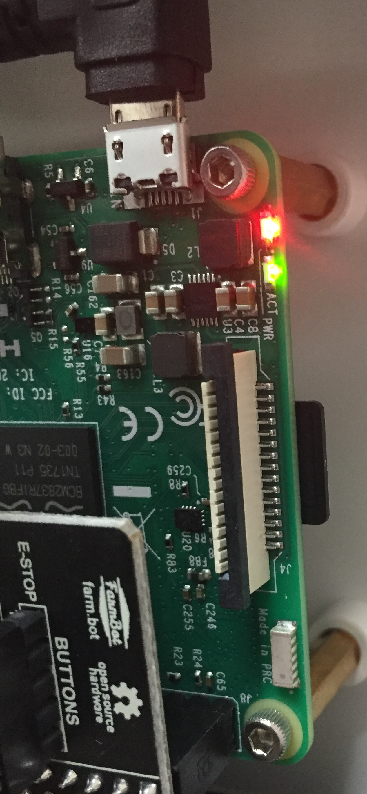
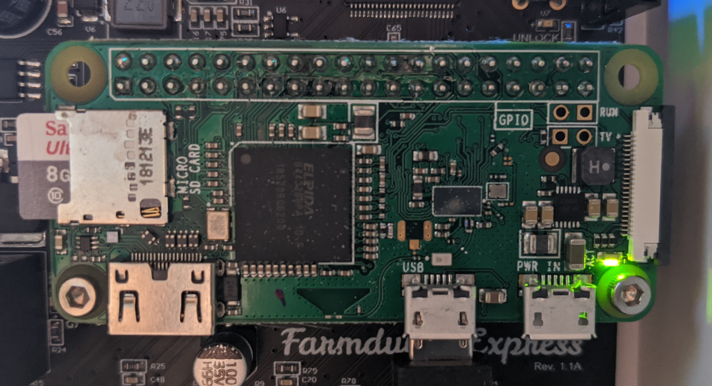
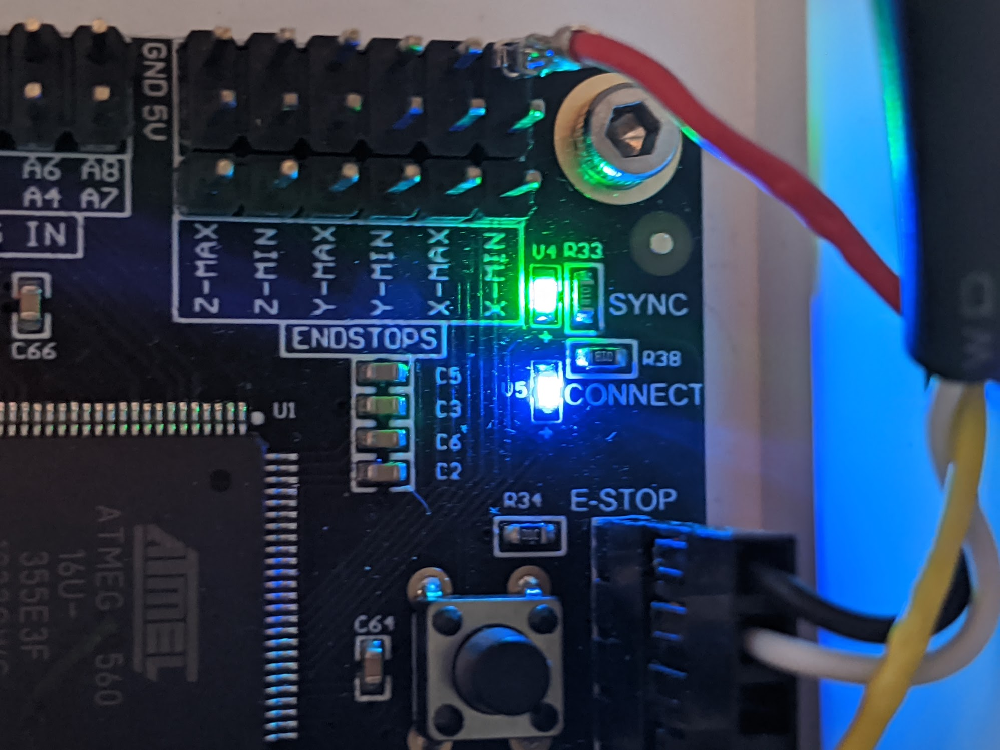

* toc
{:toc}

# Raspberry Pi LEDs
The Raspberry Pi has two LED lights that convey information about its status.

_Raspberry Pi 3, included with Genesis kits_

_Raspberry Pi Zero W, included with Express kits_

## Red (power) LED

|Red (power)                   |Status                        |
|------------------------------|------------------------------|
| (solid red)|Good to go! You are connected to a 5V power supply via the Farmduino.
| (blinking red)|Low power - Try a more powerful power supply or a different cable.
|  (off)|No power / low power - Plug in to a 5V, 3A power supply.

## Green (activity) LED

|Green (activity)              |Status                        |
|------------------------------|------------------------------|
| (solid green)|Busy working/booting
| (blinking randomly)|Busy working/booting
| (blinking consistently)|Network disconnected or emergency stopped - [Configure FarmBot](configurator.md), press UNLOCK in the Web App, or check that the network FarmBot is connected to is online.
| (off)|Ready and waiting for the next task

# Electronics box LEDs
In addition to the LEDs located on the Raspberry Pi, Genesis v1.4+ kits feature LEDs mounted on top of the electronics box, and Express v1.0+ kits feature LEDs on the Farmduino Express circuit board.

_Box LEDs on Genesis kit_

_Farmduino Express LEDs on Express kits_

## LED 1 (sync)
This green LED indicates the **sync status** between FarmBot and the web app. It is connected to Raspberry Pi GPIO BCM pin 24.

|Green (sync)                  |Status                        |
|------------------------------|------------------------------|
| (solid green)|Synced and ready
| (blinking slowly)|Needs sync (Will not execute any unsynced events or sequences)
| (blinking quickly)|Syncing
| (off)|Offline - Check the connection status LED

## LED 2 (connection)
This blue LED indicates the **connection status** between FarmBot and the internet and web app. It is connected to Raspberry Pi GPIO BCM pin 25.

|Blue (connection)             |Status                        |
|------------------------------|------------------------------|
| (solid blue)|Connected and working
| (blinking slowly)|Needs configuration - [Configure FarmBot](configurator.md), press UNLOCK in the Web App, or check that the network FarmBot is connected to is online.
| (off)|Offline - Check your internet connection.  If you are connected to the internet but the Blue LED is off, one or more of your ports may be blocked. Get your network administrator to check the ports listed in the [Firewall is blocking network traffic](../../Extras/troubleshooting/connecting-farmbot-to-the-web-app.md#6-firewall-is-blocking-network-traffic) troubleshooting section.

## LED 3 (custom)
This white LED (Genesis kits only) is user controllable via the Control Peripheral sequence command. It is connected to Raspberry Pi GPIO BCM pin 12.

## LED 4 (custom)
This white LED (Genesis kits only) is user controllable via the Control Peripheral sequence command. It is connected to Raspberry Pi GPIO BCM pin 13.

# Electronics box buttons
Some kits also include push buttons featuring integrated LED lights.

## E-Stop Button
The **E-Stop Button** (included with all Genesis v1.4+ and Express v1.0+ kits) has a red LED that indicates if FarmBot is E-STOPPED or not. It is connected to Raspberry Pi GPIO BCM pin 17.

|Red (E-stop)                  |Status                        |
|------------------------------|------------------------------|
| (solid red)|Unlocked and ready
| (blinking red)|FarmBot is missing firmware. This is normal during configuration. If you have completed configuration, selected your FarmBot model in the [Message Center](../../The-FarmBot-Web-App/the-farmbot-web-app/message-center.md) and still see blinking, you may need to flash the [Arduino Firmware](../../FarmBot-OS/arduino-firmware.md).
| (off)|Locked - Check the Unlock Button LED status

## Unlock Button
The **Unlock Button** (included with all Genesis v1.4+) has a yellow LED that indicates if FarmBot is UNLOCKED or not. It is connected to Raspberry Pi GPIO BCM pin 23.

|Yellow (unlock)               |Status                        |
|------------------------------|------------------------------|
| (blinking)|Locked - When safe to do so, press this button to unlock FarmBot.
| (off)|Unlocked and ready

## Other buttons
Some kits include three additional buttons (Button 3, Button 4, and Button 5) whose actions can be customized via [Pin Bindings](../../The-FarmBot-Web-App/settings/pin-bindings.md), however the LEDs for these buttons are not customizable.
