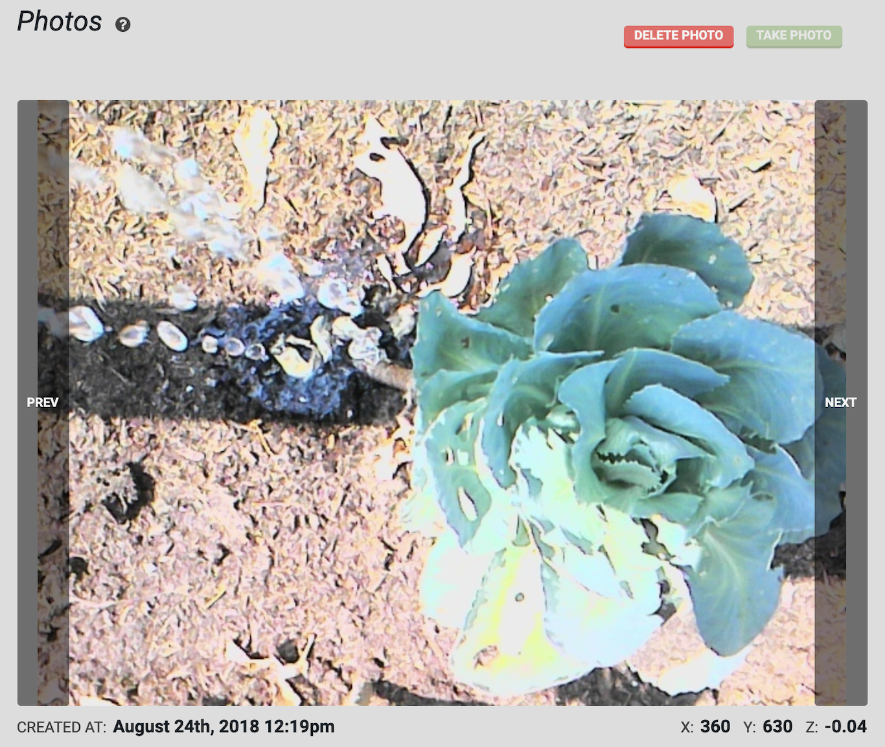

* toc
{:toc}

The **photos panel** offers a carousel for you to view all of the photos you've taken with your FarmBot, as well as controls for taking photos, deleting photos, calibrating the camera, and performing weed detection.



<iframe class="embedly-embed" src="//cdn.embedly.com/widgets/media.html?src=https%3A%2F%2Fwww.youtube.com%2Fembed%2FRYQyYA4ZwF8%3Ffeature%3Doembed&display_name=YouTube&url=https%3A%2F%2Fwww.youtube.com%2Fwatch%3Fv%3DRYQyYA4ZwF8&image=https%3A%2F%2Fi.ytimg.com%2Fvi%2FRYQyYA4ZwF8%2Fhqdefault.jpg&key=f2aa6fc3595946d0afc3d76cbbd25dc3&type=text%2Fhtml&schema=youtube" width="854" height="480" scrolling="no" title="YouTube embed" frameborder="0" allow="autoplay; fullscreen" allowfullscreen="true"></iframe>

# Viewing photos
The carousel at the top of the panel allows you to view all of the photos in your FarmBot account. Photos are displayed in reverse chronological order, so the most recent photo you've taken always shows up first.

To take a photo, press the take photo button. Once FarmBot takes the photo, it will upload it to the web app along with the coordinates of where the photo was taken, as well as the date and time.

Once you have taken multiple photos, use the `PREV` and `NEXT` buttons to navigate through your images. To delete a photo, press the delete photo button.



# What's next?

 * [Camera Calibration](../The-FarmBot-Web-App/photos/camera-calibration.md)
 * [Weed Detection](../The-FarmBot-Web-App/photos/weed-detection.md)
