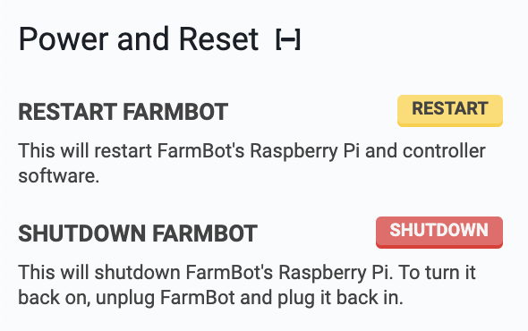

* toc
{:toc}

# Restart FarmBot
This will restart FarmBot's Raspberry Pi and FarmBot OS.

# Shutdown FarmBot
This will shutdown FarmBot's Raspberry Pi. To turn it back on, unplug FarmBot and plug it back in.

# Factory reset
Factory resetting your FarmBot will destroy all data on the device, revoking your FarmBot's ability to connect to your web app account and your home WiFi network. Upon factory resetting, your device will restart [Configurator](../../FarmBot-OS/farmbot-os/configurator.md).

Factory resetting your FarmBot will not affect any data or settings from your web app account, allowing you to do a complete restore to your device once it is back online and paired with your web app account.

# Automatic factory reset
Automatically factory reset when the WiFi network cannot be detected. Useful for network changes. Disable this setting to allow FarmBot to wait indefinitely for the configured WiFi network to come back online if it disconnects.

# Connection attempt period
For use with automatic factory reset: set the time in minutes to attempt connecting to WiFi before a factory reset.
