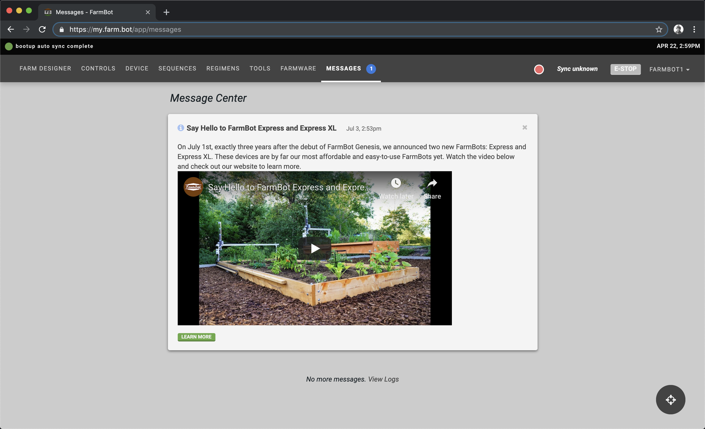

* toc
{:toc}

The **message center** contains **messages** with important information about your user account, your FarmBot, and news such as new feature and product announcements. Look for the blue badge :large-blue-circle: in the main app menu to see when new messages are available.

# Message actions
Most messages will have buttons, links, input fields, dropdown menus, and other types of actionable UI elements. We recommend you fully read each message and take any necessary actions before dismissing it.

# Dismissing messages
When you are finished reading a message, click the <i class="fa fa-times"></i> icon in the top right of the card to dismiss it. At this time, you will not be able to recover messages after dismissal.



