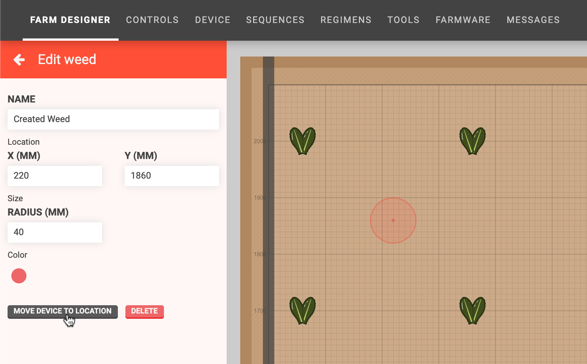

* toc
{:toc}

The **weeds panel** allows you to keep track of the weeds in your garden that your FarmBot has detected or that you have manually entered.

# Adding weeds
To add a weed, click the <i class="fa fa-plus"></i> button in the weeds panel.

This will open the **create weed** panel where you can provide the **name**, **X and Y coordinates**, **radius**, and **color** for the weed. You can also click and drag in the map to define the coordinates and radius. Click SAVE to save the weed.

# Editing weeds
To edit a weed, click it in the weeds list or in the map (when the weeds panel is opened). This will open the **edit weed** panel, allowing you to change anything about the weed. Changes will be saved when you press the <i class="fa fa-arrow-left"></i> button.

# Moving to a weed
There are two ways to move FarmBot to a weed. The first way is by clicking MOVE DEVICE TO LOCATION from the edit weed panel.

The second way is from sequences. Simply select the weed from the dropdown in a Move To command or location variable.

# Deleting weeds
To delete a weed, click on it to open up the edit weed panel. Then press the DELETE button.



