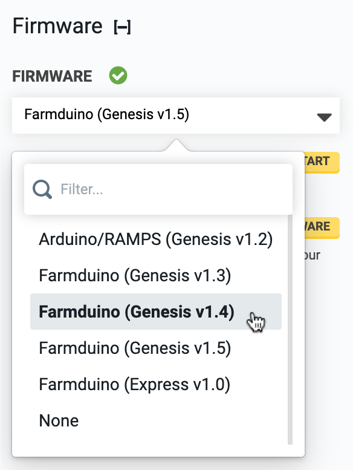

* toc
{:toc}

The **FarmBot Arduino Firmware** performs the following tasks:

 * Physically controls the FarmBot hardware by sending electrical pulses to the stepper motor drivers, reading voltages from pins, and outputting voltages and data to the Universal Tool Mount and peripherals.
 * Communicates with the Raspberry Pi to receive G-code and F-code commands and send back logs and collected data.
 * Monitors the rotary encoders as a closed-loop feedback control system to ensure that the stepper motors have not missed any steps. (Genesis kits only)



# Changing firmware

If you need to change your firmware because you chose the wrong one during setup, or you just upgraded your electronics, you can manually change it. Navigate to the [Device page](https://my.farm.bot/app/device). Under the Device widget, select the correct electronics board/hardware version from the dropdown menu labelled **FIRMWARE**. This will instruct FarmBot to flash the new firmware. After flashing is complete, you will need to UNLOCK FarmBot to complete the initialization.

# Reflashing firmware

If you are experiencing issues with your firmware, or just installed replacement electronics without firmware installed, you may manually reflash the firmware. Navigate to the [Device page](https://my.farm.bot/app/device). Under the Device widget, find the **FLASH FIRMWARE** setting and click FLASH FIRMWARE. After flashing is complete, you will need to UNLOCK FarmBot to complete the initialization.

# Using custom firmware

Using custom firmware is only recommended for software developers. For more information, see the [developer docs](https://developer.farm.bot/Documentation/firmware/custom-firmware).
