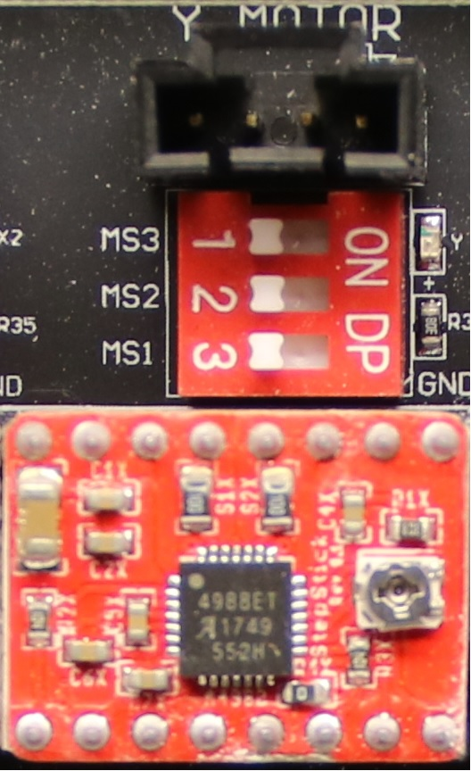
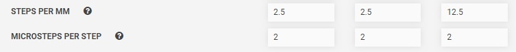

* toc
{:toc}

**Microstepping** allows the stepper drivers to position the stepper motor shaft *in between* full steps, which can allow for smoother and quieter movements. The RAMPS shield, Farmduino, and A4988 stepper drivers that come with FarmBot Genesis v1.2, v1.3, and v1.4 kits allow for full-step, 1/2 step, 1/4 step, 1/8 step, and 1/16 step settings. The microstepping setting for each stepper driver is set with **jumper pins** or **DIP switches**.



Stock FarmBots are set to use full-steps by default (no microstepping), which means that one step pulse from the microcontroller will move the motor shaft one full step. With the stock 200 step/revolution motors, this equates to 1/200th of a rotation. If you set the drivers to 1/2 step microstepping, then each step pulse from the microcontroller will move the motor 1/2 of a step, or 1/400th of a revolution. This means that a full motor step would require two step pulses from the Arduino.

If you use microstepping, you will need to make changes in the [hardware settings](../../Web App/device/hardware-settings.md) section of the web app match the hardware DIP switch positions.



The tables below show the available microstepping settings for both the A4988 and DRV8825 stepper drivers.

A4988 stepper drivers

MS1 | MS2 | MS3 | Microstepping
--- | --- | --- | -------------
Low (no jumper) | Low (no jumper) | Low (no jumper) | Full step
High (jumper) | Low (no jumper) | Low (no jumper) | 1/2 step
Low (no jumper) | High (jumper) | Low (no jumper) | 1/4 step
High (jumper) | High (jumper) | Low (no jumper) | 1/8 step
High (jumper) | High (jumper) | High (jumper) | 1/16 step

DRV8825 stepper drivers

MODE 0 | MODE 1 | MODE 2 | Microstepping
------ | ------ | ------ | -------------
Low (no jumper) | Low (no jumper) | Low (no jumper) | Full step
High (jumper) | Low (no jumper) | Low (no jumper) | 1/2 step
Low (no jumper) | High (jumper) | Low (no jumper) | 1/4 step
High (jumper) | High (jumper) | Low (no jumper) | 1/8 step
Low (no jumper) | Low (no jumper) | High (jumper) | 1/16 step
High (jumper) | Low (no jumper) | High (jumper) | 1/32 step

