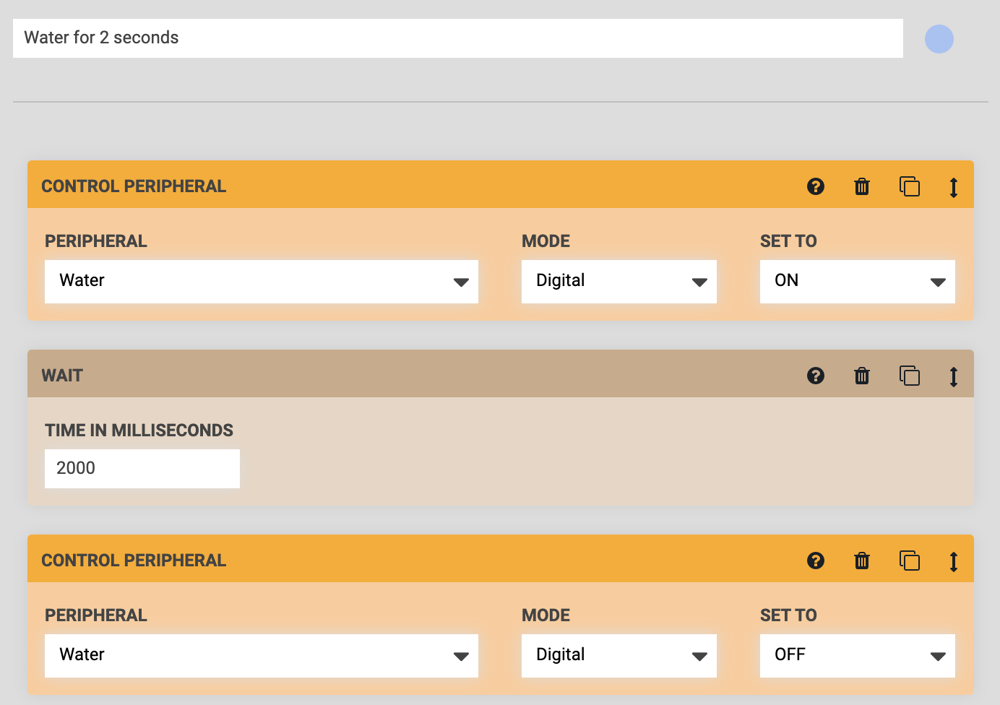
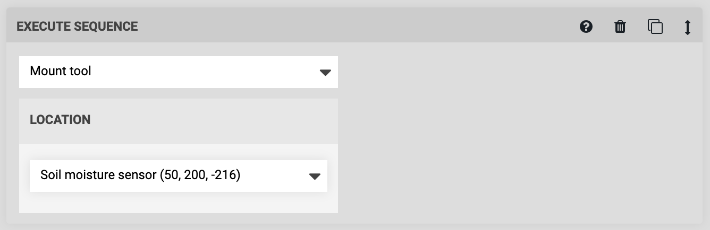
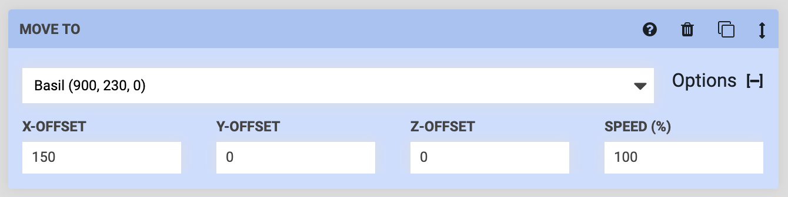
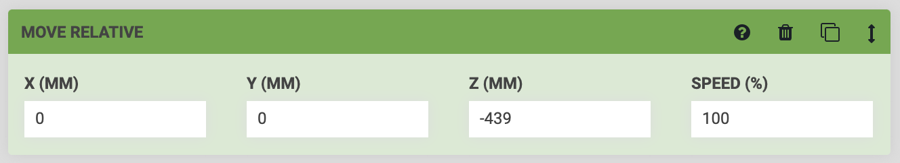
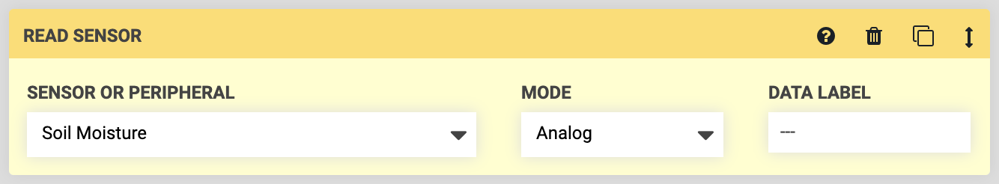
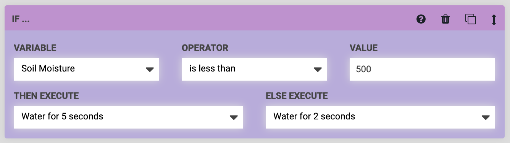
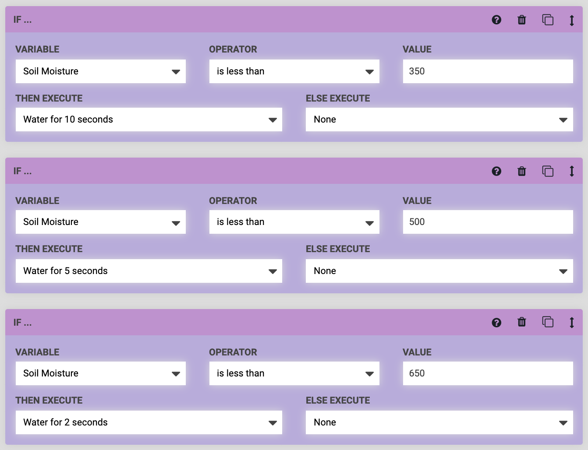

* toc
{:toc}

Before we get started, make sure you and your FarmBot meet the following prerequisites:

* Your FarmBot has a **soil moisture sensor**. This is included with all FarmBot Genesis kits, but not with FarmBot Express kits.
* Your FarmBot is fully assembled. The UTM must be wired up according to the [pin mapping table](https://genesis.farm.bot/FarmBot-Genesis-V1-5/tools/utm#pin-mapping) and your soil sensor according to the [wiring instructions](https://genesis.farm.bot/FarmBot-Genesis-V1-5/tools/soil-sensor#step-3-install-the-electronic-screws).
* FarmBot must be able to mount the soil sensor tool, pull it out of its slot, and verify it is mounted.
* You are familiar with [building sequences](../../The-FarmBot-Web-App/sequences.md) and [using sensors](../../The-FarmBot-Web-App/sensors.md).

# Step 1: Add the soil moisture sensor

Ensure you have added the **SOIL MOISTURE** sensor by checking the SENSORS widget on the Controls page. If you do not see the sensor, add it using [these instructions](../../The-FarmBot-Web-App/sensors.md#creating-sensors).

# Step 2: Build watering sequences

Build two simple watering sequences, one that doses water for 2 seconds, and one for 5 seconds. Each sequence should have the following steps:

**Step 1:** CONTROL PERIPHERAL to turn the water **ON**

**Step 2:** WAIT for 2 (or 5) seconds

**Step 3:** CONTROL PERIPHERAL to turn the water **OFF**

Name your sequences something descriptive, such as "Water for 2 seconds" and "Water for 5 seconds".

# Step 3: Measure the soil moisture

Start building a third sequence and name it "Measure soil moisture and water for 2 or 5 seconds". This sequence should have the following steps:

**Step 1:** EXECUTE a sequence to mount the soil moisture sensor. If you haven't built a sequence for this yet, refer to [this guide](../how-to-guides/mount-and-dismount-tools.md).

**Step 2:** MOVE TO the X and Y location *above* where you would like to measure the soil moisture. You can type in Custom Coordinates or select a plant's location and add **OFFSET** values to measure the soil next to the plant. The z-axis should be fully raised for this movement to ensure you do not hit any plants on the way to this location.

**Step 3:** MOVE RELATIVE in the negative **Z** direction to have FarmBot move the sensor straight down into the soil. The value you enter for the **Z** field should be the distance (in the negative direction) that FarmBot needs to descend to insert the soil moisture sensor approximately 40mm into the soil.

**Step 4:** READ SENSOR to measure the Soil Moisture sensor using the Analog **MODE**.

# Step 4: Interpret the soil moisture reading

The soil moisture sensor will provide a reading of about `250` in dry soil (or no soil), and about `850` in very wet soil (or water).

However, because everybody's soil and garden is different **you must interpret the data yourself**. For example, some people might want soil measured below a moisture level of `600` to get watered, while you might only want soil measured below a moisture level of `350` to get watered. It's up to you!

When interpreting results, we recommend **dividing by 100 and rounding to the nearest whole number**. For example, measurements of `467`, `481`, `502`, and `539`, should all be divided and rounded to the same result of `5`. That's because the composition of the soil at different locations will provide slightly different results, even if "it's all the same soil". Furthermore, even repeat readings in the same location can result in slightly different results due to temperature fluctuations, subterranean soil movement, and electronic interference.

Once you have an understanding of soil moisture readings and what they mean for your garden, it is time to tell FarmBot to take an action based on the data.

# Step 5: Use an IF statement to decide how much to water

**Step 5:** Add an IF STATEMENT to the sequence. The **VARIABLE** should be set to "Soil Moisture", because that is the piece of data that we want to evaluate. Then set the **OPERATOR** and **VALUE** as desired, and choose the sequences FarmBot should **EXECUTE** depending on if the statement is true or false.

In this example, if the soil moisture is less than `500`, FarmBot will then water for 5 seconds. Else, FarmBot will water for 2 seconds.

Note that when FarmBot goes to execute the watering sequences, you will need to have it first dismount the soil moisture sensor, then mount the watering nozzle, and then dose the water where needed.

# Step 6: Give FarmBot more choices (optional)

Let's say you want FarmBot to have four choices depending on the sensor reading: Water for 2 seconds, 5 seconds, 10 seconds, or not at all. You can accomplish this by making a third watering sequence for the 10 second option ([step 2 of this guide](#step-2-build-watering-sequences)) and adding more IF STATEMENT commands.

In the example below, FarmBot will check the soil moisture sensor reading and if it is less than `350`, it will water for 10 seconds. Else (if the reading is greater than `350`), it will move on to the second IF statement. If the reading is less than `500`, it will water for 5 seconds, else move on to the third IF statement. And finally if the reading is less than `650`, it will water for 2 seconds, else move on without watering.

# Troubleshooting

There are a few likely issues that may cause soil sensor performance problems:

* If the connection between the UTM and the soil sensor tool is not complete then you will get a false reading at the extreme end of the range of `0` to `1023`. Ensure FarmBot has properly mounted the tool and made the necessary electrical connections and try again.
* Inserting the soil sensor into the exact same location in the soil over and over can provide inaccurate results because the soil will get pushed away more and more and eventually make no contact with the sensor. Make FarmBot measure in different locations to prevent this.
* As with all sensors, there will be variance between readings. Variances could come from the soil, the environment, build-up of soil on the sensor, the depth inserted into the soil, time the sensor is left in the soil, contact between the soil and the sensor, connection quality between the UTM and the tool, etc. All of these factors and more may contribute to sensor readings that vary significantly when you think they shouldn't. The solution here is to change your expectation of the sensor. Instead of dividing by 100 and rounding to the nearest whole number, divide by 200, 300, or even 500 and round. This will yield fewer possible results, with more raw sensor reading range allocated to each result. This will minimize the "bouncing" between readings. At the simplest, you can interpret results on a binary wet/dry scale.
