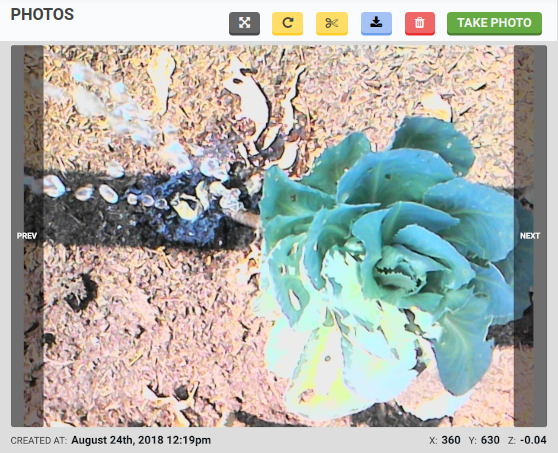
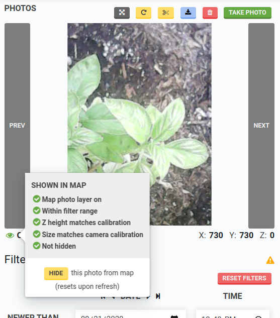

The **photos panel** offers a carousel for you to view all of the photos you've taken with your FarmBot, as well as controls for taking photos, deleting photos, calibrating the camera, and performing weed detection.



<iframe class="embedly-embed" src="//cdn.embedly.com/widgets/media.html?src=https%3A%2F%2Fwww.youtube.com%2Fembed%2FRYQyYA4ZwF8%3Ffeature%3Doembed&display_name=YouTube&url=https%3A%2F%2Fwww.youtube.com%2Fwatch%3Fv%3DRYQyYA4ZwF8&image=https%3A%2F%2Fi.ytimg.com%2Fvi%2FRYQyYA4ZwF8%2Fhqdefault.jpg&key=f2aa6fc3595946d0afc3d76cbbd25dc3&type=text%2Fhtml&schema=youtube" width="854" height="480" scrolling="no" title="YouTube embed" frameborder="0" allow="autoplay; fullscreen" allowfullscreen="true"></iframe>

# Viewing photos
The carousel at the top of the panel allows you to view all of the photos in your FarmBot account. Photos are displayed in reverse chronological order, so the most recent photo you've taken always shows up first.

To take a photo, press the take photo button. Once FarmBot takes the photo, it will upload it to the web app along with the coordinates of where the photo was taken, as well as the date and time.

Once you have taken multiple photos, use the `PREV` and `NEXT` buttons to navigate through your images. To delete a photo, press the <i class='fa fa-trash'></i> button.

Press the <i class='fa fa-expand'></i> button to open the full screen image viewer.

Press the <i class='fa fa-repeat'></i> button to toggle photo crop and rotation. When enabled, the photo will appear as it does in the map. When disabled, the photo will appear as it was taken by the camera without any adjustments applied.

Press the <i class='fa fa-scissors'></i> button to toggle photo cropping.

Press the <i class='fa fa-download'></i> button to download the photo taken by the camera. Note: the photo downloaded will be the image captured by the camera without rotation or cropping.



The <i class='fa fa-eye'></i> icon shows whether or not a photo is displayed in the map. Press the icon to open the **SHOWN IN MAP** info pop-up to see why a specific photo is or isn't displayed. Press the HIDE button to temporarily hide a photo from the map.

# What's next?

 * [Camera Calibration](photos/camera-calibration.md)
 * [Weed Detection](photos/weed-detection.md)
