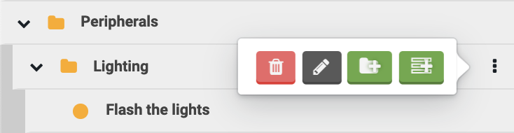
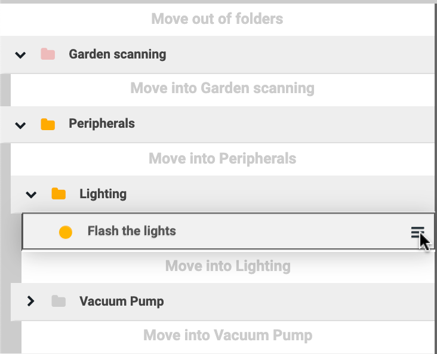

* toc
{:toc}

The web app is a platform designed to give you unlimited control over how you use your FarmBot and therefore how you grow your food. Because nobody wants to sit on their computer all day controlling their FarmBot manually, we have designed several features to help you automate your farming operation.

**Sequences** allow you to combine the most basic **commands** of FarmBot (such as moving or controlling a peripheral) into more complex actions requiring multiple **steps** (for example: picking up the watering nozzle, watering a plant, and then putting the tool away). When a sequence is initiated, FarmBot will execute all of the commands in the sequence (the steps) one after the other until the sequence is finished.

<iframe class="embedly-embed" src="//cdn.embedly.com/widgets/media.html?url=http%3A%2F%2Fwww.youtube.com%2Fwatch%3Fv%3D8tw6Qmu-WdI&src=http%3A%2F%2Fwww.youtube.com%2Fembed%2F8tw6Qmu-WdI&type=text%2Fhtml&key=f2aa6fc3595946d0afc3d76cbbd25dc3&schema=youtube" width="854" height="480" scrolling="no" frameborder="0" allow="autoplay; fullscreen" allowfullscreen="true"></iframe>

You can create sequences using the sequence editor as shown below. On the left of the screen is a list of all your sequences, which can be organized into folders. In the middle is the currently opened sequence. And on the right are the available commands that you can add to sequences.

# Organizing sequences into folders
Add a new folder in the top level by pressing the <i class="fa fa-folder"></i> button next to the sequence search bar. To change the color of the folder, click the folder icon.

Open and close a folder by clicking the <i class="fa fa-chevron-right"></i> and <i class="fa fa-chevron-down"></i> buttons, or open and close all folders by clicking the <i class="fa fa-chevron-right"></i> and <i class="fa fa-chevron-down"></i> buttons next to the sequence search bar.

Click the <i class="fa fa-ellipsis-v"></i> menu shown on the right when hovering on a folder to delete the folder, edit the folder name, add a subfolder, or add a new sequence within the folder.

To move sequences between folders, click or click and drag the <i class="fa fa-bars"></i> menu shown on the right when hovering over the sequence.

# Sequence editor options
You can customize how the sequence editor works with the options in the <i class="fa fa-cog"></i> menu located to the left of the COPY button when a sequence is loaded into the editor. Each option is described in the tooltip shown when the <i class="fa fa-question-circle"></i> icon is clicked.
