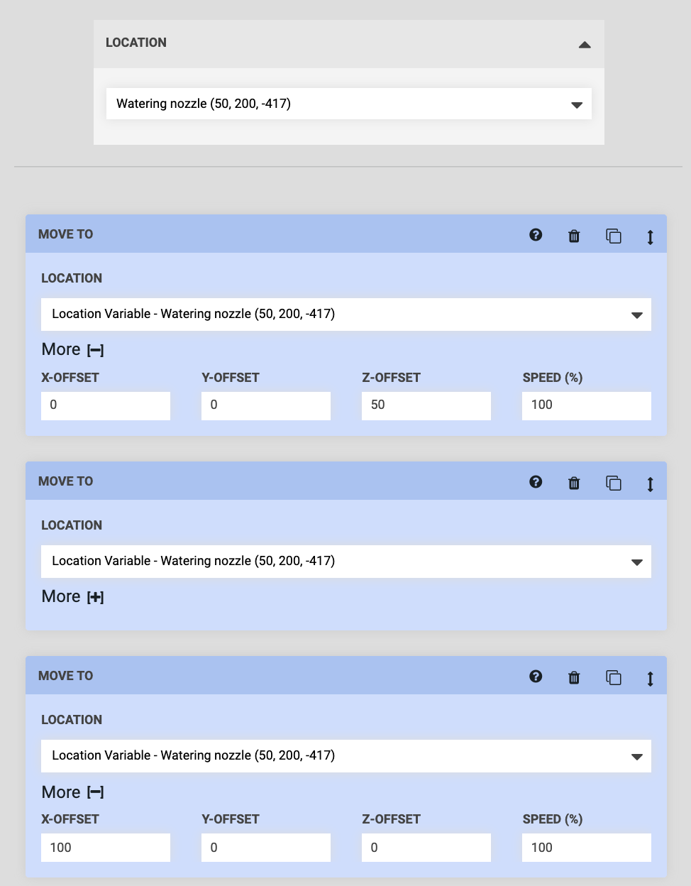

* toc
{:toc}

**Variables** allow you to create *dynamic* sequences that execute differently depending on the **variable value** provided. This allows one sequence to be used more generally (in multiple ways), rather than for one specific purpose. To see how variables are used, let's go through a practical example.

# Start with a static sequence
We'll start with a *static* sequence (a sequence without any variables). Static sequences are executed the same way every time and can only be used for one specific purpose. For example, the sequence below can only be used to mount the Watering Nozzle tool because the **LOCATION** inputs in the Move commands are _hard coded_ to one location.

If you wanted to mount the Seeder tool, you would need to make a second sequence with all of the **LOCATION** inputs set to the Seeder tool. You can imagine that if you had many tools, creating a bunch of variations of basically the same sequence would be tedious and cumbersome.

_A static sequence that can only be used for one specific purpose_

# Add a variable
Let's change the static sequence above into a *dynamic* sequence that can be used to mount any of our tools (assuming they all need to be mounted using the same general method).

Select `Location Variable - Add new` for the **LOCATION** input in the first Move command.

This will create a **location variable** in the sequence header and update the **LOCATION** input in the Move command to display as Location Variable - Select a location <i class="fa fa-caret-down"></i>.

Now select `Location Variable - Select a location` for the **LOCATION** inputs in the other two Move commands.

Then set the **variable value** (in the sequence header) to the `Watering Nozzle` tool from before and notice that all of the **LOCATION** inputs in the Move commands will update to Location Variable - Watering Nozzle (x, y, z) <i class="fa fa-caret-down"></i>.

At this point, while we've added a variable, the sequence is still *static* and would execute in the exact same way as before every time it is run. If we wanted to mount a different tool, we would again need to create a copy of the sequence, this time changing the variable value to the tool we wanted. And still as before, if we had many tools, such a process would be tedious and cumbersome.

## Make the variable externally defined
To make our sequence *dynamic* and re-usable for different purposes, we need to make the variable **externally defined**. This will allow us to provide the variable value from another sequence, a regimen, or an event, which will dictate how the sequence is run each time.

To do this, change the variable value (in the sequence header) to `Externally defined`. This selection will then get reflected in all of the **LOCATION** inputs in the Move commands as they update to Location Variable - Externally defined <i class="fa fa-caret-down"></i>.



_A dynamic sequence that can be used in a general way_

Now our sequence is built in a generic way that will allow it to mount any tool, depending on what value is provided for the variable! In the next section we'll look at all the ways in which you can provide this value.

# What's next?

 * [Externally Defined Variables](../sequences/externally-defined-variables.md)
