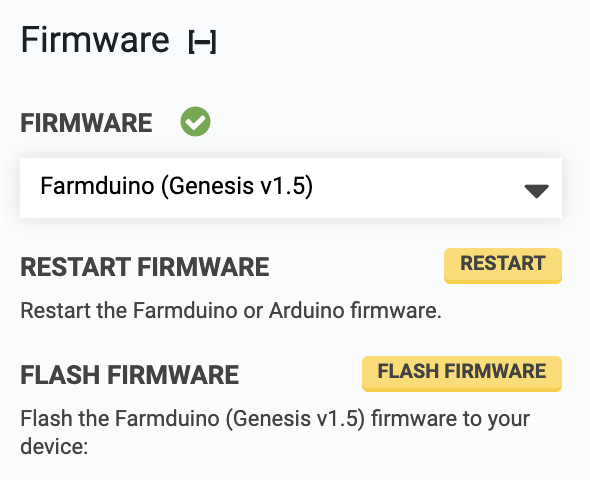

* toc
{:toc}

# Firmware
Select the firmware to be used with your electronics board.

# Restart firmware
This will restart the firmware. This may be useful for developers.

# Flash firmware
This will flash the selected firmware to the microcontroller. This is used when installing a new electronics board.
