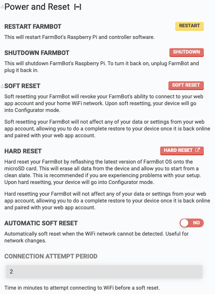

* toc
{:toc}

# Restart FarmBot
This will restart FarmBot's Raspberry Pi and FarmBot OS.

# Shutdown FarmBot
This will shutdown FarmBot's Raspberry Pi. To turn it back on, unplug FarmBot and plug it back in.

# Soft reset
Soft resetting your FarmBot will revoke your FarmBot's ability to connect to your web app account and your home WiFi network. **This is useful before moving FarmBot to a new location with a different WiFi network, or when switching FarmBot from one web app account to another.**

Upon soft resetting, you will need to [reconfigure FarmBot](http://configure.farm.bot) to connect it to internet and your web app account.





# Hard reset

Hard resetting your FarmBot will erase all data from the device, allowing you to start from a clean slate. **This is recommended if you are experiencing problems with your setup.**

Perform a hard reset by [reflashing the latest version of FarmBot OS onto the microSD card](doc:farmbot-os#section-installation). Upon hard resetting, you will need to [reconfigure FarmBot](http://configure.farm.bot) to connect it to internet and your web app account.



# Automatic soft reset
Automatically soft reset when the WiFi network cannot be detected. Useful for network changes. Keep this setting disabled to allow FarmBot to wait indefinitely for the configured WiFi network to come back online if it disconnects.

# Connection attempt period
For use with automatic soft reset: set the time in minutes to attempt connecting to WiFi before a soft reset.
