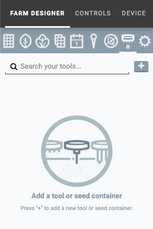
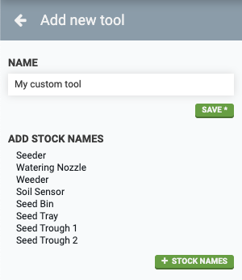
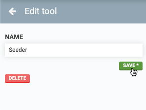
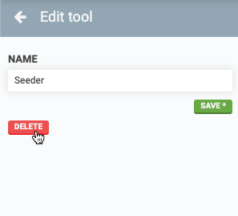
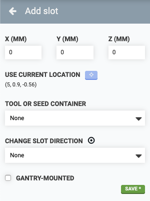
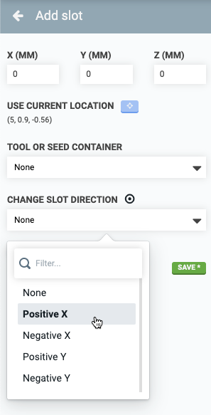
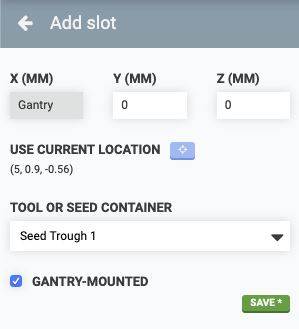
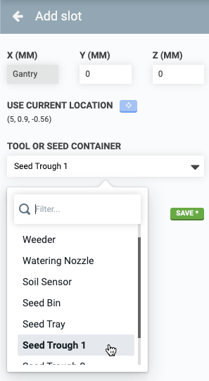

* toc
{:toc}

On the **tools panel** you can manage all of your FarmBot's **tools**, **seed containers**, and **slots**.



# Tools and seed containers
## Creating tools and seed containers
To create a new **tool** or **seed container**, press the <i class="fa fa-plus"></i> button. Provide a Name to define the tool or seed container and then press SAVE. Alternatively, press <i class="fa fa-plus"></i> STOCK NAMES to add all of the standard tools and seed containers included with your FarmBot kit.

## Editing tools and seed containers
To edit a tool or seed container, click it from the **TOOLS AND SEED CONTAINERS** list (Genesis), or the **SEED CONTAINERS** list (Express) located at the bottom of the main tools panel. Make your desired edits and then press the SAVE button.

## Deleting tools and seed containers
To delete a tool or seed container, click it from the **TOOLS AND SEED CONTAINERS** list (Genesis), or the **SEED CONTAINERS** list (Express) located at the bottom of the main tools panel. Then click the DELETE button.



# Slots
Once you've added all of your tools and seed containers, its time to load some or all of them into **slots**. Slots are locations within FarmBot's coordinate system that can hold a **tool** or **seed container** and correspond to physical hardware such as a toolbay (Genesis kits) or the gantry-mounted seed trough holder (all kits).

## Creating slots
To create a new slot, press the <i class="fa fa-plus"></i> button next to the **SLOTS** label in the tools panel.

Next, provide **coordinates** for the tool slot.
  * If you plan to load an **interchangeable tool** into the slot (Genesis kits only), use coordinates for when FarmBot's UTM will fully mount the tool while it is still in the slot.
  * If you plan to load a **seed container** into the slot, use coordinates for when FarmBot's seed injector needle will be positioned to pick up a seed from the container.

To input accurate coordinates, use the manual controls to move FarmBot into the desired position (mounting the tool or picking up a seed). Then click the **USE CURRENT LOCATION** <i class="fa fa-crosshairs"></i> button to copy FarmBot's current coordinates into the **X**, **Y**, and **Z** input fields.

### Changing slot direction
Some slots (such as the toolbays included with Genesis kits) have a **slot direction**, which is the direction that the tool must be loaded and unloaded from. To specify a slot's direction, use the **CHANGE SLOT DIRECTION** dropdown.

### Gantry-mounted slots
Some slots (such as those provided by the seed trough holder) are **gantry-mounted** and move with the FarmBot along the x-axis. To account for this and properly render these types of slots in the farm designer, you can specify that a slot is **GANTRY-MOUNTED** with a checkbox. Doing so will display the **X** coordinate as Gantry.

## Loading slots
To load a tool or seed container into the slot, select one from the **TOOL OR SEED CONTAINER** dropdown and then press save.



## Deleting slots
To delete a slot, select it from the **SLOTS** list in the main tools panel and then press the DELETE button.



