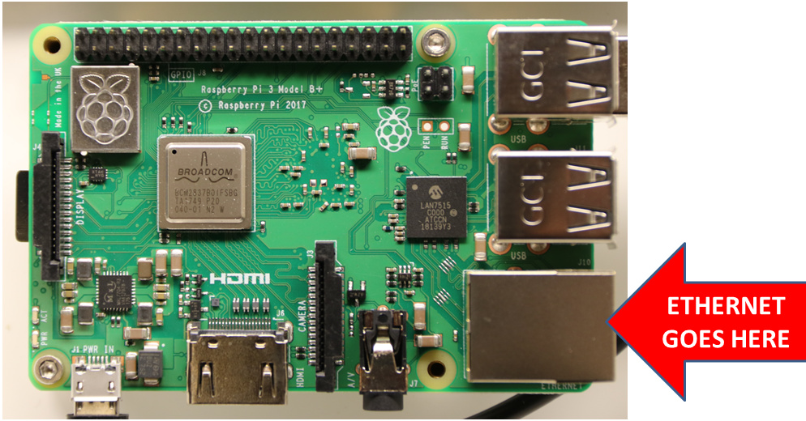
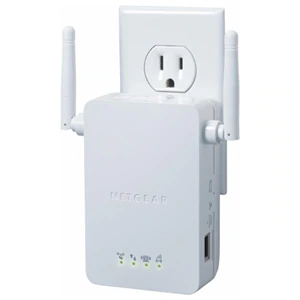

* toc
{:toc}

Your FarmBot needs to be connected to the internet and the Web App. When everything is connected and functioning, the **connectivity popup** should show a `code 31` diagnosis code and the points on the graphic should show green. Follow this troubleshooting guide if you are having trouble getting full connectivity to your FarmBot.

|Suggested steps               |Applies to                    |
|------------------------------|------------------------------|
|Step 1: [Check the connectivity popup](#step-1-check-the-connectivity-popup)|All FarmBots
|Step 2: [Try a Wi-Fi hotspot with a cellular network](#step-2-try-a-wi-fi-hotspot-with-a-cellular-network)|All FarmBots
|Step 3: [Check for blocked ports](#step-3-check-for-blocked-ports)|All FarmBots connecting to school or corporate networks
|Step 4: [Try a wired Ethernet connection](#step-4-try-a-wired-ethernet-connection)|Genesis kits only
|Step 5: [Improve Wi-Fi signal strength](#step-5-improve-wi-fi-signal-strength)|All FarmBots

# Step 1: Check the connectivity popup
The **connectivity popup** is used to diagnose communications between the various FarmBot systems. To learn more about the connectivity popup and to get access to the full list of connectivity codes check out this page: [Connectivity Diagnosis Codes](connectivity-codes.md).

# Step 2: Try a Wi-Fi hotspot with a cellular network
Use your smartphone or a dedicated hotspot device from a provider like Verizon or AT&T to create a **WiFi hotspot** in very close proximity to your FarmBot (within 10 feet). Ensure the hotspot device has a working cellular connection by connecting to it with a laptop or other device and loading a few webpages, such as the FarmBot web app. Once you are certain the hotspot is up and functional, configure FarmBot to connect to the hotspot.

If you are able to complete configuration and get your FarmBot online using the hotspot, then you can either continue to use the hotspot with your FarmBot or further troubleshoot your normal WiFi network. Most likely the issue with your normal network is a [blocked port](#step-3-check-for-blocked-ports) or a [weak WiFi signal](#step-5-improve-wi-fi-signal-strength).

If your FarmBot does not connect with the hotspot, there may be an issue with your hardware. However, this is an extremely rare circumstance (less than 1/1,000 FarmBots have hardware issues of this type). Almost certainly there is usually another issue at play.

# Step 3: Check for blocked ports



It is very common for the IT department of schools and corporate networks to **block ports** that are not commonly used. Just because the FarmBot is connected to the internet doesn't mean the FarmBot will be able to connect to the Web App because of these blocked ports. We have [specific instructions for your IT department](for-it-security-professionals.md) to help you connect your FarmBot to the internet if you suspect any ports are blocked.

FarmBot requires the following ports to be open on your network:

  * Port 5672 - AMQP
  * Port 80 - HTTP(S)
  * Port 443 - HTTP(S)
  * Port 3002 - WebSockets

On FarmBot Genesis v1.4+ check the Blue LED communication light. You have blocked ports if the Blue LED is OFF and the Green LED is ON. On Express v1.0+, the blue and green LEDs are located in the top right of the electronics board itself. See the [status LEDs page](../../FarmBot-OS/farmbot-os/status-leds.md) for more information.

# Step 4: Try a wired Ethernet connection



The best and most reliable way to connect FarmBot to the internet is with a **wired Ethernet connection** (Genesis kits only). Simply connect an Ethernet cable between the Raspberry Pi and your router.

# Step 5: Improve Wi-Fi signal strength
The most common enemies of the Raspberry Pi Wi-Fi are other Wi-Fi networks and other electronic devices. If you are in an area with lots of other heavy duty electrical equipment such as power lines, transformers, microwaves, fridges, other appliances, radio equipment like baby monitors, or mobile phone towers, it may disrupt the Raspberry Pi Wi-Fi radio.

Here is a link with [more information on how you can improve the Wi-Fi signal](https://www.netspotapp.com/wifi-interference.html).

## Try a Wi-Fi range extender
There are multiple ways users can use a **Wi-Fi range extender** and these are a few ideas that we have:

1) Use the Wi-Fi extender to extend the Wi-Fi network coverage so that the FarmBot can connect over Wi-Fi with a stronger signal. Sometimes the Wi-Fi signal needs some help and the Wi-Fi range extender will lend a hand to boost your Wi-Fi.

2) Use both the range extender and an Ethernet cord to plug into the Raspberry Pi on the FarmBot. This will work in case it is infeasible to run an Ethernet cord from the primary router all the way to the FarmBot.

There are many range extender’s and repeaters on the market and this one is just an example:

_Netgear Universal Wi-Fi Range Extender (WN3000RP)_

There are other resources, documentation and diagnostic Wi-Fi Apps available online to help with poor Wi-Fi signal. Check out this page by Netgear on [Wi-Fi range extenders](https://www.netgear.co.uk/home/discover/wifi-range-extender/).

# Other networking issues

## Does FarmBot expose SSH (secure shell) access?

If provided an SSH key during configuration (in the "Advanced" panel), it is possible to SSH into a device. There are some caveats, however:

 * The SSH session exposes an [IEX](https://hexdocs.pm/iex/IEx.html) shell, not bash.
 * The Linux distribution that FarmBot uses does not offer any useful utilities for an end user. (IE there is no `apt-get`, `bash`, `top`, `init`, etc)
 * SSH access is used for debugging only. It is not intended to be used for software development or hosting.
