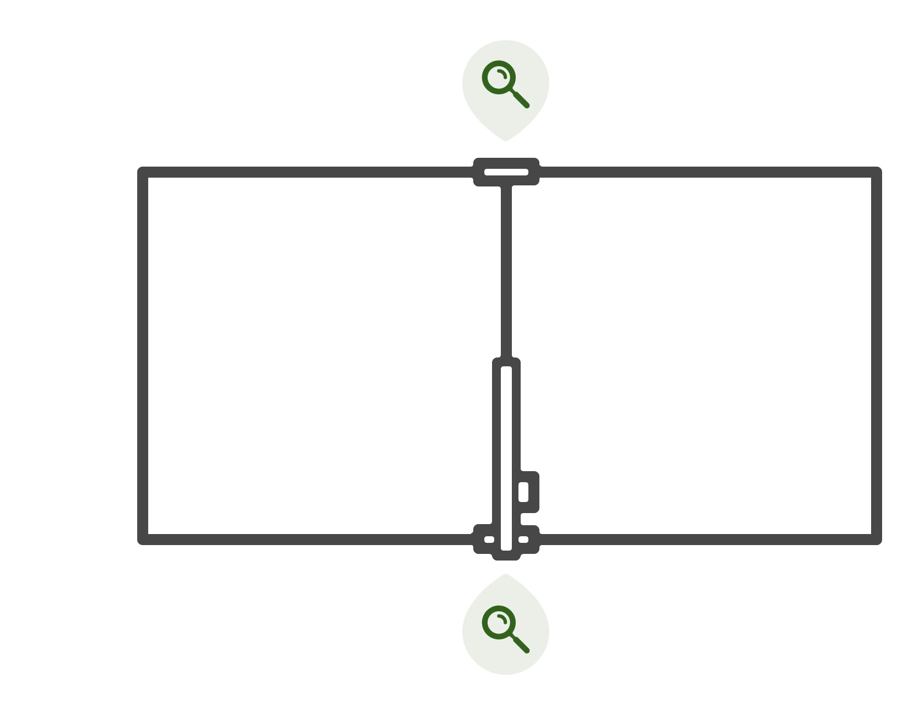
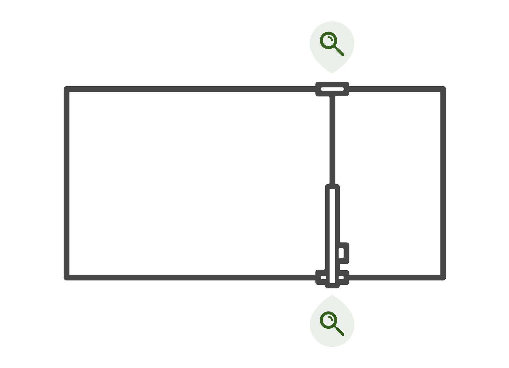

* toc
{:toc}

Accurate position tracking is imperative for FarmBot to sow seeds one day and return to water the plants week after week. To keep track of its location within the garden coordinate system, FarmBot must:

  * Base all movements off a fixed **home position**, also known as the **origin**, **zero**, or `(0, 0, 0)`.
  * Keep track of every movement so FarmBot always knows its **current position**.
  * Detect when a motor has **stalled** due to debris, hardware malfunction, or user error.
  * Know all three **axis lengths**, so FarmBot does not try to move farther than allowed.

# Home
All of FarmBot's movements must be based off a fixed **home position**, also known as the **origin**, **zero**, or `(0, 0, 0)`. To know where the home position is located, FarmBot can either [automatically find home](#automatically-find-home) or you can [manually set home](#manually-set-home). Finding or setting home should occur regularly:

  * After powering up FarmBot
  * After a movement error
  * After moving FarmBot by hand
  * At the start of long-running sequences
  * At the start of any sequences that require a high degree of precision such as a tool mounting sequence

## Automatically find home



To **automatically find home**, FarmBot will:

:mag: Move in the direction of the home position, **searching** for it.

:boom: Using [special hardware](#how-it-works), FarmBot will **detect** when the home position has been reached.

:white_check_mark: Once the home position is reached the first time, FarmBot will back up a short distance and then move forward again to **verify** that the home position is found a second time in the same location. If the verification fails, FarmBot will go back to step 1 of the process.

:house: Once the verification succeeds, FarmBot will **set** the current location as the home position. In other words, FarmBot's coordinates will be set to `(0, 0, 0)`.

_Note that the graphic above omits step 3 of the process_

To instruct FarmBot to automatically find home on a regular basis, use the FIND HOME command in your sequences. This is recommended at the start of long-running sequences and sequences that require a high degree of precision.

To instruct FarmBot to automatically find home right now, use the FIND HOME X, FIND HOME Y, and FIND HOME Z buttons in the settings panel, or the <i class='fa fa-home'></i> button on the controls page to find home for all three axes in the order Z, Y, X. This is recommended after moving FarmBot by hand or a movement error.

To instruct FarmBot to automatically find home every time it boots up, turn the **FIND HOME ON BOOT** setting ON. This may be useful for recovering from a power outage, or in classrooms where one FarmBot is shared by many students and regularly turned on and off.

## Manually set home
If you do not have **ENCODERS**, **STALL DETECTION**, or **LIMIT SWITCHES** enabled, you can move FarmBot to the desired home position with the manual controls or by hand. Then use the SET HOME X, SET HOME Y, and SET HOME Z buttons in the settings panel to manually set the current location as the home position for each axis. In other words, manually set FarmBot's coordinates to `(0, 0, 0)`.

You may also instruct FarmBot to set the home position on a regular basis by using the SET HOME command in a sequence.

## Stop at home
Most FarmBot setups physically restrict movements beyond the home position via hardware such as hardstops. If this is true for your setup, you should also turn **STOP AT HOME** ON for each applicable axis. This will further restrict FarmBot (via software) from even *attempting* to move beyond the home position.

# Axis length
To restrict movement beyond the maximum position of an axis, FarmBot must first know the **axis length**. To know the axis lengths, FarmBot can either [automatically find axis lengths](#automatically-find-axis-length) or you can [manually set axis lengths](#manually-set-axis-length). Finding or setting axis lengths should occur only after hardware changes that affect the length of an axis:

* After assembling your FarmBot
* After adjusting belts or hardstops
* After making any other adjustment that affect the distance FarmBot can travel

## Automatically find axis length



To **automatically find an axis length**, FarmBot will:

:mag: Move in the direction of the maximum position, **searching** for it.

:boom: Using [special hardware](#how-it-works), FarmBot will **detect** when the maximum position has been reached.

:straight_ruler: FarmBot will then move in the direction of the home position, **searching** for it, while also **measuring** the distance it has moved from the maximum position.

:boom: Using [special hardware](#how-it-works), FarmBot will **detect** when the home position has been reached.

:white_check_mark: FarmBot will then **set** the **AXIS LENGTH** to the distance that was measured between the maximum and home positions. FarmBot will also set the current location as the home position.

To instruct FarmBot to automatically find an axis length right now, use the FIND LENGTH X, FIND LENGTH Y, and FIND LENGTH Z buttons in the settings panel. This is recommended after first assembling your FarmBot or making any changes to the hardware that may affect the distance FarmBot can travel.

You may also instruct FarmBot to automatically find an axis length on a regular basis by using the FIND AXIS LENGTH command in a sequence. However, this is generally not necessary because axis lengths do not change on a regular basis.

## Manually set axis length

You can manually set an axis length by typing in a value to the **SET AXIS LENGTH (MM)** fields in the settings panel. This can be useful if you would like to shorten an axis via software instead of using a hardware hardstop.

## Stop at max
Most FarmBot setups physically restrict movements beyond the max position via hardware such as hardstops. If this is true for your setup, you should also turn **STOP AT MAX** ON for each applicable axis. This will further restrict FarmBot (via software) from even *attempting* to move beyond the max positions.

# How it works

Automatically finding home and axis lengths requires special hardware to signal to FarmBot when a max position or the home position have been reached. There are three types of hardware supported by different FarmBot models that serve this purpose.

|FarmBot model                 |Required hardware             |
|------------------------------|------------------------------|
|Genesis v1.2+ Genesis XL v1.2+|[Rotary encoders](#rotary-encoders)
|Express v1.0+ Express XL v1.0+|[Stall detecting stepper drivers](#stall-detecting-stepper-drivers)
|DIY bots                      |[Limit switches](#limit-switches)

## Rotary encoders

FarmBot Genesis kits include **rotary encoders** on each motor that monitor how much the motor shafts have rotated. Whenever FarmBot reaches a hardware hardstop located at an axis end, the motors will stall, and the rotary encoders will signal to FarmBot that the axis end has been reached.



## Stall detecting stepper drivers

FarmBot Express kits include **stall detecting stepper drivers** that can detect when a motor has stalled. Whenever FarmBot reaches a hardware hardstop located at an axis end, the motors will stall, and the stepper drivers will signal to FarmBot that the axis end has been reached.



## Limit switches

DIY FarmBot builders may use **limit switches** which are small buttons that can be positioned at axis end locations. Whenever FarmBot reaches an end location, it will press the button, which creates a signal indicating the axis end has been reached.

# Troubleshooting

It is possible for the automatic find home and automatic find axis length procedures to provide inaccurate results, or for FarmBot's position to be lost. If you are having trouble, try to identify the underlying cause and fix it. Here are some common situations that may occur:

  * Debris or other factors may cause FarmBot to incorrectly identify a location as an end position. For example, if a tree branch falls onto FarmBot's tracks and prevents it from reaching the true home position, FarmBot may incorrectly identify the position where it stalls against the tree branch as the home position. Ensure there is no debris preventing FarmBot from moving along any axis.
  * A misconfiguration of some motor settings, such as **STEPS PER MM**, **MICROSTEPS PER STEP**, or **ENCODER SCALING** can make FarmBot think it is traveling more or less distance than it actually is. This would result in incorrect axis length measurements and incorrect position tracking. Review your settings to ensure they are correct for your hardware.
  * Motor settings that are too fast or accelerate too quickly, or a **MOTOR CURRENT** that is too extreme can cause stall detecting stepper drivers (used by FarmBot Express) to incorrectly detect stalls. Do not set the motor current too much more or less than the default value.
  * Moving a FarmBot by hand that does not have rotary encoders enabled will change the true position without FarmBot knowing it. To prevent accidental movements, consider turning **ALWAYS POWER MOTORS** ON.
