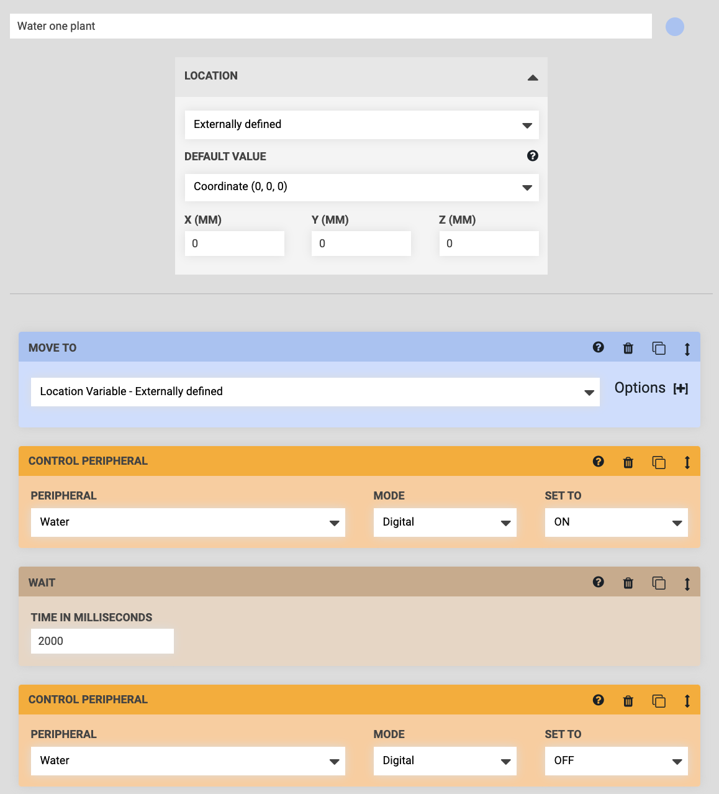
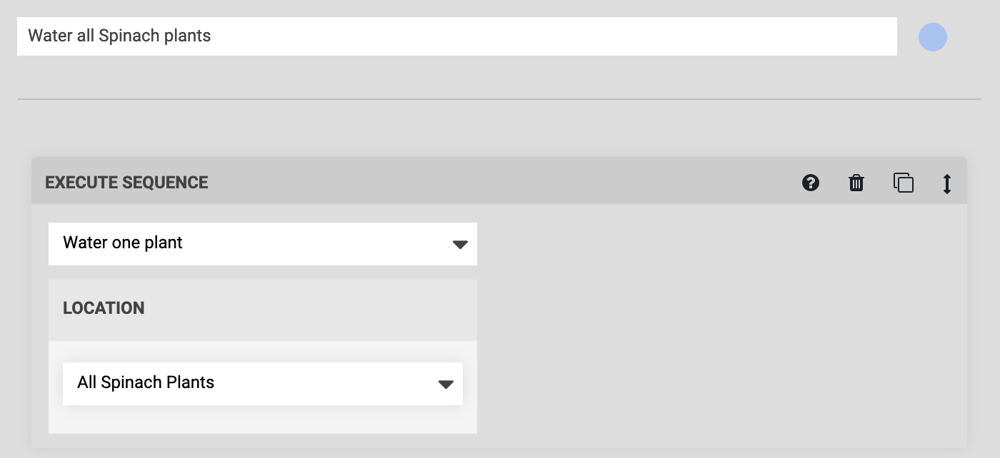

* toc
{:toc}

When setting up FarmBot to take care of your whole garden, you will frequently need to **perform the same action on many plants**. For example, you may need to water all of your Spinach plants, or you may wish to take a photo of every plant to track growth. In this guide we'll show you how to accomplish this quickly by:

  * **Creating a group** of plants you wish to perform the same action on.
  * **Building a sequence** that performs the action on **one plant**.
  * Building another sequence that executes the first sequence **for every plant in the group**.

# Step 1: Create a group
Navigate to the **groups panel** and click <i class='fa fa-plus'></i>. **Select all** plants, and then use **FILTERS** to narrow your selection. In this example we will filter by **Type** so that only the Spinach plants are selected. Give your group a descriptive name such as "All Spinach Plants" and then press <i class='fa fa-arrow-left'></i> to save the group.



# Step 2: Perform an action on one plant



The first sequence you need to make will perform an action (in this example, watering) on one plant. We'll name this sequence "Water one plant", and it should have the following steps:

**Step 1:** MOVE TO a location variable

**Step 2:** CONTROL PERIPHERAL to turn the water on

**Step 3:** WAIT for 2 seconds

**Step 4:** CONTROL PERIPHERAL to turn the water off

The important part of this sequence is the **location variable**. Instead of selecting a specific plant in the MOVE TO dropdown, select `Location variable - Add new`. This will create a **LOCATION VARIABLE** form at the top of the sequence. Here, set the location to `Externally defined`. When FarmBot runs this sequence (in part 3 of this how-to guide) it will replace the variable with the location of one of the plants in the group. The **DEFAULT VALUE** of the variable can be set to `Coordinates (0, 0, 0)`, as it will not be used.

To perform a different action, replace steps 2, 3, and 4 with your own.

# Step 3: Execute the action on every plant in the group

Now use the "Water one plant" sequence as a building block to water all the plants in the group.

Create a new sequence with an EXECUTE command. Select the "Water one plant" sequence in the dropdown. Because "Water one plant" has an externally defined variable, you will be presented with the **LOCATION VARIABLE** form in the command. Select the "All Spinach Plants" group and save the sequence.

When FarmBot runs this "Water all Spinach plants" sequence, it will execute the "Water one plant" sequence over and over for every plant in the "All Spinach Plants" group. Press the RUN button to try it out!

If things don't work as you expected, go back and make changes to the first sequence. You might consider adding a MOVE RELATIVE command after the MOVE TO command or using **OFFSET** values to better position FarmBot relative to each plant before performing the action.

If FarmBot doesn't perform the action on all the plants you wanted, go back and make changes to the group.
