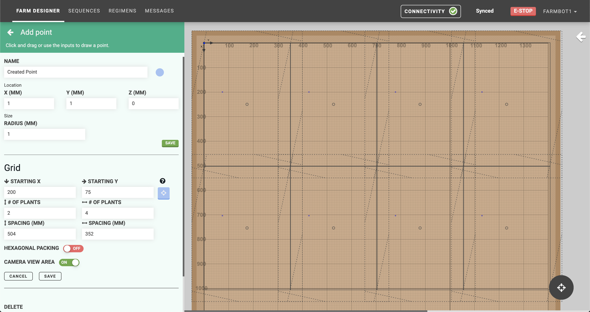
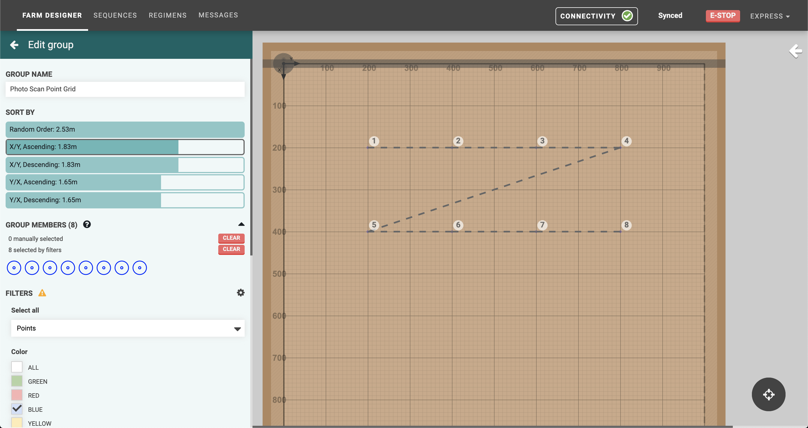
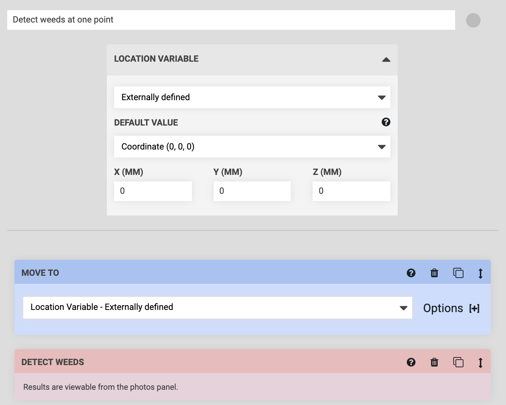
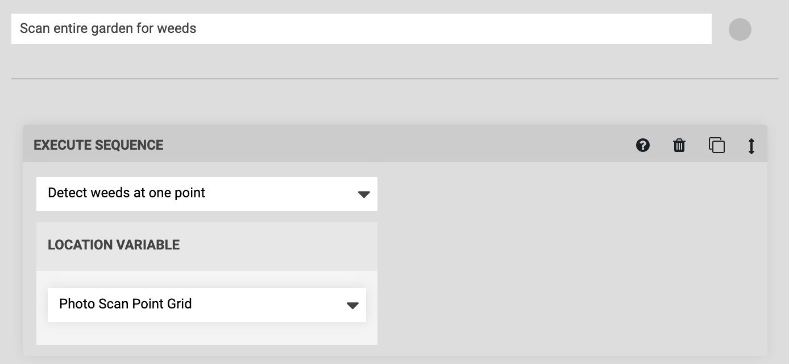
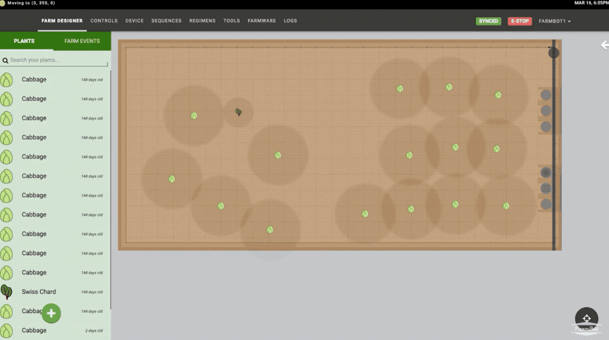



# Step 1: Create a point grid
Create a grid of **points** for every location you want FarmBot to take a photo at by using the **Grid** feature in the **Add point** panel. Toggling **CAMERA VIEW AREA** ON will allow you to visualize the camera's field of view in the map. Adjust the horizontal and vertical **SPACING** between points in the grid until there will be minimal overlap between photos. Then press **SAVE**.



# Step 2: Group the points
Create a **group** with all of the points in the point grid by first **Selecting all** `Points` and then checking the **Color** that you used in the previous step. Give the group a unique name such as `Photo Scan Point Grid`.

# Step 3: Create sequences
You will need to create two sequences to scan the whole garden. The first sequence will simply MOVE TO one of the points (via a location variable) and then DETECT WEEDS. We'll call this sequence `Detect weeds at one point`.

The second sequence will EXECUTE the `Detect weeds at one point` sequence for every point in the `Photo Scan Point Grid` group. We'll call this sequence `Scan entire garden for weeds`.

# Step 4: Scan the garden
You're now ready to RUN the `Scan entire garden for weeds` sequence and view the results in the farm designer.

After the first test run, you may need to:

  * Adjust the locations, spacing, and number of points in the grid
  * Adjust the color range or other weed detection parameters

# What's next?

 * [Weeds](../../The-FarmBot-Web-App/weeds.md)
