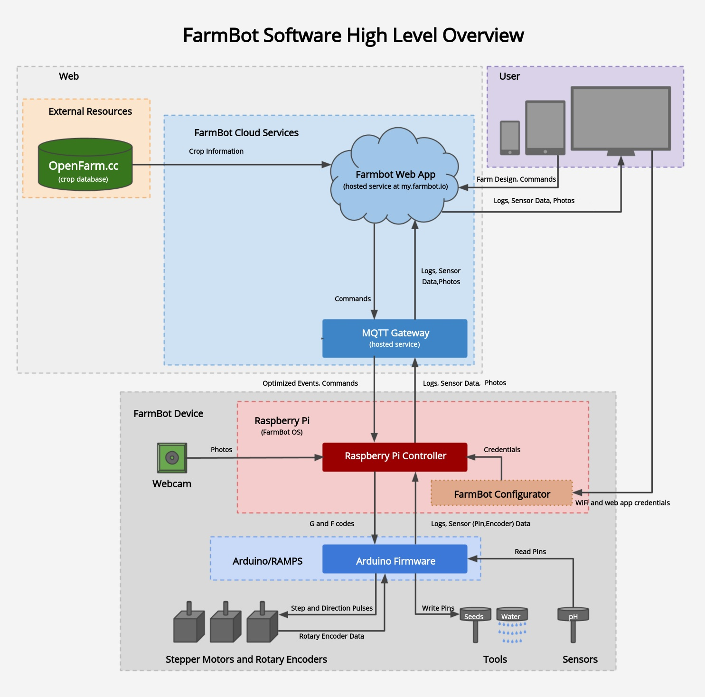
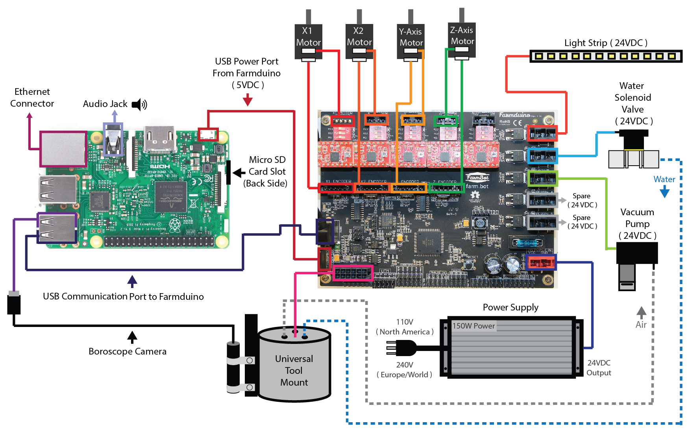
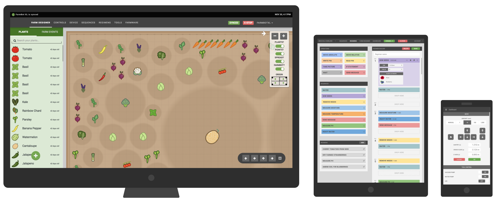

* toc
{:toc}

There are many **software systems** contributing to FarmBot's functionality. The diagram below shows the different components and how data flows between them. Read the brief descriptions of each component in the following sections to understand the system as a whole, and then dive into setting up the needed components for your FarmBot.

<iframe class="embedly-embed" src="//cdn.embedly.com/widgets/media.html?src=https%3A%2F%2Fwww.youtube.com%2Fembed%2FWQvQOfVNQB8%3Ffeature%3Doembed&display_name=YouTube&url=https%3A%2F%2Fwww.youtube.com%2Fwatch%3Fv%3DWQvQOfVNQB8&image=https%3A%2F%2Fi.ytimg.com%2Fvi%2FWQvQOfVNQB8%2Fhqdefault.jpg&key=f2aa6fc3595946d0afc3d76cbbd25dc3&type=text%2Fhtml&schema=youtube" width="854" height="480" scrolling="no" title="YouTube embed" frameborder="0" allow="autoplay; fullscreen" allowfullscreen="true"></iframe>

_High Level Overview_





The Raspberry Pi is the communications link to the FarmBot Web App. The Raspberry Pi communicates directly with the Farmduino board. The Farmduino is the central component of the FarmBot from a electronic systems perspective. This diagram shows how all of the FarmBot components interact with the Farmduino with the Raspberry Pi acting as the communications node between the Web App and the Farmduino.

_FarmBot Systems Diagram_

# The FarmBot web app
The **web app** allows you to easily control and configure your FarmBot from a web browser using your laptop, tablet, or smartphone. The application features real-time manual controls and logging, a sequence builder for creating custom routines for FarmBot to execute, and a drag-and-drop farm designer so you can graphically design your garden.

# FarmBot OS
FarmBot's Raspberry Pi runs a custom operating system named **FarmBot OS** to maintain a connection and synchronize with the web application via the message broker. This allows FarmBot to download and execute scheduled events, be controlled in real-time, and upload logs and sensor data. The OS communicates with the Farmduino/Arduino over a USB cable or serial connection to send G and F code commands, and also receive collected data from sensors and rotary encoders.

FarmBot OS has a built-in utility named **configurator** allowing you to easily enter WiFi and web app credentials from a WiFi enabled device (such as a laptop or smartphone). This is used for initial setup in order to get your FarmBot connected to your home WiFi and web app account.

# Arduino firmware
The **firmware** that is flashed onto the Arduino or Farmduino microcontroller is responsible for physically operating FarmBot's motors, tools, sensors, and other electronics. It receives G and F codes from FarmBot OS, and then moves the motors and reads and writes pins accordingly. It also sends collected data from the rotary encoders and pin reads back to the Raspberry Pi.

# OpenFarm
**[OpenFarm](https://openfarm.cc)** is a free and open database for farming and gardening knowledge. This service provides crop and growing information to the web app for a streamlined user experienced.

{%
include callout.html
type="success"
title="OpenFarm is built by us too!"
content="[OpenFarm](https://openfarm.cc) was originally conceived as a small component of the FarmBot project. As progress was made, it became clear that OpenFarm had no reason to be tied to FarmBot, but could rather live on its own. In September of 2014, 1,605 people [backed OpenFarm on Kickstarter](https://www.kickstarter.com/projects/roryaronson/openfarm-learn-to-grow-anything/). Today, OpenFarm is a standalone application, non-profit, and community. You can get involved with OpenFarm by joining the [Slack channel](http://slack.openfarm.cc), contributing on [GitHub](https://github.com/openfarmcc), or going to [OpenFarm](https://openfarm.cc) and creating content!"
%}

# What's next?

 * [Getting Started](getting-started.md)
