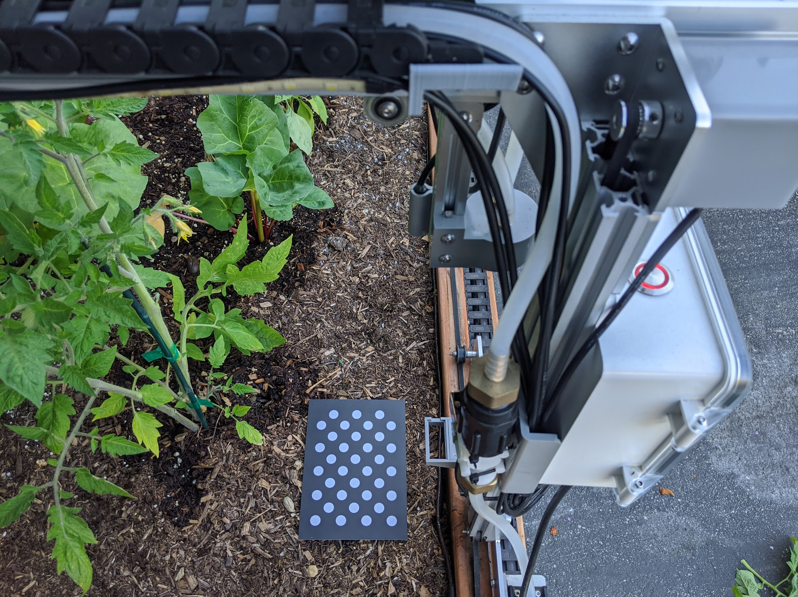
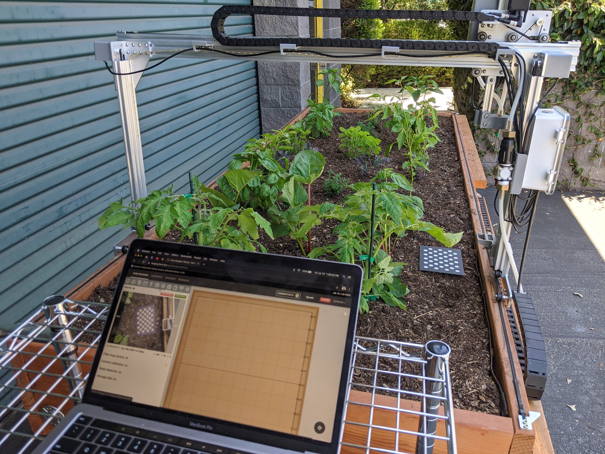
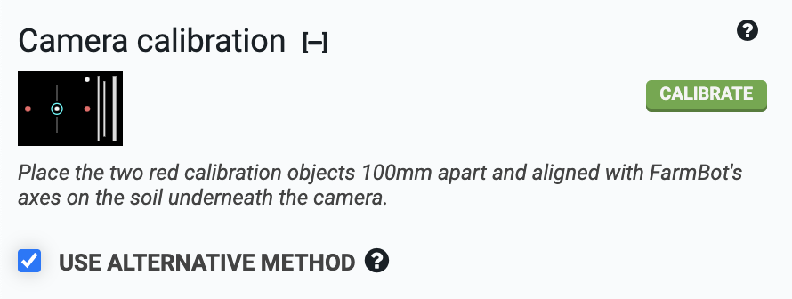
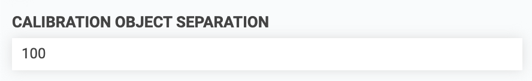

FarmBot's camera must be **calibrated** so that images can be **scaled**, **rotated**, and **positioned** such that the pixels in the images match up with the FarmBot coordinate system. This allows images to be displayed in the correct location in the farm designer map and also allows FarmBot to detect and locate objects in the garden, such as weeds.

There are two methods for camera calibration. [Method 1 - Calibration via dot grid](#method-1-calibration-via-dot-grid), is the preferred method because it is the most accurate and easiest to perform. Method 1 requires a printed **[camera calibration card](https://farm.bot/products/camera-calibration-card)** featuring a dot grid (shown below), which is included with all Genesis v1.5+ and Express v1.0+ kits.

[Method 2 - Calibration via two objects](#method-2-calibration-via-two-objects), is the less preferred method because it is more difficult. Method 2 should only be used if you do not have a printed camera calibration card featuring a dot grid.

# Method 1: Calibration via dot grid



## Step 1: Place the calibration card in the bed
Place the **camera calibration card** on the surface of the soil in your garden bed with the **dot grid** facing up. The rotation of the card does not matter, though it will help to orient the card square with FarmBot's axes in case you need to troubleshoot the calibration process.

## Step 2: Calibrate
From the [controls panel](../controls/move.md), move FarmBot directly over the camera calibration card and raise the z-axis as high as it will go. Now open the [photos panel](https://my.farm.bot/app/designer/photos) and scroll down to the **camera calibration** section. Expand the section and press the calibrate button. FarmBot will take a photo, then move 100mm in the +Y direction, take another photo, move 100mm in the +X direction, take a 3rd photo, and then move back to where it started.



Once calibration is finished, FarmBot will upload the resulting calibrated image as well as calculated values for **ORIGIN LOCATION IN IMAGE**, **PIXEL COORDINATE SCALE**, and **CAMERA ROTATION**.

If FarmBot is unable to detect the dot grid in any of the images, it will upload the problematic image and then move back to where it started. Inspect the image and make adjustments before retrying calibration. There are two main reasons FarmBot will not find the dot grid:

### Dot grid is outside the camera's field of view
If the camera calibration card was outside of the camera's field of view, or too far from the center of the image, then FarmBot may not detect it. Try moving the card a small amount (25mm) towards the center of the camera's field of view and retrying calibration.

### Poor lighting
If the lighting in the image is too bright or too dim, FarmBot will have trouble detecting the dot grid. To increase lighting, you may try toggling ON FarmBot's LED light strip, or waiting for another time of the day. To decrease lighting, you may try waiting until another time of the day when the garden is shaded.

## Step 3: Check results
After camera calibration, photos taken of the garden should line up with the grid when shown in the farm designer. If locations such as plants appear offset in photos when compared to the corresponding map locations, **CAMERA OFFSET X** and **CAMERA OFFSET Y** can be adjusted until they match.



# Method 2: Calibration via two objects



To use this method, check **USE ALTERNATIVE METHOD** in the camera calibration panel.

## Step 1: Place the calibration objects in the bed
Place two red calibration objects on the surface of the soil in your garden bed. The objects should be bright red, and preferably round. FarmBot kits over the years have included different calibration objects according to the table below:

|Kit                           |Calibration Object            |
|------------------------------|------------------------------|
|Genesis v1.2                  |[Red rubber caps](https://genesis.farm.bot/v1.2/Extras/bom/miscellaneous#red-markers)
|Genesis v1.3                  |[Red rubber caps](https://genesis.farm.bot/v1.3/Extras/bom/miscellaneous#red-markers)
|Genesis v1.4                  |[Red plastic golf tees](https://genesis.farm.bot/v1.4/Extras/bom/miscellaneous#red-markers)
|Genesis v1.5 and Express v1.0 |[Calibration card with red dots](https://genesis.farm.bot/v1.5/Extras/bom/electronics-and-wiring#camera-calibration-card)

The objects can be placed anywhere in the bed, but they need to be placed *square* with FarmBot's coordinate system and in a location where FarmBot's camera can be moved directly overhead. The objects should be separated about 100mm or more apart, but they must both be within the field of view of the camera.

## Step 2: Enter distance and orientation
Measure the distance from the center of one calibration object to the center of the next and input this distance in millimeters into the **CALIBRATION OBJECT SEPARATION** field.



Select the axis along which the calibration objects are placed. If you placed them in the direction of the tracks, select `X` in the **CALIBRATION OBJECT SEPARATION ALONG AXIS** drop down menu. If you placed them in the direction of the gantry, select `Y`.

For the **ORIGIN LOCATION IN IMAGE** setting, look at a photo you have taken with FarmBot's camera (take one using the take photo button if you haven't already). Determine which direction home is in the image, and select the corner of the image that corresponds to that direction. It can help to view a photo taken when FarmBot was at home `(0, 0, 0)`. If a corner of the image does not correspond to the origin, try rotating the camera until one does.

## Step 3: Select color range
For FarmBot to find the red calibration objects, it needs to know which shades of red to look for. The **HUE** color range slider should be set to approximately `20` to `160`, with the **INVERT HUE RANGE SELECTION** checkbox marked. This will select a hue range that includes various shades of red.

## Step 4: Calibrate
Move FarmBot directly over the calibration objects and raise the z-axis as high as it will go. Press the calibrate button and watch the status ticker. Once calibration is finished, FarmBot will upload the resulting image as well as calculated values for **PIXEL COORDINATE SCALE** and **CAMERA ROTATION**.

If more than the two red objects are detected in the image, adjust the **HUE**, **SATURATION**, and **VALUE** parameters until the two red objects are the only objects detected in the image. Detected regions of the image are outlined in green and circled in blue. Each new calibration will replace the previous calibration values.

The scan current image button can be used to run camera calibration on an image already taken instead of taking a new photo.

## Step 5: Check results
After camera calibration, photos taken of the garden should line up with the grid when shown in the farm designer. If locations such as plants appear offset in photos when compared to the corresponding map locations, **CAMERA OFFSET X** and **CAMERA OFFSET Y** can be adjusted until they match.



# What's next?

 * [Weed Detection](weed-detection.md)
 * [Scan the Garden for Weeds](../../FarmBot-Software/how-to-guides/scan-the-garden-for-weeds.md)
