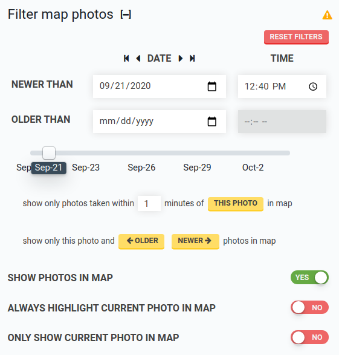

* toc
{:toc}

Filter map photos by using the **DATE** arrows, date and time inputs, or the date slider.

# Show photos in map

Toggle the map photos layer on or off.

# Always highlight current photo in map

When on, the photo currently displayed in the photos panel image viewer will be highlighted in the map with an orange border.

# Only show current photo in map

When on, all map photos except the photo currently displayed in the photos panel image viewer will be hidden.
