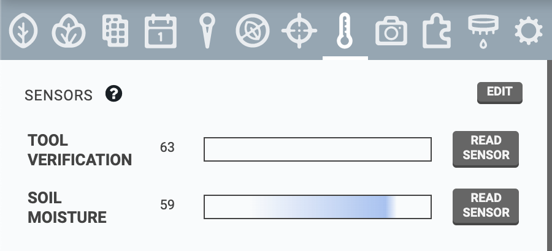
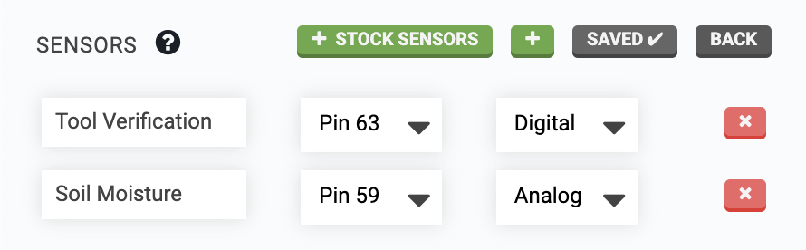
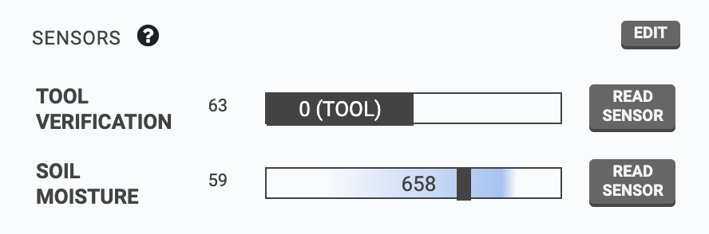

* toc
{:toc}

The **sensors panel** allows you to manage FarmBot's sensors, take measurements, and view historical sensor readings.



# Creating sensors
To create a new sensor, press EDIT, and then the <i class='fa fa-plus'></i> button. To define the sensor, provide a Name, choose a Pin #, and specify if the sensor is `Digital` or `Analog`. Pressing <i class='fa fa-plus'></i> STOCK SENSORS will add all of the standard sensors included with your FarmBot kit.



When finished editing, press SAVE.

# Reading sensors
To manually read a sensor, press its READ SENSOR button. FarmBot will then read the sensor and display the value in the widget. Digital sensors will provide a value of either `0` or `1`, while analog sensors will provide a value between `0` and `1023`.

You can also read sensors from [sequences](sequences.md) by using the READ SENSOR command. For more information, see the [read sensor command documentation](sequences/sequence-commands.md#read-sensor).

## Historical readings
Use the **SENSOR HISTORY** section of the panel to view sensor readings from the past. Optionally, you can filter by **SENSOR**, **TIME PERIOD**, and/or **X**, **Y**, and **Z** coordinates. The **DEVIATION** field can be used to filter within a range of locations around the specified coordinates. To remove all current filters, press CLEAR FILTERS.

# Deleting sensors
To delete a sensor, press edit and then the sensor's <i class='fa fa-times'></i> button. Finish editing by pressing back.



# Hiding sensors
If you do not plan to use any sensors, use the **HIDE SENSORS** toggle in the [app settings panel](settings/account-settings.md) to remove the sensors panel.

# What's next?

 * [Photos](photos.md)
