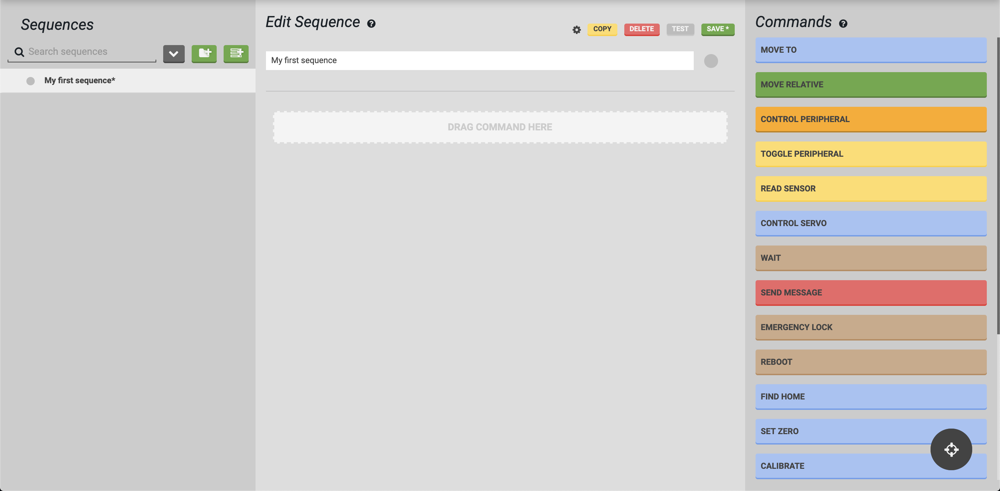
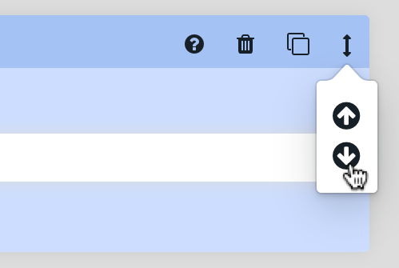
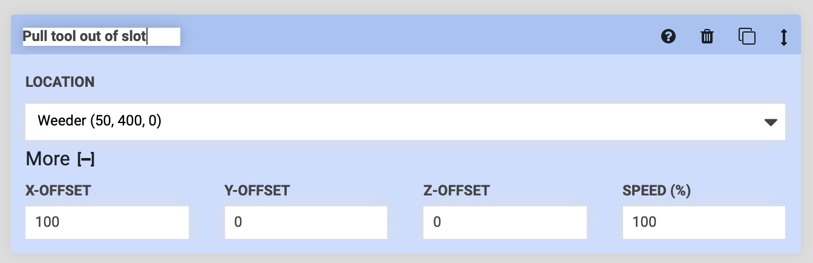

* toc
{:toc}

# Step 1: Create or select a sequence
In the **Sequences** panel, click the <i class='fa fa-server'></i> button to create a new sequence. Or, select an existing sequence if you would like to edit it. If you have many sequences, use the search box to find one more quickly.

Once a sequence has been created or selected, it will be loaded into the **Sequence Editor** panel, and the **Commands** panel will appear on the right side of the screen (on large screens). If you are using a small screen, such as on a smartphone, you will only see the **Sequence Editor** panel at this point.

# Step 2: Provide a name and color
In the **Sequence Editor** panel, enter a Sequence name and optionally assign it a color . The color will not affect FarmBot's execution of the sequence, it is only for helping you organize and recognize your own sequences.



# Step 3: Add commands
On large screens, add **commands** to your sequence by dragging and dropping them from the **Commands** panel into the **Sequence Editor** panel. When dragging and dropping, you can add the new command anywhere in the sequence (at the top, bottom, or somewhere in the middle). Alternatively, you can click a command and it will be added to the bottom of the sequence.



On small screens, click the Add command button located in the sequence where you would like to add the command. This will bring up the **Add Command** panel, where you can then click the command you would like to add at that location. If you change your mind, click the <i class='fa fa-arrow-left'></i> button to go back to the editor.

## Delete, copy, and re-order steps
Each step in a sequence has a cluster of icons in the top right: <i class='fa fa-question-circle'></i> <i class='fa fa-trash'></i> <i class='fa fa-copy'></i> <i class='fa fa-arrows-v'></i>.
 * Clicking or hovering over the <i class='fa fa-question-circle'></i> icon will bring up a tooltip with information about how to use that command.
 * Clicking <i class='fa fa-trash'></i> will delete the step from the sequence.
 * Clicking <i class='fa fa-copy'></i> will duplicate the step and all of its parameter values. The copy will be inserted directly below the original.
 * Clicking and dragging the <i class='fa fa-arrows-v'></i> icon will allow you to drag and drop the step to another location in the sequence.
 * Clicking the <i class='fa fa-arrows-v'></i> icon will show a popup with <i class='fa fa-arrow-circle-up'></i> and <i class='fa fa-arrow-circle-down'></i> icons. Clicking one of these will move the step up or down one position in the sequence. These controls are especially useful when using a touchscreen that doesn't work with drag-and-drop functionality.

# Step 4: Define step parameters
For each step (command) in the sequence, enter in your desired parameter values. Some parameters such as **SPEED** will have default values and do not need to be entered in every time. Other parameters require a value to be added or chosen every time.



# Step 5: Name each step
You can rename each sequence step by clicking on its name and typing in something new. While this is optional, naming each step with some descriptive text can allow you to easily remember what each step is for when you look at the sequence again tomorrow, or in a few months. It might also be useful if multiple people use the same FarmBot account, such as in a school setting, so everyone can understand what each sequence does.

# Step 6: Save
Click Save &ast; to save the sequence.



# What's next?

 * [Example Sequences](../sequences/example-sequences.md)
