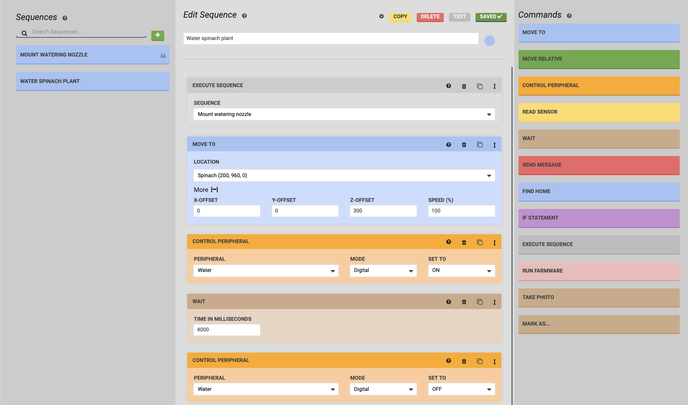

* toc
{:toc}

# Example 1: Tool mounting sequence

In this example we'll create a sequence to mount the watering nozzle tool.



## Step 1: Add the tool to a slot
If you haven't already, [create the watering nozzle tool in the web app and add it to a slot](../tools.md). Then place the real tool in the physical slot to ensure your real-life configuration matches the web app.

## Step 2: Create the sequence
Navigate to the **Sequences** page of the web app and press the <i class='fa fa-plus'></i> button to add a new sequence. The new sequence will appear in the sequence editor in the middle column. Give the sequence a descriptive name and optionally assign it a color.

## Step 3: Start from home
Begin the sequence with a movement to the home position. Add a Find Home command by clicking it or dragging it into the sequence from the **Commands** column.



## Step 4: Move above the tool
Next, we want to move FarmBot to a position directly above the tool to prepare it for descending and mounting the tool. Add a Move command by clicking it or dragging it into the sequence. Select the `Watering Nozzle` tool in the **LOCATION** dropdown and add a `100` mm **Z-OFFSET**.

## Step 5: Mount the tool
Now we want FarmBot to descend directly down to mount the tool. Add another Move command and select the `Watering Nozzle` in the **LOCATION** dropdown as before. This time, we will not add any offsets.

## Step 6: Pull the tool out of the slot
At this point, FarmBot's UTM would be mounted to the watering nozzle tool in the slot. The next step will be to pull the tool out of the slot. Add another Move command and select the `Watering Nozzle` as before. Then add a `100` mm **X-OFFSET**.

## Step 7: Save and test the sequence
Press the SAVE button to save the sequence. Then use the RUN button to try out your new sequence.



## Additional considerations
### Prepare for subsequent movements
It can be helpful to add a Move Relative command at the end of the sequence to move FarmBot in the positive Z direction. This will help reduce the likelihood of subsequent movements impacting any nearby objects (such as plants).

### Omit the homing step
You may consider omitting the Find Home command at the beginning of the sequence if the sequence is being used within a larger sequence that already has a Find Home at the beginning.

### Use a location variable
This example sequence can only be used to mount the watering nozzle tool, meaning you will need to make additional sequences to mount other tools. Consider using a [location variable](variables.md) to make this a generic _mount tool_ sequence that can be used to mount any of your tools.

# Example 2: Watering sequence

Now that we've created a sequence to mount the watering nozzle, let's create a sequence to water a plant. In this example we'll water a Spinach plant at coordinates `(200, 960, 0)`.

1. **Mount the watering nozzle** - Mount the watering nozzle by using the Execute Sequence step and selecting the `Mount Watering Nozzle` sequence created in the previous example.
2. **Move above the plant** - Move above the plant by selecting the Spinach plant and making use of a **Z-OFFSET**.
3. **Open the solenoid valve** - Add a Control Peripheral step to turn the `Water` peripheral `ON`. This will start the flow of water.
4. **Wait** - Use a Wait step to continue watering the plant for `4000` milliseconds (4 seconds).
5. **Close the solenoid valve** - Use another Control Peripheral step to set the `Water` peripheral to `OFF`, stopping the flow of water.
6. **Save and test** - Press the SAVE button and then RUN to try out your new sequence!

## Additional considerations
### Put the watering nozzle tool away
Now that you've mounted the watering nozzle tool and used the tool to water a plant, use another Execute Sequence step and a third sequence to put the watering nozzle tool away.

### Water any plant by using a variable
This sequence can only be used to water the specific Spinach plant chosen. Instead of making watering sequences for every plant in your garden, make this sequence a generic _Water plant_ sequence that can be used on any plant by using a [location variable](variables.md).

### Take a photo
While your FarmBot is located at the plant, consider using a Take Photo step to track the growth of your plant each time it is watered.

### Modularize the watering action
Consider making a sequence that only contains the steps required for dispensing water: Control Peripheral, Wait, and Control Peripheral. This can then be changed more easily and re-used in different ways with Execute Sequence steps in other sequences.
