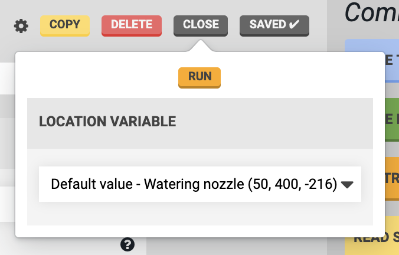
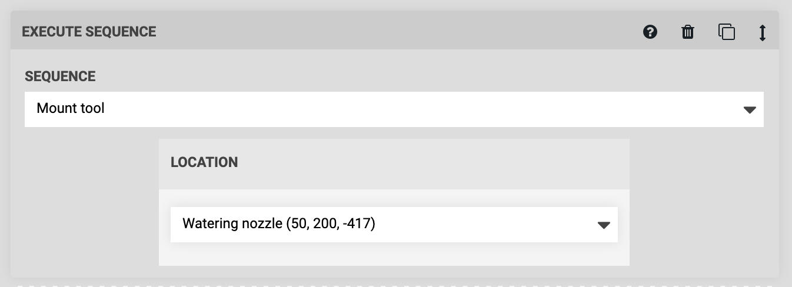
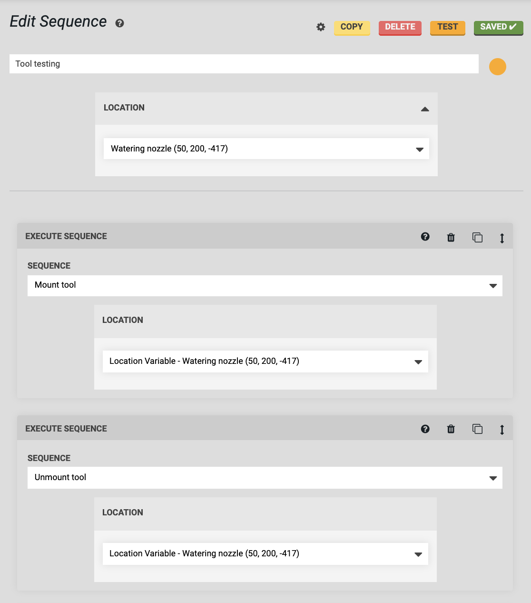
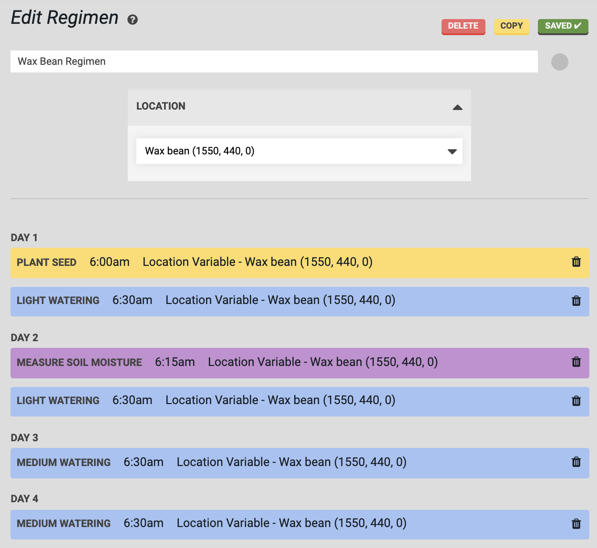
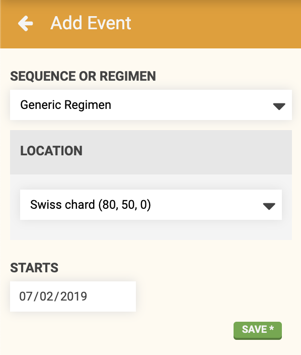

* toc
{:toc}

There are five places that you can provide a value for an **externally defined variable**:
1. When using the [run button](#run-button)
2. In an [execute step](#execute-step)
3. In a [parent sequence's header](#parent-sequence-header)
4. In a [regimen header](#regimen-header)
5. In an [event](#event)

# Run button
If you want to test run your sequence, you will need to provide a value for the variable to be used during the run. Simply click the RUN button and provide a variable value in the popup form. Then click RUN again and FarmBot will execute the sequence with the variable value provided. You can test run your sequence as many times as you want with the same or different variable values each time.

# Execute step
If you add your sequence to another sequence using an EXECUTE SEQUENCE command, then a variable form will be shown in the step.

# Parent sequence header
If you add your sequence to another sequence using an EXECUTE SEQUENCE command and choose `Location Variable - Add new`, then a *new variable* will be created that belongs to the parent sequence. You can then provide a value for that variable in the sequence header, and it will be passed into the subsequence(s). Notice that the value you choose will be displayed in each EXECUTE SEQUENCE command that the value will be passed into.



# Regimen header
If you add your sequence to a regimen, then a variable form will be shown in the regimen's header. You can provide a value right there, or choose `Defined externally`, in which case you will need to provide a value in the event that runs the regimen (see below). Notice that the value you choose will be displayed in each regimen item that the value will be passed into.

# Event
If you make an event for a sequence or a regimen with a variable set to `Defined externally`, then a variable form will appear in the add event panel.

