* toc
{:toc}

Below are descriptions of the basic commands you can use in a sequence. When using the web app, hover over the <i class='fa fa-question-circle'></i> icon in the top right of any sequence step to view usage information.

# Move

The Move command instructs FarmBot to move to a new location. To use this command, first choose a **LOCATION**  from the dropdown. Options include:

  * Custom coordinates
  * Offset from current location
  * Location variables
  * Tool and seed container locations
  * Plant locations
  * Map points
  * Weed locations

## Custom coordinates

When choosing the **custom coordinates** option, three input fields will be revealed allowing you to specify the exact **X, Y, Z** coordinates you want FarmBot to move to.

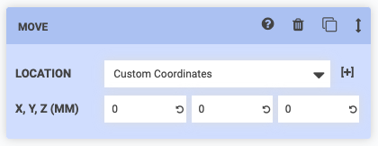

## Offset from current location

When choosing the **offset from current location** option, three input fields will be revealed allowing you to specify the **OFFSET** amount you want FarmBot to move to.

## Location variables

When choosing **variable - add new**, a variable form will be added to the sequence header. Upon selecting a variable value in the sequence header, the dropdown selections in all Move steps set to that variable will be updated. See the [variables](variables.md) documentation for more information.

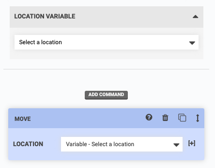

## Other locations

When choosing a **tool or seed container location**, a **plant location**, a **map point**, or a **weed location**, those resources will then become _in-use_, meaning that they cannot be deleted until you remove them from your sequence. If you update their coordinates, your sequence steps will be automatically updated.

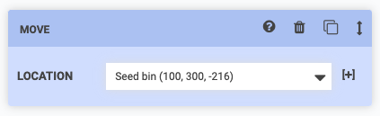

{%
include callout.html
type="warning"
title="Be careful when moving to tools or seed containers"
content="Under most circumstances you will need to mount a tool or pick up a seed from a seed container in **multiple steps**. First, you should move to the tool or seed container with a **positive z-axis offset**. This will allow FarmBot to then descend onto the tool or into the seed container from above in a second step (with no z-offset).

If you try to move to a location to mount a tool or pick up a seed in one step, you risk the z-axis traveling too low too quickly and the FarmBot crashing into the tool and/or bending a seed injection needle."
%}

## Advanced options

Within the **[+]** dropdown, you will find several options to modify the base **LOCATION** and several options for changing how FarmBot performs the movement. By default, the app will only load the **[+]** options in an open state if you've changed any of options from the default values. If you would like the **[+]** options to always load in an open state, set **OPEN OPTIONS BY DEFAULT** to YES from the <i class='fa fa-gear'></i> menu in the sequence header.

**OVERRIDE** allows you to override the X, Y, and/or Z values from the **LOCATION** field with new values. You may type in a custom coordinate, a formula, or disable an axis entirely. The Z axis override dropdown also includes a special **Safe Height** value. Currently the Safe Height is set to Z = 0, though this will be customizable in the settings panel in the future. Coming soon is a Soil Height option.



**OFFSET** allows you to add positive or negative offsets to the base **LOCATION**. This is useful when pulling tools out of slots, or when watering around or above a plant.

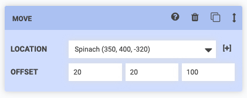

**VARIANCE** allows you to add randomness to a movement, in case you want to perform an action repeatedly (such as suppressing a weed) but with small variations between repetitions. In the example below FarmBot will move to 288 +/- a random variance between 0 and 4 on the X axis. Thus, the final X location will be a random value between 284 and 292.

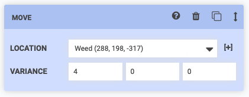

**SPEED (%)** allows you to slow down movement along an axis for greater precision, for example when mounting and dismounting tools. Speed is a percentage of the **MAX SPEED** for each axis.

**SAFE Z** allows you to instruct FarmBot to perform a MOVE command as three distinct movements:

  1. Move Z to the Safe Z height
  2. Move X and Y to the new location
  3. Move Z to the new location

This is useful when you need FarmBot to move across the garden but want to ensure it does not run into any plants or other objects.

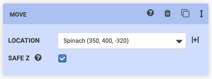

# Control peripheral

The Control Peripheral command allows you to control **peripherals** such as the vacuum pump, solenoid valve, and lights. To use this command, first select a peripheral from the **PERIPHERAL** dropdown. Options include:

  * All of the peripherals you have defined in the [peripherals section of the controls panel](../controls/peripherals.md)
  * The Box LEDs, if you have any included with your FarmBot version

Next, select the **MODE** which you would like to control the peripheral with. You can choose either `Digital` or `Analog`.

Last, specify what value you would like the peripheral to be **SET TO**. The digital mode allows for turning the peripheral **ON** and **OFF**, while the analog mode allows for controlling the peripheral with PWM (pulse width modulation) to any value between `0` and `255`.

## Advanced options

In the **sequence editor options menu** ( icon next to the copy sequence button), there is an option to **SHOW PINS**. Enabling this setting will show additional options in the **PERIPHERAL** dropdown for all of the Arduino's raw **pins**. If you have hooked up custom peripherals to any of the Digital Out or Analog Out pins on your electronics board, this is one way you can control them from a sequence like any other peripheral.



# Toggle peripheral



The Toggle Peripheral command allows you to toggle the state of a **digital peripheral**. For example, if a peripheral is currently ON, and then FarmBot _toggles_ that peripheral, it will get turned OFF.

To use this command, select a peripheral from the **PERIPHERAL** dropdown. Options include:

  * All of the peripherals you have defined in the [peripherals section of the controls panel](../controls/peripherals.md)
  * The Box LEDs, if you have any included with your FarmBot version

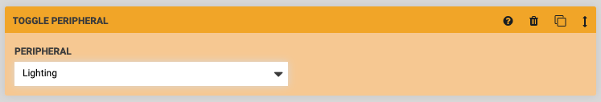

# Read sensor

The Read Sensor command instructs FarmBot to read the value of a **sensor**. For example, you would use this command to measure the soil moisture content with the soil moisture sensor. To use this command, first select a sensor from the **SENSOR** dropdown. Options include:

  * All of the sensors you have defined in the [sensors panel](../sensors.md)
  * All of the peripherals you have defined in the [peripherals section of the controls panel](../controls/peripherals.md)

Next, select the **MODE** which you would like to read the sensor with. You can choose either `Digital` or `Analog`. Use digital for a `0` (LOW) or `1` (HIGH) response, and analog for a reading between `0` and `1023` for 0-5V.

Last, optionally provide a **DATA LABEL** to allow your recorded sensor reading to be more searchable at a later date.

## Advanced options

In the **sequence editor options menu** ( icon next to the copy sequence button), there is an option to **SHOW PINS**. Enabling this setting will show additional options in the **SENSOR OR PERIPHERAL** dropdown for all of the Arduino's raw **pins**. If you have hooked up custom sensors to any of the Digital In or Analog In pins on your electronics board, this is one way you can read them from a sequence like any other sensor.



# Control servo

The Control servo command instructs FarmBot to move a servo to the provided **ANGLE**.

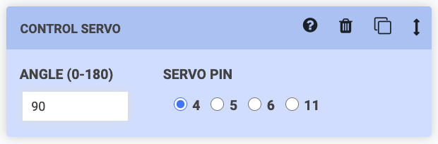

# Wait

The Wait command causes a delay before executing the next step in the sequence. This could be used to hold the solenoid valve open for FarmBot to water a plant for `2000` milliseconds (2 seconds), for example.

The maximum time allowed is 3 minutes (`180,000` milliseconds). If you need to have FarmBot wait for longer, use multiple steps.

# Send message

The Send Message command instructs FarmBot to send a message. This is useful for error and success notifications and debugging. To use this command, simply type in the **MESSAGE** you would like FarmBot to send, choose a **TYPE**, and select the channels you would like the message to be sent to.

`{{ x }}` can be used as a text variable for FarmBot's current x-axis position (`y` and `z` can also be used). `{{ pin13 }}` can be used to write the current value of pin 13 (pins 0 through 69 can also be used).

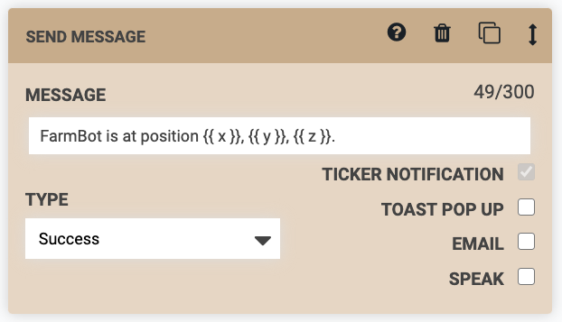

# E-stop

The E-stop command instructs FarmBot to stop operations (halt motor movements and turn off peripherals). To continue operations, you will need to manually unlock the device.

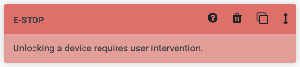

# Reboot

The Reboot command instructs FarmBot to power cycle the onboard computer.

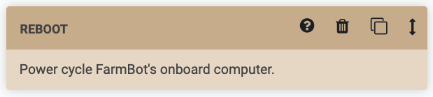

# Find home

The Find Home command instructs FarmBot to automatically find the home position for the chosen axis. If you choose **ALL**, FarmBot will find home for each axis one at a time in the order: z-axis, y-axis, x-axis.



# Set home

The Set home command instructs FarmBot to set the current location along an axis to `0`, also known as the `Home` position for that axis. If you choose **ALL**, FarmBot will set all axes to zero.

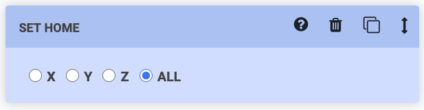

# Find axis length

The FIND AXIS LENGTH command instructs FarmBot to automatically find the length of the chosen axis. If you choose **ALL**, FarmBot will find the length of each axis one at a time in the order: z-axis, y-axis, x-axis.



# If

The If... command allows FarmBot to check if a condition is true or false and take an action based on the results. This allows for smarter, condition based farming, and for gracefully handling errors and failures.

If the condition that FarmBot checks is true, you can instruct FarmBot to execute another sequence or do nothing, in which case FarmBot will continue to the next step in the current sequence. If the condition that FarmBot checks is false, you can also instruct FarmBot to execute another sequence or do nothing.

In the example below, FarmBot will check **_IF..._** the **VARIABLE** (`Soil moisture`) `is less than` the **VALUE** (`500`). If that condition is true, **_THEN..._** FarmBot will execute a sequence to `Water the plant`. **_ELSE..._** (if the condition is not true), FarmBot will do nothing (ie: continue to the next step in the current sequence).

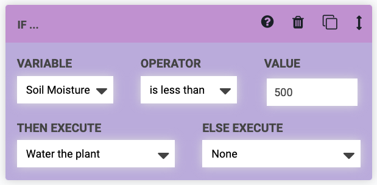

# Execute sequence

The Execute Sequence command uses *existing sequences* as *steps* in a *new, larger sequence*. This allows you to re-use smaller, simpler sequences in different combinations to create far more complex sequences that are easier to modify, manage, and mashup later because of their modularity.

For example, you could make a sequence to `Mount the watering nozzle`, another sequence to `Water the plant`, and a third sequence to `Unmount the watering nozzle`. Then, in a new sequence, you could use three Execute Sequence commands (one for each of the smaller sequences) to execute all the steps needed to water the plant.

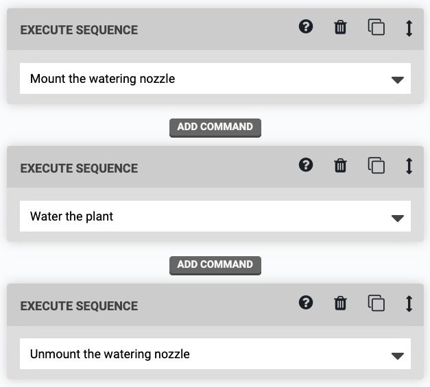



# Run farmware

The Run Farmware command instructs FarmBot to run a [farmware](../farmware.md). To use the command, select which farmware you would like to run from the **PACKAGE NAME** dropdown. Or, select `Manual Input` and type in the name of the package, for example, `plant-detection`.

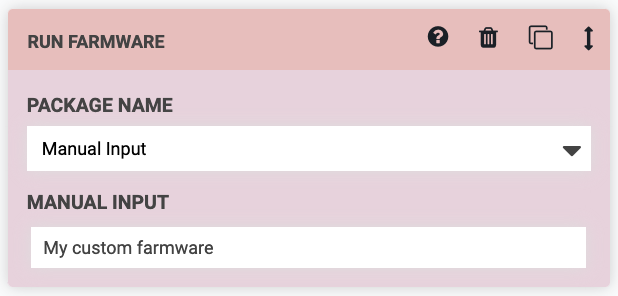

# Detect weeds

The Detect Weeds command instructs FarmBot to take a photo and run the weed detection software. After taking the photo and processing it, FarmBot will upload it to the web app, along with the coordinates from where the photo was taken, the date and time. FarmBot will also add any weeds that it identified to the **PENDING** category in the weeds panel.

# Take photo

The Take Photo command instructs FarmBot to take a photo with the USB camera or the Raspberry Pi camera (whichever is selected in [camera settings](../photos/camera-settings.md)). After taking the photo, FarmBot will upload it to the web app, along with the coordinates from where the photo was taken, and the date and time.

You can view the photos taken on the photos panel and in the farm designer.

# Mark as

The Mark as command instructs FarmBot to **MARK** an item's **PROPERTY**  **AS** the value of your choice. For example, you could mark a Spinach plant's `Plant stage` property as `Planted`. Using this command allows FarmBot to systematically update an item's properties as it works with that item. This step also accepts a Location Variable as an input, which can be used when running a sequence over a group of items.

While a variety of properties are available for each item type such as `X`, `Y`, `Z`, `Radius`, and `Color`, you can also set custom properties in the format `meta.custom-property`. These properties can then be viewed on the item's details panel in the farm designer, and you can also select items with these properties using advanced groups filters.

# What's next?

 * [Advanced Sequence Commands](advanced-sequence-commands.md)
 * [Building a Sequence](building-a-sequence.md)
