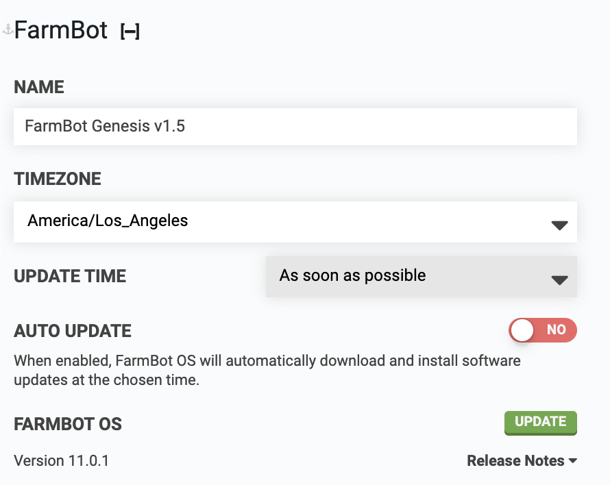

# Name
Give your FarmBot a fun name. For example: `Broccoli Overlord` 🥦 🤖

# Timezone
Set the device's timezone.



# Update time
With this dropdown you can choose the hour of the day when FarmBot will apply software updates so that updates occur at a convenient time (such as the middle of the night) when you do not have any events scheduled and do not plan to be working with your FarmBot.

You may also choose the `As soon as possible` option, in which case FarmBot will install updates immediately as they become available. Note that selecting this option may cause unexpected disruptions and event execution failures.

# Auto update
When enabled, FarmBot OS will automatically download and install software updates at the chosen time.



# FarmBot OS
View the version of FarmBot OS that you have installed on your device, that version's release notes, and install updates if they are available using the UPDATE button. Note that the update button will display as UP TO DATE when there are no updates available.

# What's next?

 * [Auto Updates](../../FarmBot-OS/farmbot-os/auto-updates.md)
