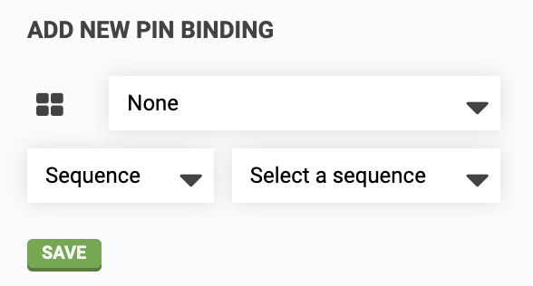

* toc
{:toc}

**Pin bindings** allow electrical signals from a button or sensor to trigger a FarmBot **action** or **sequence**. For example, a red button could be used to trigger the E-STOP action as recommended with FarmBot Genesis v1.4+ kits. For practical examples, see our [use FarmBot's buttons](../../FarmBot-Software/how-to-guides/use-farmbots-buttons.md) how-to guide.

# Adding a pin binding

To add a pin binding, first select the Raspberry Pi GPIO **PIN NUMBER** that your button or sensor is connected to (open the GPIO diagram for assistance by pressing the  icon). Next, choose the type of **BINDING** (either `Sequence` or `Action`) and then select the **TARGET** (the sequence or action desired). Press BIND to save the pin binding.







# Deleting a pin binding
To delete a pin binding, press the <i class='fa fa-times'></i> button.
