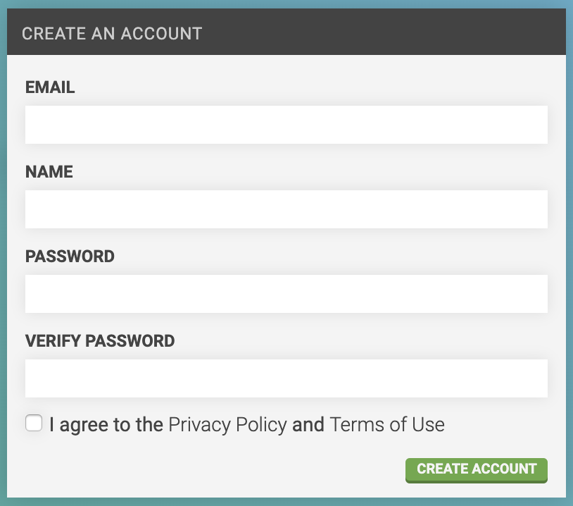
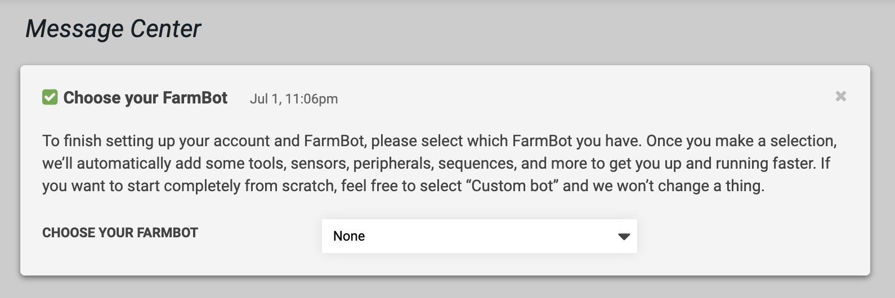

* toc
{:toc}

1. Go to [my.farm.bot](https://my.farm.bot)
2. Enter an Email, Name, and Password in the **CREATE AN ACCOUNT** widget
3. Check that you agree to our [privacy policy](http://privacy.farm.bot) and [terms of use](http://tos.farm.bot)
4. Click Create account
5. Check your email and click the link to confirm your account

# Choose your FarmBot
Clicking the email verification link will log you into the app and take you to the [message center](message-center.md). Here, you'll see a few messages to help you become familiar with the app, as well as one to **Choose your FarmBot**.

Once you let the app know which FarmBot model you have, it will add a set of resources (peripherals, sequences, etc) and apply a set of settings (map size, firmware version, etc) appropriate to your FarmBot model. This will allow you to get started working with your FarmBot more quickly.



# Connect FarmBot to your account
1. [Install FarmBot OS](../../FarmBot-OS/farmbot-os.md)
2. [Configure FarmBot](../../FarmBot-OS/farmbot-os/configurator.md) with the same email and password you used to create your web app account
3. Go to [my.farm.bot](https://my.farm.bot) and log in



# What's next?

 * [Message Center](message-center.md)
