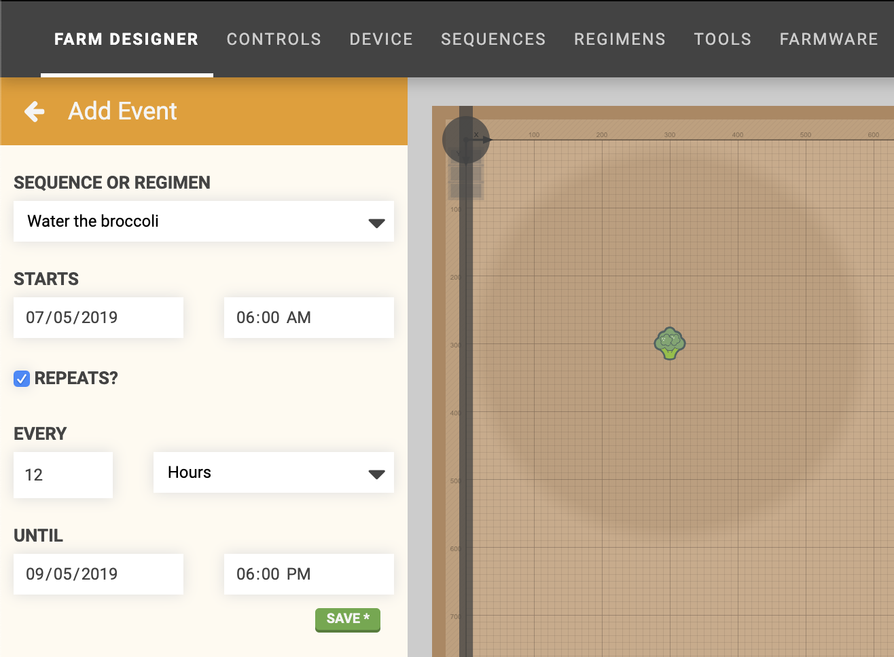

It would not be convenient for you to manually initiate sequences every time you want them to execute. This is where **events** come in to help. If you've ever used a calendar application before, you'll feel right at home with this. Let's get started

<iframe class="embedly-embed" src="//cdn.embedly.com/widgets/media.html?url=http%3A%2F%2Fwww.youtube.com%2Fwatch%3Fv%3Dvwnsr8zelaY&src=http%3A%2F%2Fwww.youtube.com%2Fembed%2Fvwnsr8zelaY&type=text%2Fhtml&key=f2aa6fc3595946d0afc3d76cbbd25dc3&schema=youtube" width="854" height="480" scrolling="no" frameborder="0" allow="autoplay; fullscreen" allowfullscreen="true"></iframe>

# Creating events
Navigate to the events panel on the farm designer page and press the <i class='fa fa-plus'></i> button to create a new **event**. Choose the **SEQUENCE OR REGIMEN** that you would like to execute and provide a **START** date and time. By default, the current date and current time + 3 minutes will be input into the date and time fields.

Optionally, sequence events can be set to **REPEAT EVERY** custom interval **UNTIL** a stop date and time.

> 📘
>
> New events must be scheduled at least one minute into the future.

If the sequence or regimen you selected has an [externally defined variable](sequences/externally-defined-variables.md), you will need to provide a value for that variable in the event creation panel.

Once you are finished, press the SAVE button to save the event. The event will now show up in the agenda.

# Editing events
To edit an event, hover over an event in the agenda view and press the <i class='fa fa-edit'></i> icon. Make the desired changes and press SAVE.



# Deleting events
To delete an event, click on it to open up the edit event panel. Then press the DELETE button.

# What's next?

 * [Points](points.md)
