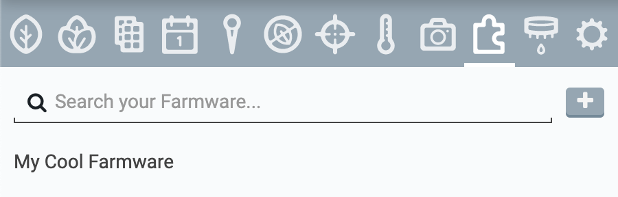
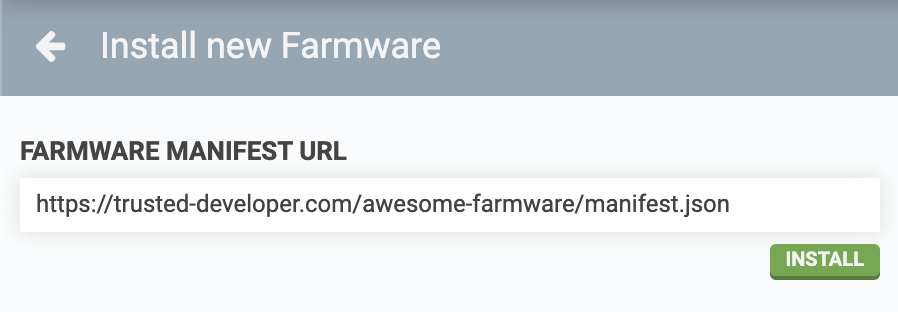
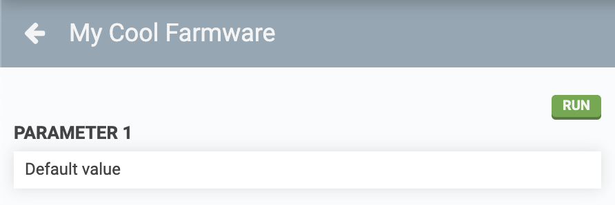
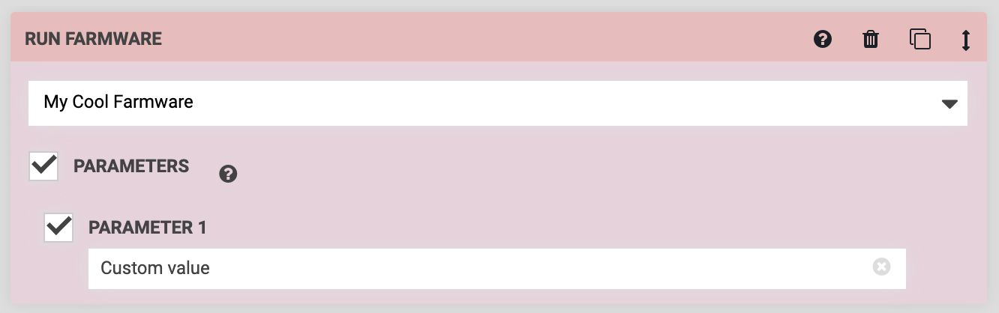

* toc
{:toc}



**Farmware** is FarmBot's plugin system allowing 3rd party developers to add custom functionality to FarmBot OS. Once a Farmware has been installed onto your FarmBot, it will show up in the **Farmware panel**. Selecting a Farmware from this list will show its options and controls.



# Installing Farmware



To install a new Farmware, press the <i class='fa fa-plus'></i> button on the Farmware panel. Enter the **FARMWARE MANIFEST URL** (link to the `manifest.json` file for the Farmware) and press install.

# Running Farmware

You can run a Farmware *manually* by selecting it in the Farmware panel and pressing the RUN button. If the Farmware accepts **PARAMETERS**, it will run using the default values as shown in the panel, which can be edited as needed.

You can also run Farmware *systematically* by using the Run Farmware command in sequences. By default, the Farmware will use values for all **PARAMETERS** as listed in the Farmware panel, but you can override those values on a per-command basis using the checkboxes and input fields in the sequence command.

# Removing Farmware
To remove a Farmware from your FarmBot, press the REMOVE button at the bottom of the Farmware details panel. Note that if the Farmware is still used in any of your sequences, those sequences will fail when they try to run the Farmware that is no longer available.



