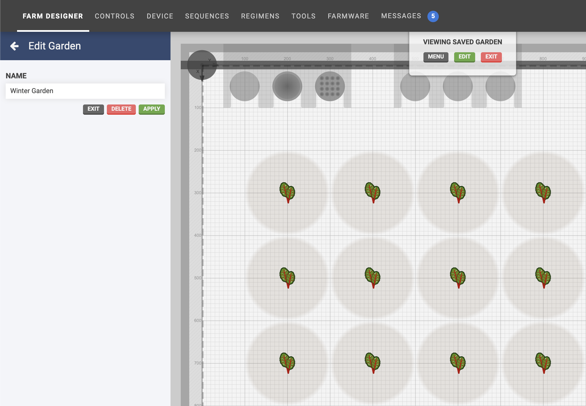

The **gardens** feature allows you to save a garden (all of the plants and their locations) for re-use at a later time. This can be especially useful if you want to have different gardens for each season.

# Save a garden
To save the current garden, first navigate to the **gardens** panel and click the <i class='fa fa-plus'></i> button.

Enter a **NAME** and click Snapshot current garden. A copy of the garden will then be saved and shown in the list of gardens.

> 📘
>
> Saving a garden may take a moment depending on the number of plants.

# View and edit gardens
Navigate to the **gardens** panel and select a garden.

This will load the garden into the map allowing you to view it, as well as add, re-locate, and delete plants from the garden. The map background will be displayed gray to indicate a saved garden (rather than the current garden) is being displayed and edited.

Once you are finished viewing and editing, click the Exit button located in the saved gardens panel, or the Exit button located in the **VIEWING SAVED GARDEN** menu at the top of the map area.

# Applying a garden
If you are ready to use one of your gardens, you must **apply** it to an empty map. First, delete all plants from the current garden (the one that is shown when you load the app). You can do this quickly by using the [multi-select mode](farm-designer.md#select-mode) and Select all button.

Once the current map is empty, navigate to the gardens panel, select a garden, and click Apply.

> 📘
>
> Applying a garden may take a moment depending on the number of plants.

# What's next?

 * [Events](events.md)
