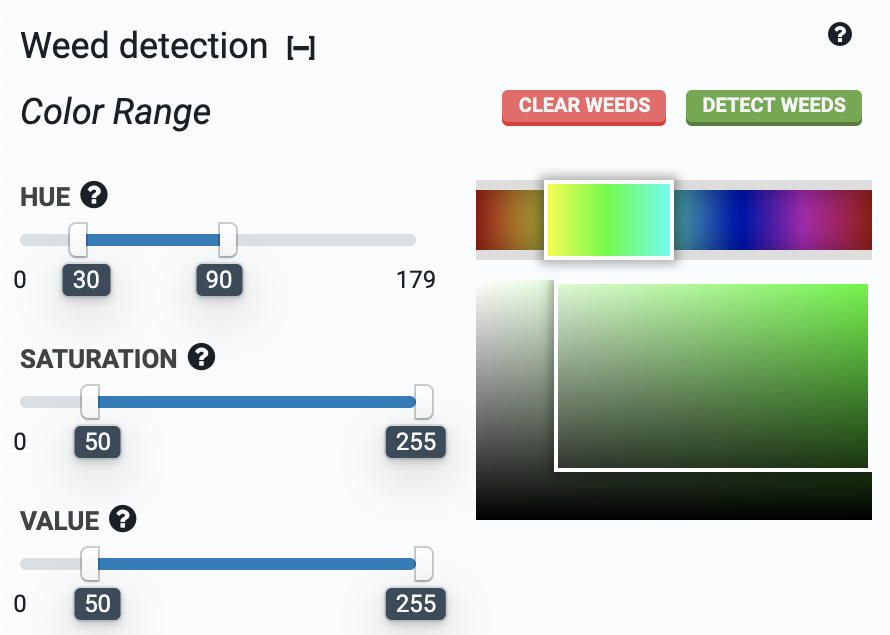
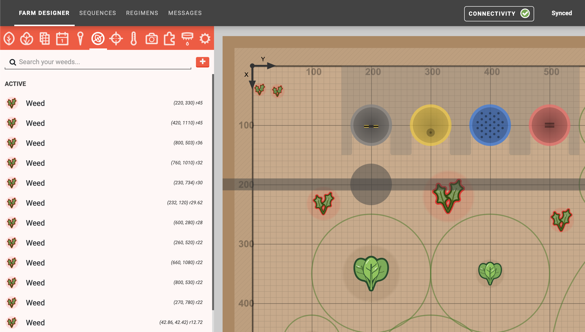
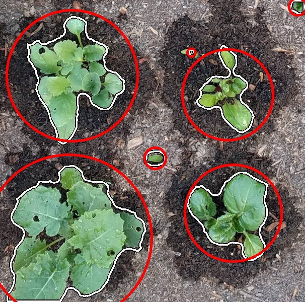
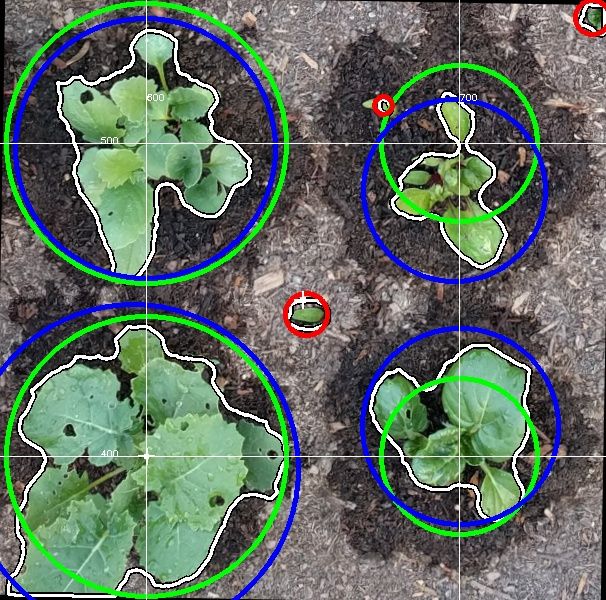
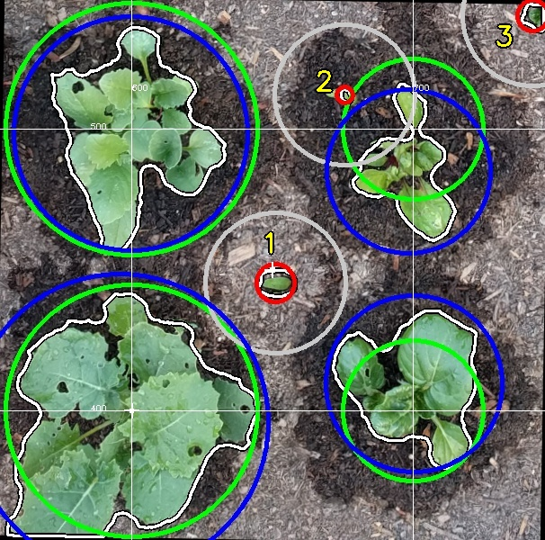
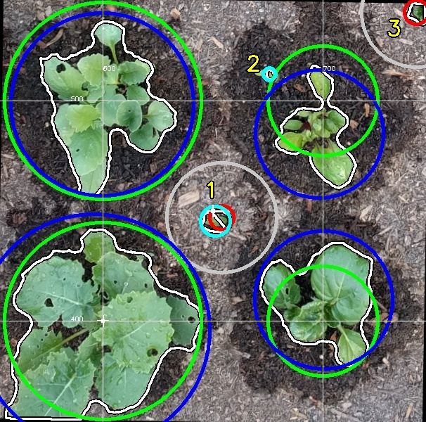
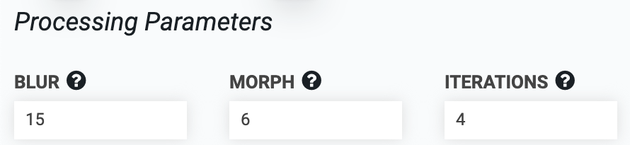

* toc
{:toc}

FarmBot is designed to remove weeds early and often, so that the weeds are always small, young, and fragile, and therefore easily removed by the [weeding tool](https://genesis.farm.bot/docs/weeder). FarmBot finds weeds by using computer vision software to detect all plants in the bed and then mark any detected plant that was not planted by FarmBot as a weed.

<iframe width="850" height="495" src="https://www.youtube.com/embed/_Qko08YBP2o" frameborder="0" allow="accelerometer; autoplay; clipboard-write; encrypted-media; gyroscope; picture-in-picture" allowfullscreen></iframe>



# Step 1: Select color range

The weed detector software needs a range of color to look for when determining what is a plant and what is soil or other background. Use the sliders for **HUE**, **SATURATION**, and **VALUE** to select a range of colors you want to detect. The color boxes will give an indication of the range selected. For the hue slider, a green color range is approximately `30` to `90`.



# Step 2: Detect weeds

Move the FarmBot over a section of soil. Press <span class="fb-button fb-green">detect weeds</span> to instruct FarmBot to take a photo and then process that image with the weed detection software. Any weeds found in the image will appear in the map, and be listed as **PENDING** in the weeds panel. See [Weeds](../weeds.md) for additional information.



<span class="fb-button fb-green">scan current image</span> can be used to run weed detection on an image already taken, instead of taking a new photo.

# Step 3: Scan the entire garden

Detect weeds across FarmBot's entire bed by creating a sequence of movements in a grid pattern with a <span class="fb-step fb-run-farmware">detect weeds</span> command at each grid point. For step-by-step instructions, see the [Scan the Garden for Weeds How-to guide](../../FarmBot-Software/how-to-guides/scan-the-garden-for-weeds.md).

# Step 4: Remove weeds with FarmBot

Weed removal can be performed by creating a weed removal sequence that uses the weeding tool on weeds in the farm designer.

# How it works

If we process a photo of our garden bed without providing any information, we would detect all the plants in the image:



However, we want to determine what is a weed, and the locations of those weeds.

So we feed the plant detection software some calibration parameters, letting it determine the location of the objects in the image. Based on the known locations of desired plants in the image, we can determine which plants are desired plants, and which ones are weeds.

Known (desired) plants are marked with a green circle, the detected plants that match the desired plants are marked with a blue circle, and the detected plants that do not match desired plants are marked with a red circle (those are weeds):



You can see a grid overlay showing the coordinate system and that the image has been rotated slightly to adjust for camera rotation.

_But wait!_ Our weeding tool is a certain size, and disrupts the soil within a certain area, its region of influence. We can represent that disrupted region with a grey circle:



We see that the weeder might affect the lower left plant when weeding weed number `1`, since its region of influence is intersecting the desired plant's circle. We also see that we wouldn't be able to weed `2` without significantly disrupting the upper right plant. We can weed `3` safely.

The software takes the weeding tool size into consideration with a feature called __Safe Remove__.

It adjusts the location to be weeded for weed `1` away from the lower left plant, removes weed `2` from the list since it can't be removed safely, and keeps `3` on the list of weeds to remove since there are no conflicts. You can see the weeds to remove and the weeder location represented with the red and grey circles as before, and cyan circles drawn for weeds that may not be removed completely (or at all) because the action might harm a desired plant:



You may now instruct the machine to remove the weeds marked in red, and remove the weeds marked in cyan by hand.

Program text output

```
7 plants detected in image.

4 known plants inputted.
Plants at the following machine coordinates ( X Y ) with R = radius are to be saved:
    (   600   400 ) R = 45
    (   600   500 ) R = 45
    (   700   400 ) R = 25
    (   700   500 ) R = 25

2 plants marked for removal.
Plants at the following machine coordinates ( X Y ) with R = radius are to be removed:
    (   743   541 ) R = 6
    (   654   447 ) R = 6

2 plants marked for safe removal.
Plants at the following machine coordinates ( X Y ) with R = radius were too close to the known plant to remove completely:
    (   651   446 ) R = 7
    (   676   512 ) R = 3

4 detected plants are known or have escaped removal.
Plants at the following machine coordinates ( X Y ) with R = radius have been saved:
    (   700   410 ) R = 31
    (   596   396 ) R = 53
    (   698   485 ) R = 29
    (   600   499 ) R = 42
```

# Troubleshooting

These are some common errors that can occur when doing weed detection.

## Invalid coordinate conversion values

**<span class="fa fa-circle red"></span> [plant-detection] ERROR: Coordinate conversion calibration values invalid for provided image.**

This error occurs because the camera was calibrated at a different z-axis height than the current z height. This error can also happen if the camera rotation value was changed significantly after camera calibration. The solution is to move to the calibrated height (usually 0) or re-calibrate the camera.

## Poor results



Once an image has been taken with the camera, the weed detector software will process it. There are several advanced processing parameters (**BLUR**, **MORPH**, and **ITERATION**) that can help you fine tune the system to perform the best in your environment. The default values should work in most circumstances, though if you are seeing poor results or working in a non-standard environment, you may adjust these settings to further tune your system.



# What's next?

 * [Scan the Garden for Weeds](../../FarmBot-Software/how-to-guides/scan-the-garden-for-weeds.md)
 * [Weeds](../weeds.md)
