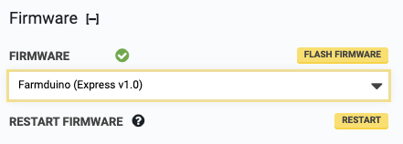

* toc
{:toc}

# Firmware

Select the firmware to be used with your electronics board. This will flash the selected firmware to the microcontroller. Pressing FLASH FIRMWARE will manually flash the firmware, which may be required when installing a new electronics board.

# Restart firmware

This will restart the firmware. This may be useful for developers.
