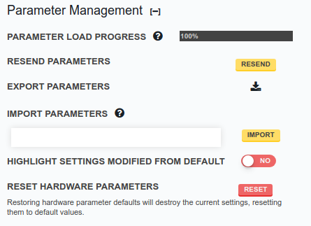
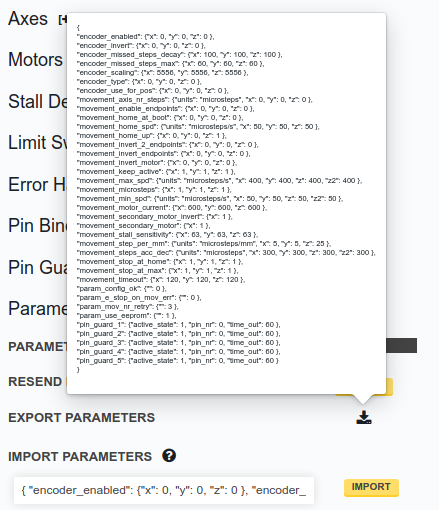

* toc
{:toc}

# Parameter load progress

The progress bar shows the percentage of parameters that FarmBot has received.
When a setting is changed, this will briefly drop below 100% as the parameter
is saved and synced to your device.

# Resend parameters

If the __PARAMETER LOAD PROGRESS__ bar does not reach 100% within a few
minutes of changing a setting, press RESEND
to send the parameters to FarmBot again.

# Export parameters

Press the <i class='fa fa-download'></i> icon to view all parameter data
in a format that can be copied and pasted to share with others or save for later use.

# Import parameters

Parameter data from the __EXPORT PARAMETERS__ button can be imported into your account
by pasting it into the input field and pressing IMPORT.
Imported data will replace all parameters in your account.

# Show advanced settings



Some settings are not shown by default because they are only useful in very special circumstances and can cause problems for non-advanced users. To show advanced settings, turn ON the **SHOW ADVANCED SETTINGS** toggle.

# Highlight settings modified from default



Disable this toggle to hide the high-visibility border around every parameter
that differs from the default value. Default values for individual parameters
are available in the <i class='fa fa-question-circle'></i> tooltip for the parameter.

# Reset hardware parameters

This will restore all settings to their default values, as shown in each setting's tooltip.
