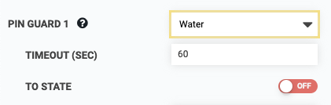

* toc
{:toc}

The pin guard feature provides an extra layer of safety to your FarmBot in the event of a software malfunction in FarmBot OS or a disruption in connectivity. When a pin guard is set, the firmware will automatically set the selected **PIN NUMBER** to the selected **STATE** after the **TIMEOUT** is reached. For example, the pin connected to your solenoid valve could be set to automatically turn OFF after 60 seconds. This would prevent flooding your garden if you manually turned the water on and then connectivity between your web browser and the FarmBot cut out, preventing you from turning the water off on your own.

