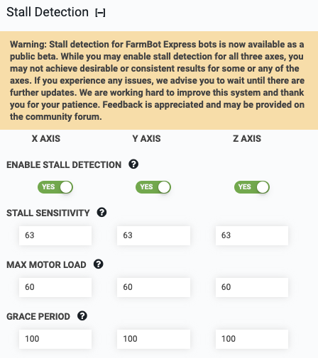

* toc
{:toc}



The **stall detection** feature for FarmBot Express bots utilizes the Trinamic TMC2130 stepper drivers’ capability of measuring back-current as a way of determining motor load, and thus when a stall has occurred. For more details, see the [stall detection hardware page](../../FarmBot-OS/arduino-firmware/stall-detection-hardware.md).



Thus far we recommend a **STALL SENSITIVITY** of 63 (least sensitive), a **MAX MOTOR LOAD** of 60 (out of 100), and a **GRACE PERIOD** of 100 steps to ignore during acceleration. We may change, add, or remove tuning parameters based on additional testing and feedback, but here’s what you may be able to expect today:

  * Stall detection is very sensitive to speed. I am running my motors quickly (~180mm/s on X and Y) to achieve good results. Going slower usually makes the driver think it is under heavier load; which we’re still investigating. Because speed is low and load is high during acceleration, you can increase GRACE PERIOD to ignore the accelerating portion of a movement. You may also shorten the distance the bot accelerates for.
  * Stall detection is very sensitive to motor current. Play around!
  * Changing sensitivity seems to have little effect in most scenarios, but we’re curious what your results are.

The bot considers that it has stalled when the motor load goes over the **MAX MOTOR LOAD**.
Each axis will need different settings, and you may not find settings that give good results yet for some or all of the axes. If so, just disable stall detection for now until the next update.

# Enable stall detection

Enable use of motor stall detection for detecting missed steps, finding axis length, and finding home.

# Stall sensitivity

These values change how sensitive the stepper driver is when determining if a motor has stalled. Changing the value currently has only a small effect on performance. It is recommended to keep the value set to 63, which is the least sensitive. Changing this to a more sensitive value will likely cause increased false stall detection.

# Max motor load

Maximum motor load (out of 100) as determined by the stepper driver before a motor is considered to have stalled. To tune this setting, navigate to the controls panel and open the **MOTOR LOAD** popups to see how your bot performs under various movement conditions. You should test:

  * Movements in the positive and negative direction
  * Movements at various locations along an axis
  * Finding home and finding axis length
  * Holding the FarmBot by hand to create a real stall

**MAX MOTOR LOAD** should be high enough to prevent false stall detections and low enough to ensure that when the bot does stall, it is correctly detected.

# Grace period

The stepper drivers are only capable of identifying stalls when instructing the motors to move at higher speeds. Thus, when the bot is accelerating at the beginning of a movement and still moving slowly, it is not possible to correctly identify a real stall. **GRACE PERIOD** is the number of steps for stall detection to ignore during acceleration.

If you find that FarmBot is detecting false stalls at the beginning of movements, you may increase the **GRACE PERIOD** value to ignore more of the beginning of the movement. You should not set the value too high otherwise it may take FarmBot much longer to detect when a real stall occurs.
