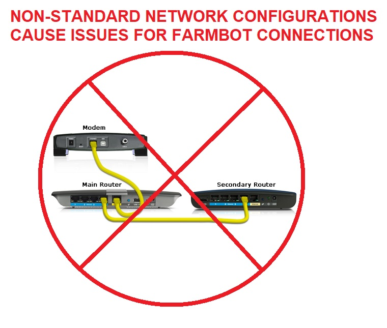

* toc
{:toc}

# Perform a hard reset

When your device has software problems, it's best to perform a software reset before investigating. There are two ways to perform a reset of FarmBot's software, **but only one way is recommended when investigating software problems**.

**Soft reset:** A soft reset is performed by clicking the SOFT RESET button in the web app. It is only useful for simple tasks like changing WiFi passwords. It is not appropriate for diagnosing software problems or starting a device from a "clean slate" because it will not remove all configuration data from an SD card. **Do not use the SOFT RESET button if you are troubleshooting a software problem.** You should instead perform a "hard reset".

**Hard reset:** A hard reset will cleanly re-write FarmBot OS to an SD card. It will overwrite corrupt data and is the preferred method to perform a reset when a device is having software problems.

_A hard reset will cleanly re-write FarmBot OS to an SD card._

To perform a hard reset:

1. Power down the device
2. Remove the SD card
3. [Re-flash FarmBot OS onto the SD Card from a desktop computer](../../FarmBot-OS/farmbot-os.md)

In summary:

 * Only a hard reset will remove old or corrupt data from your device's SD card
 * A hard reset will require you to re-run configurator
 * A hard reset **will NOT** destroy account data such as sequences or events.
 * Always hard reset your device to the latest version of FBOS prior to investigating software problems. A soft reset is not adequate.

#  Use "Isolated Mode" to find problem sources

The first priority when debugging a complicated software problem is to remove as many components as possible and slowly re-introduce components until the problem is reproducible. This assists FarmBot staff in isolating the source of the problem, a key step in finding a fix. Please perform the following steps prior to contacting FarmBot support regarding non-physical device problems:

 1. Perform a [hard reset](#perform-a-hard-reset) of the device's SD card.
 2. If the issue persists after a hard reset, remove the Raspberry Pi from the electronics box by unscrewing the hex screws that anchor it to the case as well as removing any components that may be connected to it, such as the realtime clock. You do not need to keep the Farmduino board connected to the Raspberry Pi. A Farmbot does not require a Farmduino to come online.
 3. Bring the device inside and as close as possible to the WiFi modem, removing all intermediate routers between the device and the modem. You can power the Raspberry Pi using a standard cellphone charger and USB cable.
 4. If you have a home network with multiple routers (sometimes referred to as "daisy chaining"), **connect directly to your modem**. Do not attempt to connect through intermediate routers. For example, if the device had an intermediate router to extend its WiFi range, do not connect to this router, even if you are certain that it is properly configured. Instead, connect directly to your internet modem with no additional network hardware between the Raspberry Pi and the modem.
 5. Once your device has been removed from all peripherals and extra networking equipment, it is in "isolated mode". You should re-connect additional components one-by-one until the software issue is reproducible. If your device is under warranty, FarmBot may be able to provide additional assistance, though support staff will not assist with configuration of your local network. Please contact your ISP or IT department for inquiries related to network configuration.

# My device rapidly disconnects and reconnects

An unstable network connection is the most common support request that FarmBot receives from customers. In most cases, it is caused by the local network or an account-specific misconfiguration.

The most common reasons for an unstable device connection are:

 * (common) Using multiple routers to connect a device to the internet, especially routers that were not provided nor configured by your internet service provider.
 * (common) Misconfigured NAT, DNS or DHCP settings in one of the routers on the local area network.
 * (common) The user's laptop is on a VPN or "daisy chained" router configuration and the connectivity problem is on the user's machine rather than the device.
 * Security software such as firewalls, content blockers or antivirus software.
 * Installing the FarmBot too far from a WiFi access point.
 * Running large FarmEvents that consume too much memory and crash FarmBot OS
 * Iterating over extremely large point groups that cause FarmBot OS to crash.
 * Running a sequence that calls itself in a never ending loop (recursive sequence).
 * Any other operation that would consume all of FarmBot's CPU or memory resources.

**How to fix the problem:**

1. Bring your device into "isolated mode" before troubleshooting or contacting support staff.
2. If your network runs security software or multiple routers, please review the information provided in the document ["FarmBot for IT Professionals"](for-it-security-professionals.md).
3. Ensure security software is properly configured per the document above. For extra traceability, you may wish to temporarily disable firewalls or content blockers prior to proceeding. Always check with IT staff prior to making network changes. FarmBot will not provide security or network configuration advice.
4. If the problem goes away after entering isolated mode, the problem is most likely caused by network configuration of the local area network. Contact your ISP or IT department for support. FarmBot, Inc. does not assist customers in configuring their local network.
5. If isolated mode does not fix the issue, disable all FarmEvents temporarily. Contact support if this does not fix the issue. Please have your order number ready, as well as the email associated with your FarmBot account.

{%
include callout.html
type="info"
title="Important note about FarmBot's network settings"
content="FarmBot has higher connectivity requirements than those needed for simple desktop computing tasks such as checking email, web browsing, etc. Additionally, a Raspberry Pi's WiFi modem uses considerably less power than a desktop WiFi modem and is also restricted to only one WiFi band, unlike many desktop computers. This means that a Raspberry Pi cannot adapt to WiFi issues the way a desktop computer can. **A network that is suitable for desktop web browsing might not be suitable for a Farmbot.**"
%}

# FarmBot is trying to connect too often

Occasionally, a device will be temporarily banned from the server because it is trying to re-connect too often. This is usually caused by one of the following problems:

 * Bad network settings such as a bad DNS, DHCP or NAT setting. This is often seed in "daisy chain" networks that were set up by end users rather than ISP staff.
 * Overly aggressive security software on the local network
 * (less common) Malfunctions in custom software developed by third party software developers, such as researchers or power users.

**How to fix the problem:**

 * Disable third party software.
 * Contact your ISP or IT department to review your firewall, DHCP, NAT and DNS settings.

# FarmBot does not come online after configuration

If your FarmBot does not come online after configuration, one or more of the following problems may apply:

 * You entered a bad WiFi password, account email or account password into the WiFi settings for configurator.
 * Your wireless hotspot is not properly configured or is blocking FarmBot.
 * Your ethernet cable is broken. Verify that your cable works before proceeding by attaching it to a known-working computer.
 * Your device is so far from the WiFi router that it cannot connect reliably.
 * Your network's security software has erroneously labelled FarmBot as a "rogue access point".

**How to fix the problem:**

 * Verify that your cabling works on a known-good machine.
 * Double check passwords and email address. **Case sensitivity matters.**
 * Enter "isolated mode" and try to connect to a different WiFi network to rule out the possibility of network-related problems.
 * Bring the device closer to the WiFi access point.

# FarmBot does not start configurator

If your FarmBot does not enter configurator mode, one or more of the following problems may apply:

 * You flashed the wrong version of FarmBot OS onto the SD card. Example: Trying to use the Express version of FBOS on a Genesis device.
 * You are outside of the device's WiFi range
 * Your SD card contains corrupted data. Fix this issue by re-flashing FBOS onto the SD card using Etcher.
