**Planting your first garden** is an exciting time for every FarmBot owner. In this how-to guide, we'll walk you through everything you'll need to do to get seeds in the ground with FarmBot. Before we get started though, please make sure you have completed the following prerequisites:

  * FarmBot must be completely assembled, powered up, and connected to the web app
  * FarmBot must be able to move along the full length of each axis without error
  * FarmBot must be able to turn the vacuum pump on and off without error
  * If your FarmBot has a UTM and interchangeable tools, it must be able to mount the seeder tool and pull it out of its slot without error

# Step 1: Add plants to your map

## Select crops

For your first garden, we recommend selecting **easy-to-grow crops** and growing **no more than 5 different crop types** at once. Refer to our [seed selection guide](http://seeds.farm.bot) and consult with your local nursery or master gardener to choose crops that are in-season, available, and will work well with FarmBot, your soil, and your climate.

## Add plants to the map

Once your crops are chosen, add them to the farm designer map by navigating to the [plants panel on the farm designer page](https://my.farm.bot/app/designer/plants) and clicking <i class='fa fa-plus'></i>. Type in a crop name to the search field, for example `Spinach`, and then select the best search result. Click `ADD TO MAP` and then click anywhere in the map to add a plant at that location.



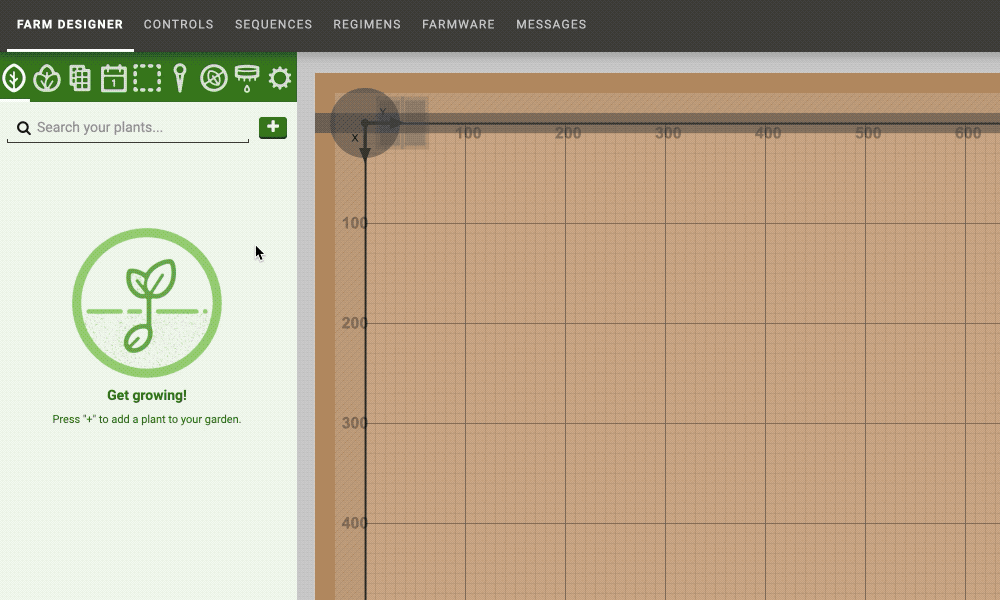

When you are finished adding plants of the first crop type, press the <i class='fa fa-arrow-left'></i> button or the `esc` key to return to the plants panel. To add plants of another crop type, click <i class='fa fa-plus'></i> again and begin a new search.

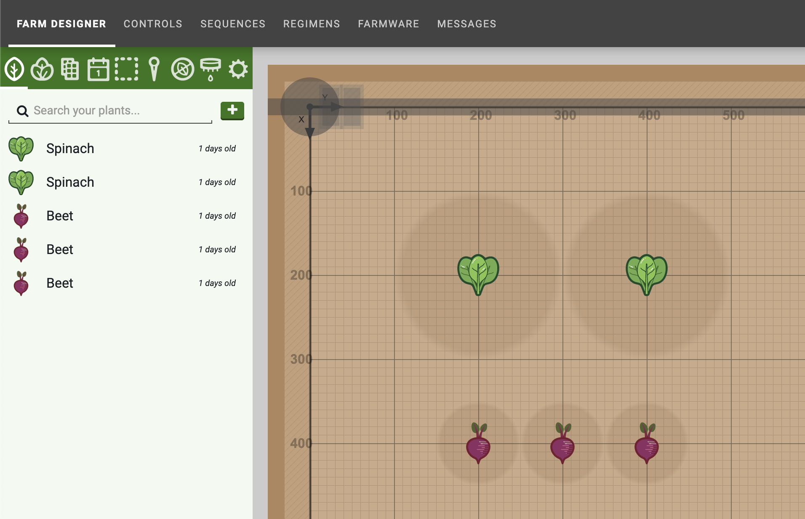



## Rearrange and remove plants as needed

If you need to rearrange or remove any plants, click the plant icon in the map that you wish to edit. Then drag-and-drop the plant to a new location in the map, manually type in new **X** and **Y** coordinates, or press DELETE to remove it.

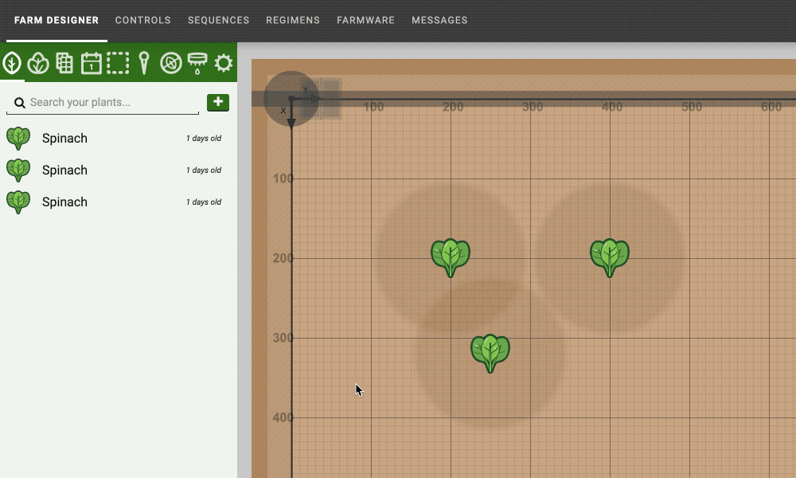

# Step 2: Create groups for each crop type
Navigate to the **groups panel** and click <i class='fa fa-plus'></i>. **Select all** plants, and then **FILTER** by **Type** so that only the plants of one crop type are highlighted in the map. Give your group a descriptive name such as "All Spinach Plants"  and then press the <i class='fa fa-arrow-left'></i> button to save the group.

Repeat to create groups for each crop type that you added to your garden.

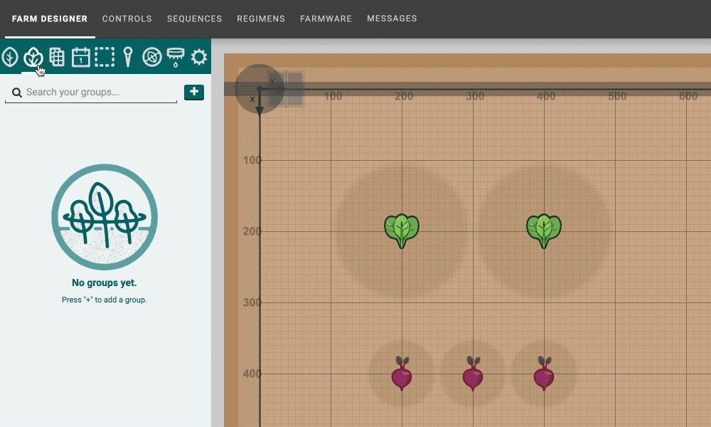



# Step 3: Create seeding sequences

In this tutorial we'll make two sequences. The first sequence will plant one seed for one plant. We'll then use this as a building block to plant all the seeds for one crop type in the second sequence. If you are unfamiliar with what sequences are, read the [sequences](../../The-FarmBot-Web-App/sequences.md) documentation before beginning.

## Sequence 1: Plant one seed



Below are all the commands for Sequence 1. Some values shown in the images may need to be adjusted for your exact FarmBot installation.

**Step 1:** MOVE TO above a gantry-mounted seed trough by using a positive **Z-OFFSET**.

**Step 2:** CONTROL PERIPHERAL to turn the vacuum pump **ON** for picking up a seed.

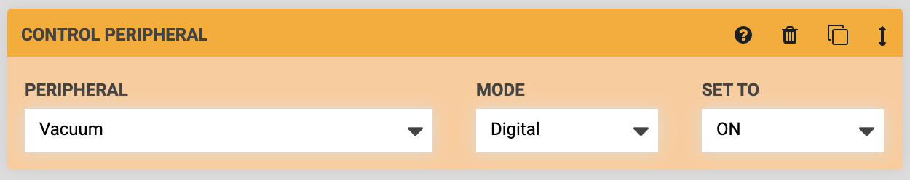

**Step 3:** MOVE TO the gantry-mounted seed trough (without an offset) such that the luer lock needle is positioned in the trough to pick up a seed.

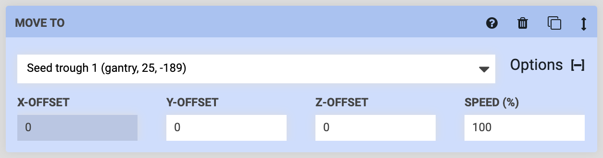

**Step 4:** MOVE TO above the gantry-mounted seed trough by using a positive **Z-OFFSET**. A seed should be suction-held onto the needle at this point.

**Step 5:** MOVE TO an **externally defined location variable**. You can find this option by first choosing "Location Variable - Add new" in the command's dropdown. This will add a gray **LOCATION VARIABLE** form to the top of the sequence. There, choose "Externally defined" and provide a **DEFAULT VALUE** of (0, 0, 0) coordinates. In the next sequence we make, we'll pass specific plant locations into this variable.

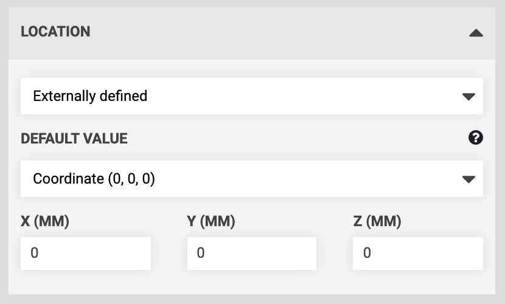

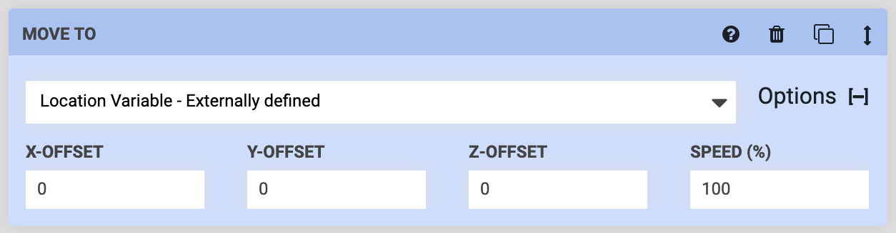

**Step 6:** MOVE TO the externally defined location variable with a negative **Z-OFFSET** equal to the distance that the z-axis must descend to place the seed in the soil at the correct depth. You can calculate this value by measuring the distance from the tip of the seeder needle to the top of the soil when the z-axis is fully raised, and then adding 10 to 40 more millimeters depending on how deep you would like to sow the seeds.

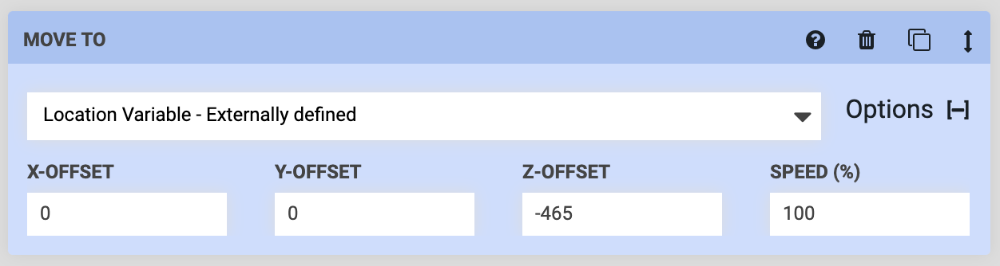

**Step 7:** CONTROL PERIPHERAL to turn the vacuum pump **OFF** and release the seed in the soil.

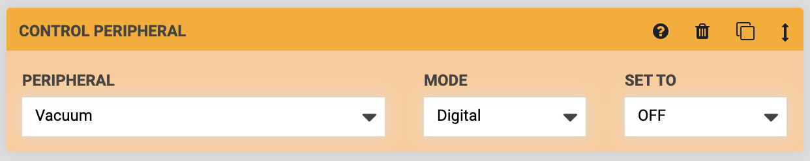

**Step 8:** MARK AS to **MARK** the location variable (the plant) **AS** `Planted`.

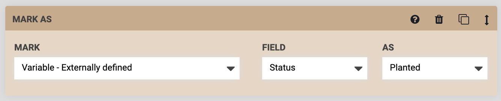

**Step 9:** MOVE TO the externally defined location variable to retract the needle out of the soil and raise the z-axis back to the maximum height.



## Sequence 2: Plant one seed for every plant in the group

Sequence 2 will have far fewer commands than Sequence 1. All Sequence 2 needs to do is mount the seeder tool (Genesis kits only), execute Sequence 1 for every plant in our group, and then dismount the seeder tool (Genesis kits only).

**Step 1:** EXECUTE a sequence to mount the seeder tool. If you haven't built a sequence for this yet, refer to [this guide](mount-and-dismount-tools.md).



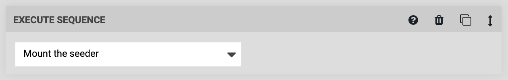

**Step 2:** EXECUTE the "Plant one seed" sequence. Because this sequence has an externally defined variable, you will be presented with the **LOCATION VARIABLE** form in the command. Selecting the "All Spinach Plants" group will instruct FarmBot to run the "Plant one seed" sequence for every plant in that group.

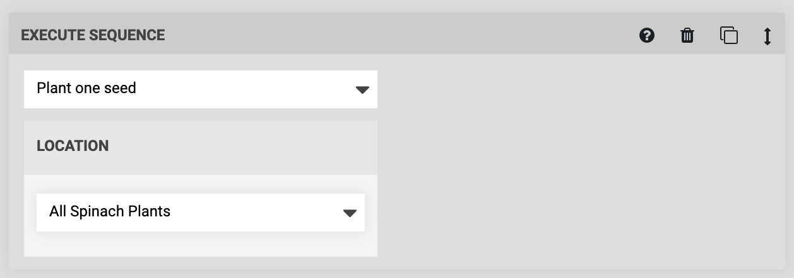

**Step 3:** EXECUTE a sequence to dismount the seeder tool. If you haven't built a sequence for this yet, refer to [this guide](mount-and-dismount-tools.md).



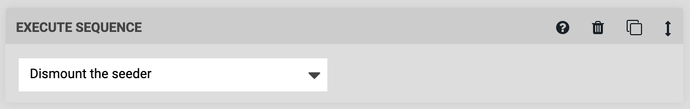



# Step 4: Plant the seeds

You're now ready to try out your sequences and plant your first garden! Pour seeds into the gantry-mounted seed trough that you selected in Sequence 1 and place the trough in its holster. With Sequence 2 loaded into the sequence editor, press RUN. FarmBot should now plant one seed for every plant in the group.

Once finished, you can add different seeds to the trough, select a different group of plants in Sequence 2, SAVE the sequence, and RUN it again!
