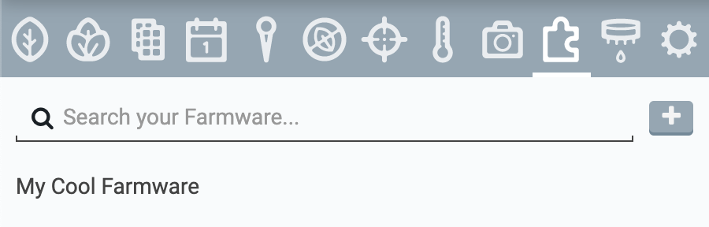



**Farmware** is FarmBot's plugin system allowing 3rd party developers to add custom functionality to FarmBot OS. Once a Farmware has been installed onto your FarmBot, it will show up in the **Farmware panel**. Selecting a Farmware from this list will show its options and controls.

# Removing Farmware
To remove a Farmware from your FarmBot, select it in the [Farmware panel](https://my.farm.bot/app/designer/farmware) and press the REMOVE button at the bottom of the Farmware details panel. Note that if the Farmware is still used in any of your sequences, those sequences will fail when they try to run the Farmware that is no longer available.



