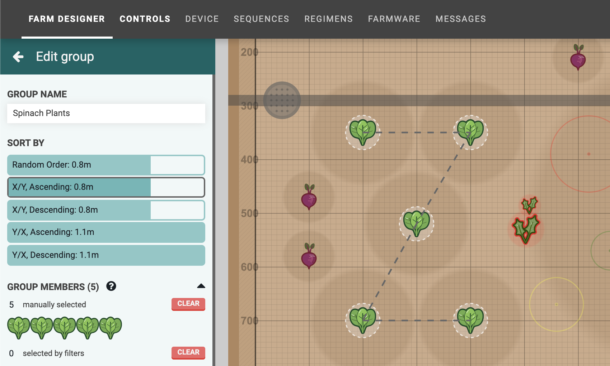
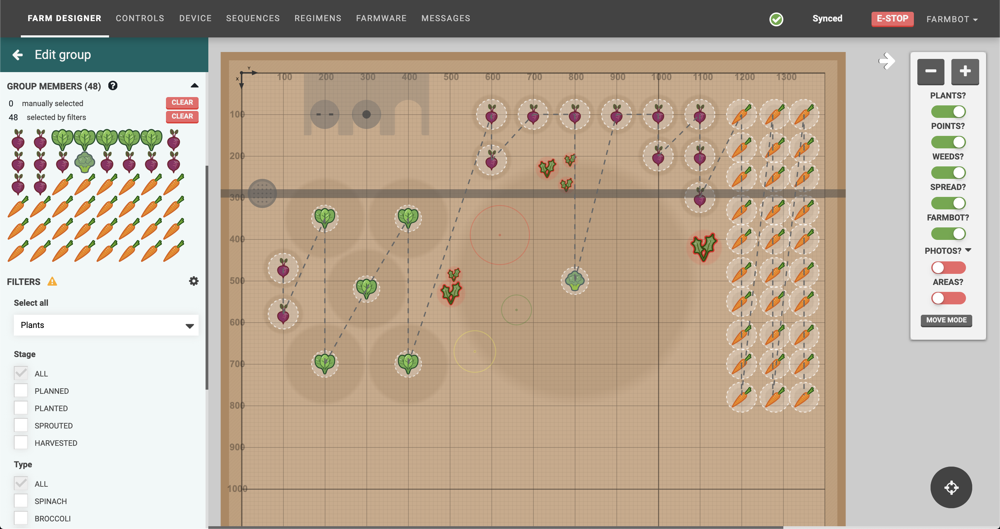
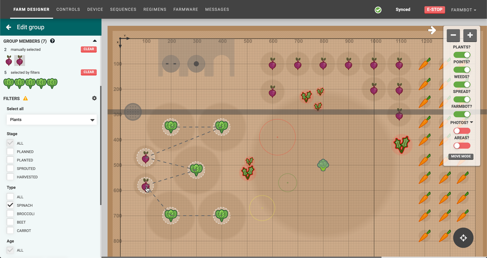

**Groups** allow you to group objects in your garden so you can easily run sequences on all members of the group. For example, with a group of all your plants, you could instruct FarmBot to run a watering sequence on all of them. Or, with a group of all the weeds in your garden, you can instruct FarmBot to run a suppression sequence on all of them.

To create and edit groups, navigate to the **groups panel** on the farm designer page.

# Creating a group
To create a group, click the <i class='fa fa-plus'></i> button in the groups panel. This will open the **edit group** panel with your new _Untitled Group_ loaded.

Alternatively you can use the [multi-select mode](farm-designer.md#select-mode) in the farm designer and then click CREATE GROUP to create a new group with your selection.

# Editing a group
From the edit group panel, you can change the **GROUP NAME**, **SORT BY** order, add **FILTERS** to automatically select group members, and manually add additional members. When you are finished editing, press the <i class='fa fa-arrow-left'></i> to go back to the list of all groups.

The **SORT BY** method will change the ordering that FarmBot uses when traveling to each group member when the group is used in a sequence. A dashed line will be shown in the map visualizing the chosen path. We encourage you to play around with this option to find the most efficient path FarmBot can take.

> 📘 On the roadmap
>
> In the future we hope to offer additional sorting options for more efficient FarmBot operation, such as a [Traveling Salesman](https://en.wikipedia.org/wiki/Travelling_salesman_problem) option.

# Add group members with filters
**FILTERS** allow you to automatically select group members that match your filtering options. As your garden changes over time (new weeds discovered, crops get harvested, etc), FarmBot will use the filters to always calculate the current group members list.

To begin, first select a **GROUP TYPE** with the **Select all** dropdown. You may choose one of `Plants`, `Points`, `Weeds`, or `Slots`. After making this selection, all of the items of that type will be added to the group. In the example below, all `Plants` have been added to the group.

From here, you may filter down the selection with the available filter options. For Plants, you may filter by **Stage**, **Type**, **Age**, and **Location**. In the example below we've selected Broccoli and Spinach as the allowed **Types**. You may mix and match as many filter options as needed to create dynamic groups for all kinds of purposes.

As your garden changes over time, FarmBot will use the filters to always calculate the current group members. For example, without changing the group at all, if additional plants are added to the garden that match the group's filters, they will automatically become group members.

In the example below, filters have been used to select all of the weeds in the garden. As weeds are removed and new ones discovered, the group members list will always stay updated without any action required.

## Filtering by location
The **Location** filter allows you to select items that are within certain areas of the garden. For example, if you would like to select plants that are in one corner of your garden, you can add two coordinate boundaries.

If you would like to select plants that are within a box in the middle of the garden, you can add four coordinate boundaries.

Toggling the **EDIT IN MAP** setting to **ON** will allow you to click and drag a rectangle in the farm designer map rather than manually typing in coordinate boundaries. It is recommended to toggle this **OFF** when not in use.

# Add group members manually
To manually add additional group members that aren't already selected by filters, click items in the farm designer map. Note that each group can only have members of one type (plants, weeds, points, or slots), so if you already have plants in the group, only plants will be clickable in the map.

To remove manually added group members, click their icon again in the farm designer map or in the **GROUP MEMBERS** list. When mousing over icons in the list, the corresponding icon in the map will be highlighted, allowing you to ensure you're removing the correct item. To remove all manually added group members at once, click the CLEAR button next to "manually selected".

# Using groups
Once you're happy with your group, try it in a sequence! Simply create a sequence with an [externally defined location variable](sequences/externally-defined-variables.md):

Then use the TEST button, making sure to select your group:

Once you've verified that FarmBot is operating how you intend, you can run this sequence over your group of plants with an EXECUTE SEQUENCE command in another sequence, or in a regimen, or an event!

# Deleting a group
To delete a group, click the DELETE GROUP button. Note that you cannot delete a group that is in-use by a sequence, regimen, or event.

# What's next?

 * [Gardens](gardens.md)
