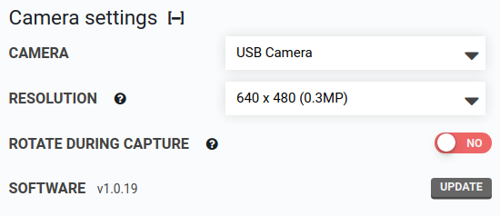

# Camera

The default camera used is a **USB camera**. If you would like to use a **Raspberry Pi camera**, select it in the **CAMERA** dropdown.

# Resolution

The camera will capture images at the closest available resolution to the selected size. Changing image resolution requires recalibration of the camera. Higher quality images will take longer to process.

# Rotate during capture

Perform camera rotation compensation when image is captured instead of in garden map. If enabled, image files will include adjustment for camera rotation (black angled borders may show in viewer). Enabling this setting will slow down photo capture.

# What's next?

 * [Camera calibration](camera-calibration.md)
