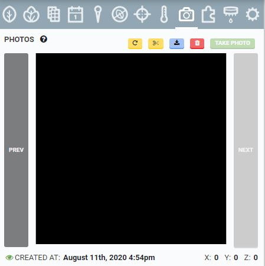
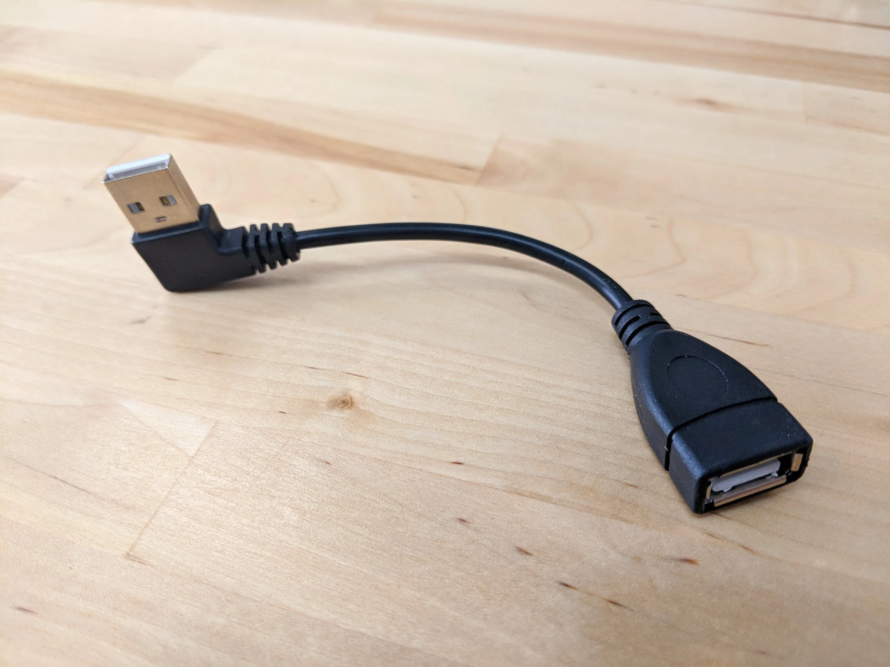
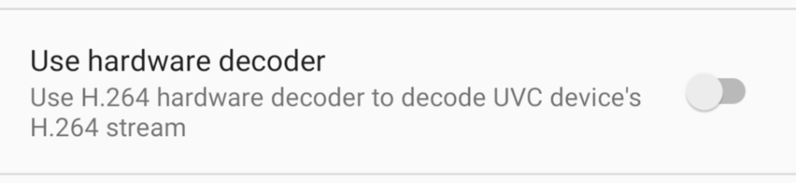
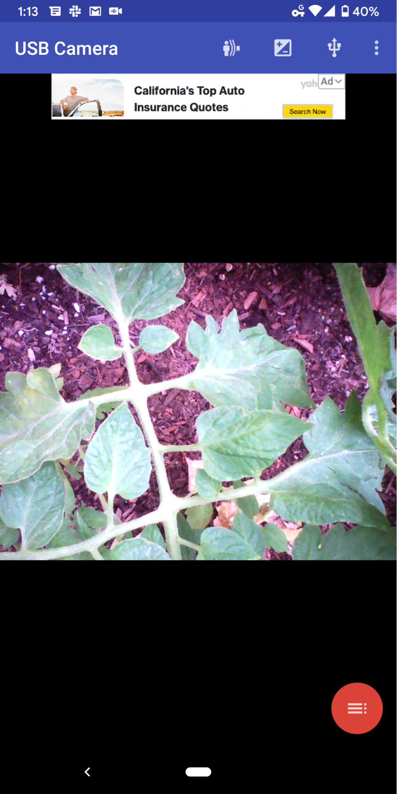
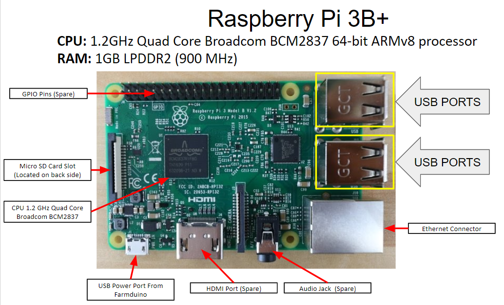
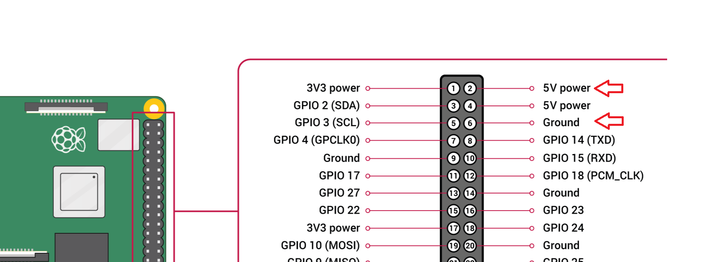
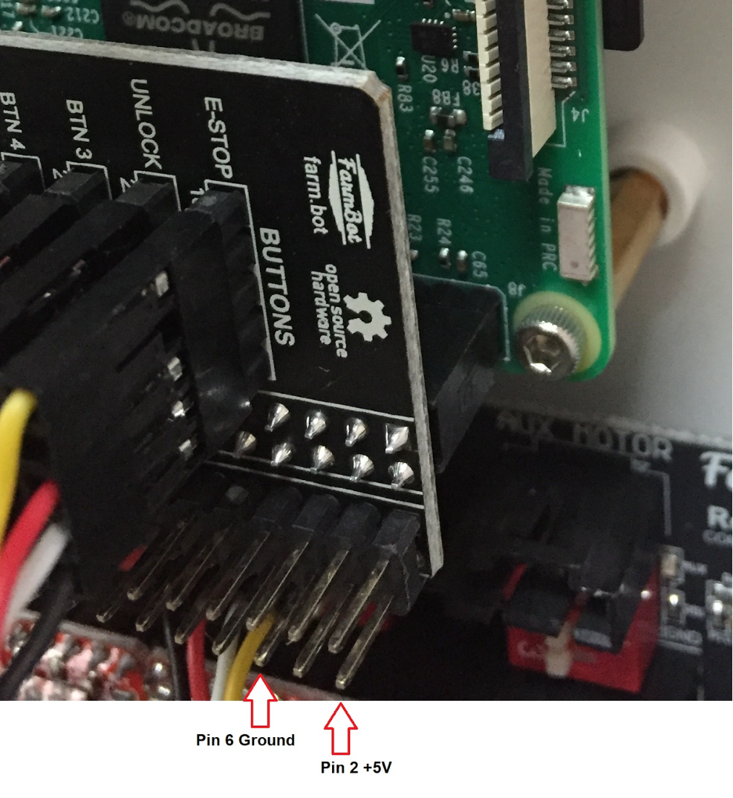

Use this document to troubleshoot camera issues and determine if you need to replace the camera. Common camera issues include:
1) When trying to take a photo, the USB Camera is not detected.

2) Photos are showing up as black images.

# Step 1: Reflash FarmBot OS

Before troubleshooting the camera itself, first [manually reflash FarmBot OS onto the microSD card](../../FarmBot-OS/farmbot-os.md#installation). Reflashing the microSD card may solve camera related software problems.

# Step 2: Check the intermediate connectors

​On Genesis v1.5+ and Express v1.0+ systems, there is an intermediate connector for the camera cable at the connection point between the Z-Axis and the Y-Axis cable carriers. Follow the procedure shown in the video below to ensure the camera cable is connected properly.

<iframe class="embedly-embed" src="//cdn.embedly.com/widgets/media.html?src=https%3A%2F%2Fwww.youtube.com%2Fembed%2FrPqgmoE3PbI%3Ffeature%3Doembed&display_name=YouTube&url=https%3A%2F%2Fwww.youtube.com%2Fwatch%3Fv%3DrPqgmoE3PbI&image=https%3A%2F%2Fi.ytimg.com%2Fvi%2FrPqgmoE3PbI%2Fhqdefault.jpg&key=f2aa6fc3595946d0afc3d76cbbd25dc3&type=text%2Fhtml&schema=youtube" width="854" height="480" scrolling="no" title="YouTube embed" frameborder="0" allow="autoplay; fullscreen" allowfullscreen="true"></iframe>

For Genesis models, also check to make sure that 90 Degree USB camera cable connector at the Raspberry Pi is plugged in sufficiently. Give both ends of the connector an extra push to ensure that everything is connected.

Once the issues with the intermediate connectors are resolved the “[take photo] - USB camera not detected” error will likely go away. If you are still having trouble with your camera, continue onto the next step.

# Step 3: Check to see if the camera works in another device

## FarmBot Genesis
Test the camera in another device such as a laptop or desktop computer and see if the USB device is recognized. This borescope camera is a plug-and-play USB device and it should be instantly recognized by a PC or Mac. Check if you are able to generate an image using the camera. Once you know that the borescope camera works properly and is able to produce an image move on to the next step.

If your camera is not recognized by another device please contact us (contact@farm.bot) and we will send you a replacement camera. If your camera is recognized, please proceed to the next step.

## FarmBot Express

Please test your micro USB camera by plugging it directly into your phone or other android compatible device to test the Express USB camera. Alternatively, you can use a micro-USB to USB adapter so that you can plug it into a laptop or PC as in the above mentioned FarmBot Genesis camera testing procedure. The Express USB camera is a plug-and-play device so there should be no need to download a driver. The camera should automatically work.

For testing in a smartphone you may need to download an app to test the camera on your device. The [USB Camera - Connect EasyCap or USB WebCam](https://play.google.com/store/apps/details?id=com.shenyaocn.android.usbcamera) on the Google Play Store worked for us.



Once the app is installed and the camera is plugged into your device, you should be able to test the operation of the camera. If the camera is functional, the USB Camera web app will display an image similar to the one shown below. If the camera is not functioning properly the device will fail to recognize the camera.

## Results of Camera Testing for both Genesis and Express Cameras

If your camera is functioning properly in another device such as your laptop, PC desktop, Mac, or smartphone but it doesn’t function properly with the FarmBot’s Raspberry Pi, there is likely something wrong with the Raspberry Pi USB port or there is likely low voltage getting to your Raspberry Pi.

If you are still having trouble with your camera, continue onto the next step.

# Step 4: Test the USB Port at the Raspberry Pi

The Raspberry Pi 3 computers sometimes have issues with their USB ports. Visually check the USB port for any debris or packaging material that may have gotten into the USB port. If one port does not function, test all 4 USB ports to see if a camera connection can be made.

If your camera is recognized by another device however your camera is not recognized by the Raspberry Pi 3, it is likely that your Raspberry Pi 3 has faulty USB ports. If this is your situation please [contact us](mailto:contact@farm.bot) and we will send you a replacement Raspberry Pi 3.

# Step 5: Test for Low Voltage on the Farmduino and on the GPIO pins on the Raspberry Pi Hat

If you are getting blank or completely black images from your FarmBot camera, there is likely low voltage getting to your Raspberry Pi to power the camera. This means that the camera is being recognized by the USB port but there is not sufficient voltage to produce an image.
This photo below is an example of Blank or Black photos produced from low voltage at the Raspberry Pi.

To confirm this issue, measure the voltage across the GPIO pins on the Raspberry Pi Adapter Board. We are looking to measure the voltage between Pin 2 and Pin 6 as shown in the diagram below.



​If the voltage measures below 4.8V please request a new USB power cable at [contact@farm.bot](mailto:contact@farm.bot).

There are four likely outcomes of this troubleshooting procedure:

1. The camera comes back online. This typically happens after reflashing the firmware.
2. The camera is faulty and needs to be replaced.
3. The Raspberry Pi USB port is faulty and the Raspberry Pi need to be replaced.
4. The USB power cable going to the Raspberry Pi power port is causing too much resistance and the subsequent voltage drop is not allowing sufficient voltage to get to the camera. The camera is underpowered and completely black or blank photos are being taken and needs to be replaced.

After going through these steps you are still unable to get the camera to function please [contact us](mailto:contact@farm.bot) and we will help you with replacement parts and continue troubleshooting your camera issues.
