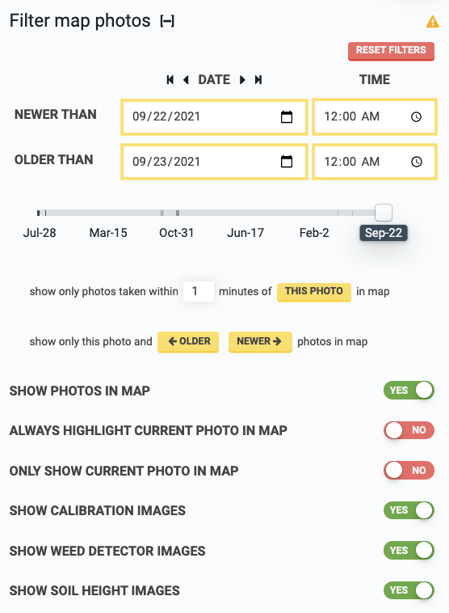

* toc
{:toc}

|                                         |   |
|-----------------------------------------|---|
|**DATE**                                 |Use the <i class='fa fa-caret-left'></i> and <i class='fa fa-caret-right'></i> buttons to change the **NEWER THAN** and **OLDER THAN** dates forwards or backwards by one day. Use the <i class='fa fa-step-backward'></i> and <i class='fa fa-step-forward'></i> buttons to change the date range to the oldest or most recent day with photos. Use the slider to only show photos from the selected day.
|**SHOW PHOTOS IN MAP**                   |Toggle the map photos layer on or off. Also accessible in the map legend.
|**ALWAYS HIGHLIGHT CURRENT PHOTO IN MAP**|When on, the photo currently displayed in the photos panel image viewer will be highlighted in the map with an orange border.
|**ONLY SHOW CURRENT PHOTO IN MAP**       |When on, all map photos except the photo currently displayed in the photos panel image viewer will be hidden.
|**SHOW CALIBRATION IMAGES**              |When on, images from the [camera calibration](camera-calibration.md) process will be shown.
|**SHOW WEED DETECTOR IMAGES**            |When on, images from the [weed detection](weed-detection.md) process will be shown.
|**SHOW SOIL HEIGHT IMAGES**              |When on, images from the [measure soil height](measure-soil-height.md) process will be shown.
|RESET FILTERS|Click to reset all filters to their default value.

# What's next?

 * [Camera settings](camera-settings.md)
