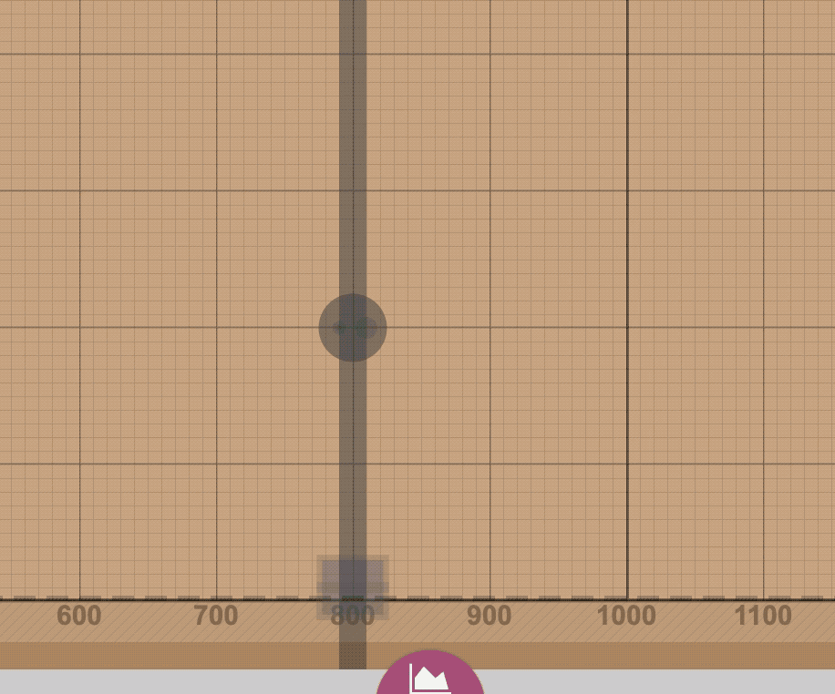
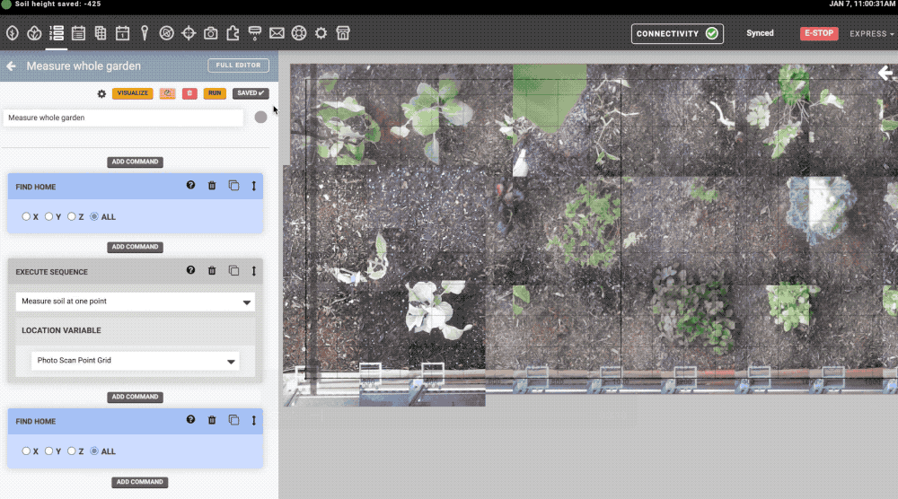

FarmBot uses computer vision software to detect the average z-axis coordinate of the soil in an image. See [how it works](https://developer.farm.bot/docs/measure-soil-height).



# Calibrate

1. Move FarmBot to a location where the camera has a clear view of a wide area of soil. Ensure the Y and Z axes have room to move _away_ from the home/zero position.
2. Measure the distance from the camera lens to the soil with a tape measure.
3. Open the **Measure soil height** section of the [photos panel](https://my.farm.bot/app/designer/photos) and enter the measured distance into the **MEASURED DISTANCE FROM CAMERA TO SOIL IN MILLIMETERS** input.
4. Press Calibrate. FarmBot will:

    1. Take a photo
    2. Move the y-axis a small amount
    3. Take another photo
    4. Move the z-axis
    5. Take another photo
    6. Move the y-axis back
    7. Take another photo
    8. Move the z-axis back

# Measure

Once calibration is complete, soil height can be measured and recorded by pressing the Measure button in the **Measure soil height** section of the [photos panel](https://my.farm.bot/app/designer/photos) or with the Measure Soil Height command in a sequence.

When measuring soil height, FarmBot will:

1. Take a photo from the current location
2. Move 10mm in the positive Y direction
3. Take another photo
4. Move 10mm in the negative Y direction back to the starting location
5. Process the images to determine the soil height
6. Upload the processed image and create a soil height point

For full garden soil mapping, follow the [scan the garden for weeds guide](../../FarmBot-Software/how-to-guides/scan-the-garden-for-weeds.md) and use the Measure Soil Height sequence command.

# Check results

Before using the detected soil height values, compare the results to your garden bed by spot checking individual values. Move FarmBot above the soil height point and measure the distance to the soil with a tape measure or slowly move FarmBot down to the detected soil height. Remember that all soil height values are relative to the bottom of the camera.

If the detected values are consistently offset from the actual soil surface, try adjusting the **MEASURED DISTANCE FROM CAMERA TO SOIL IN MILLIMETERS** input in the **Measure Soil Height** section of the [photos panel](https://my.farm.bot/app/designer/photos) or re-calibrate by pressing the RESET CALIBRATION VALUES button and following the [calibration steps](#calibrate) again.

# Remove outliers

After scanning the entire bed for soil height, it is likely you will have a couple of outlier measurements on the high and low ends of your dataset. Outliers can occur when abnormal lighting or dense plant foliage obscures FarmBot's view of the soil.

To remove or adjust outliers, open up the [soil height points list](../points.md#soil-height-points) and inspect the highest and lowest points on the list. Note that all soil height measurements are color coded on a white-to-black scale with the lightest measurements having the highest z coordinates and the darkest measurements having the lowest. If there are any outliers, click them to open the edit point panel and either delete the point entirely or manually adjust it's z coordinate.

You may also open the [profile viewer](../farm-designer.md#profile-viewer) and check the detected soil cross-section to quickly find any anomalies.

# Use soil height

After checking the detected soil points and removing or adjusting any outliers, open the [soil height points list](../points.md#soil-height-points) and press the USE AVERAGE Z button to apply the average detected soil height to the [**FALLBACK SOIL HEIGHT**](../settings/axes.md#fallback-soil-height) value in the settings panel.

Then, from any Move command in your sequences, select Soil height in the z-coordinate **OVERRIDE** dropdown.

# Tips

 * Ensure the Y and Z axes move smoothly without errors before attempting calibration.
 * Tune the weed detector parameters to detect plants before attempting soil height measurements.
 * Calibrate and measure soil height from a medium to maximum camera to soil distance.
 * Take measurements and update the soil height value over time to account for soil settlement.
 * Prepare the garden bed soil surface by smoothing and flattening as much as reasonably possible.
 * If high precision is required, consider an alternative approach such as manual measurements. **Measure Soil Height** is a simple camera-based solution and will not be as accurate or available over a large range of conditions as other methods.

# Troubleshooting

## Capture

_Error message:_ `Problem getting image` 
_Troubleshooting steps:_ Verify camera is working by taking a photo.

## Calibration

_Error message:_ `Calibration measured distance input required` 
_Solution:_ Provide a distance measurement (see the [calibration steps](#calibrate)).

_Error message:_ `Image size must match calibration` 
_Solution:_ Recalibrate or revert change to image capture size or rotation.

## Detection

All other error messages 
_Troubleshooting steps:_
 * Verify the soil is clearly visible in photos.
 * Try recalibrating at a different location.
 * Try moving the camera as far away from the soil as possible. If a closer measurement distance is desired, increase the __DISPARITY SEARCH DEPTH__ value in __Advanced__ settings.
