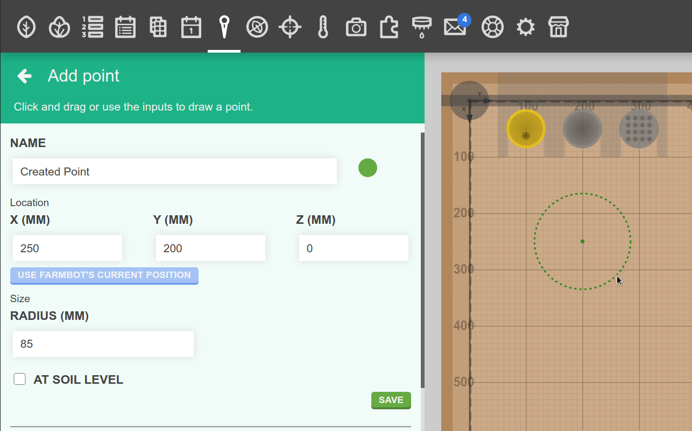
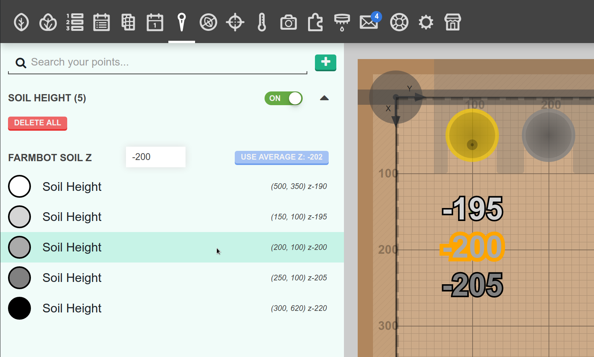
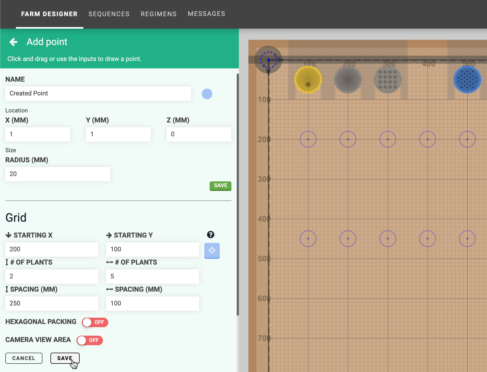
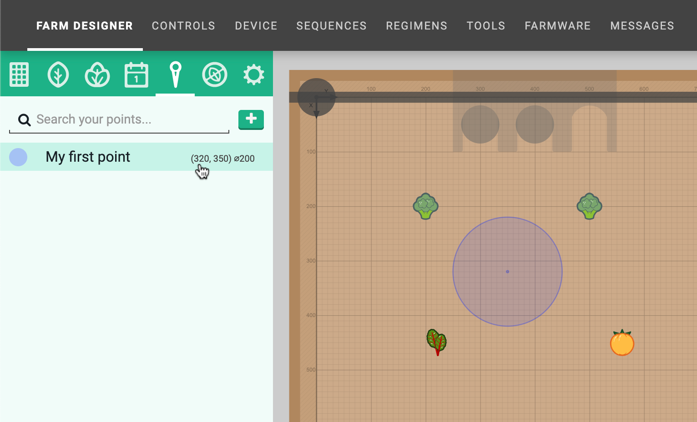
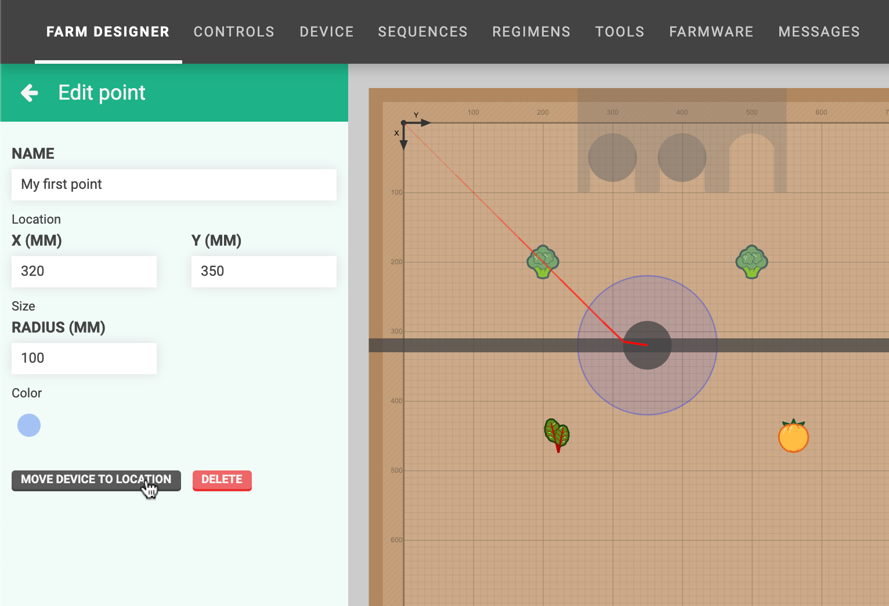
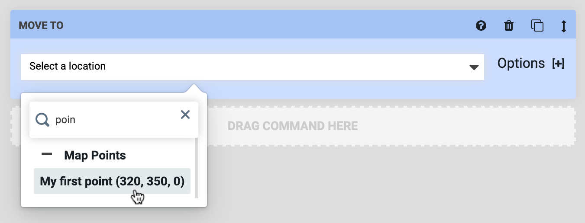
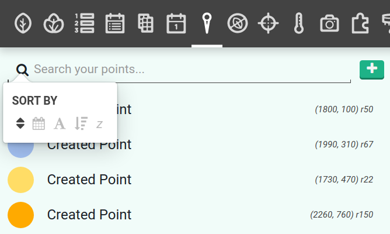

* toc
{:toc}

If you would like to create custom locations in your garden for FarmBot to travel to that are _not_ plants, tool slots, or the home location, you can use **points**. Example uses of the points feature include:

* Points for FarmBot to move to that are out of the way when you're harvesting
* Points in each corner of the bed to serve as alternative "home" positions
* Points for FarmBot to travel to for daily photos

# Adding points
To add points, click the <i class='fa fa-plus'></i> button in the points panel. This will open the **add point** panel where you can add individual points or create a grid of points.

## Individual points
To add an individual point to the map, provide a **name**, **color**, **X and Y coordinates**, and **radius**. Alternatively you can click and drag in the map to define the coordinates and radius. The USE FARMBOT'S CURRENT POSITION button can be used if FarmBot is already positioned at a location of interest. Then click SAVE to save the point.

## Soil height points
Check the **AT SOIL LEVEL** checkbox to add a special soil height point. Soil height points are automatically added to an expandable item in the points panel where they are sorted by height. Toggling soil height ON will show the soil height values in the map.

## Grid of points
To add a grid of points to the map, provide the **name**, **color**, and **radius** for all of the points in the upper portion of the panel. Then provide the grid's **STARTING X and Y** coordinates and the **# OF POINTS** and **SPACING** in each direction. Press **PREVIEW** to preview the grid in the map. If you are satisfied, then press **SAVE**.

Toggling **CAMERA VIEW AREA** ON will show the camera's field of view in the map when the FarmBot is located at each point in the grid. This is useful when creating grids for photographing large areas of the garden.

# Editing points
To edit a point, click it in the points list or in the map (when the points panel is opened). This will open the **edit point** panel, allowing you to change anything about the point. Changes will be saved when you press the <i class='fa fa-arrow-left'></i> button.

# Moving to a point
There are two ways to move FarmBot to a point. The first way is by clicking MOVE DEVICE TO LOCATION from the edit point panel.

The second way is from sequences. Simply select the point from the dropdown in a Move To command or location variable.

# Sorting points
Click the <i class='fa fa-search'></i> icon to change the order of points in the panel, where <i class='fa fa-calendar'></i>: age, <i class='fa fa-font'></i>: name, <i class='fa fa-sort-amount-desc'></i>: size, and <b><i>z</i></b>: height.

# Deleting points
To delete a point, click on it to open up the edit point panel. Then press the DELETE button.



# What's next?

 * [Weeds](weeds.md)
