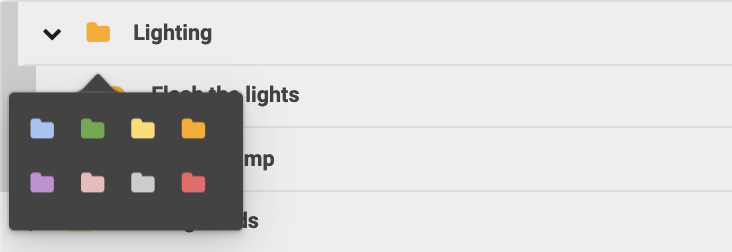
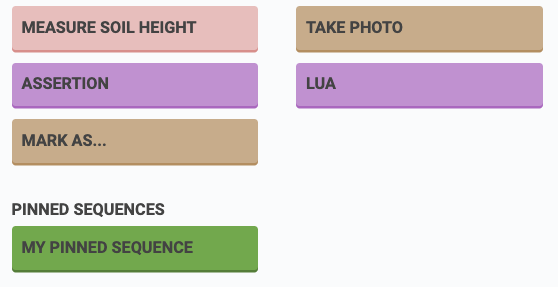
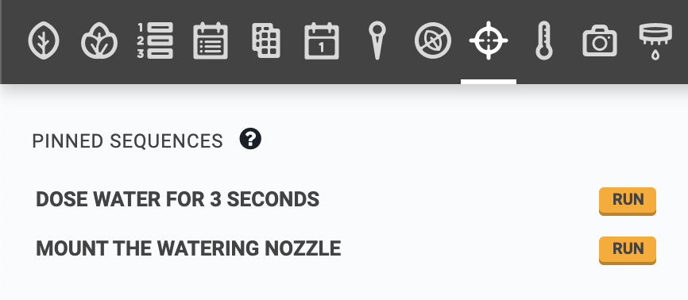
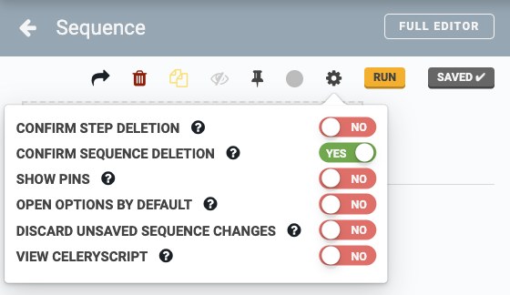

* toc
{:toc}

The web app is a platform designed to give you unlimited control over how you use your FarmBot and therefore how you grow your food. Because nobody wants to sit on their computer all day controlling their FarmBot manually, we have designed several features to help you automate your farming operation.

**Sequences** allow you to combine the most basic **commands** of FarmBot (such as moving or controlling a peripheral) into more complex actions requiring multiple **steps** (for example: picking up the watering nozzle, watering a plant, and then putting the tool away). When a sequence is initiated, FarmBot will execute all of the commands in the sequence (the steps) one after the other until the sequence is finished.

<iframe width="100%" height="450" src="https://www.youtube.com/embed/8tw6Qmu-WdI" frameborder="0" allow="accelerometer; autoplay; clipboard-write; encrypted-media; gyroscope; picture-in-picture" allowfullscreen></iframe>

You can create sequences using the sequence editor as shown below. On the left of the screen is a list of all your sequences, which can be organized into folders. In the middle is the currently opened sequence. And on the right are the available commands that you can add to sequences.

# Organizing sequences into folders

Add a new folder in the top level by pressing the <i class='fa fa-folder'></i> button next to the sequence search bar. To change the color of the folder, click the folder icon.

Open and close a folder by clicking the <i class='fa fa-chevron-right'></i> and <i class='fa fa-chevron-down'></i> buttons, or open and close all folders by clicking the <i class='fa fa-chevron-right'></i> and <i class='fa fa-chevron-down'></i> buttons next to the sequence search bar.

Click the <i class='fa fa-ellipsis-v'></i> menu shown on the right when hovering on a folder to delete the folder, edit the folder name, add a subfolder, or add a new sequence within the folder.

To move sequences between folders, click or click and drag the <i class='fa fa-bars'></i> menu shown on the right when hovering over the sequence.

# Pinned sequences

You can **pin** frequently used sequences by pressing the <i class='fa fa-thumb-tack'></i> icon in the edit sequence header.

Pinned sequences will appear at the bottom of the Add Command panel so that you may quickly add them to other sequences.

Pinned sequences are also listed in a section on the controls panel with associated RUN buttons so that you may quickly manually execute these sequences.

# Sequence editor options

You can customize how the sequence editor works with the options in the <i class='fa fa-cog'></i> menu located in the edit sequence header.

* **CONFIRM STEP DELETION** - Show a confirmation dialog when deleting a sequence step.
* **CONFIRM SEQUENCE DELETION**- Show a confirmation dialog when deleting a sequence.
* **SHOW PINS** - Show raw pin lists (eg: `Pin 13`) in Read Sensor, Control Peripheral, and If Statement steps.
* **OPEN OPTIONS BY DEFAULT** - Choose whether advanced step options are open or closed by default.
* **DISCARD UNSAVED SEQUENCE CHANGES** - Don't ask about saving sequence work before closing browser tab. Warning: may cause loss of data.
* **VIEW CELERYSCRIPT** - View raw data representation of sequence steps or the entire sequence. Useful for software developers. Once this toggle is set to YES, you may switch between the raw celerysript and normal views of individual sequence steps or the entire sequence by clicking the <i class='fa fa-code'></i> buttons in the sequence or step headers.

# What's next?

 * [Sequence Commands](sequences/sequence-commands.md)
 * [Building a Sequence](sequences/building-a-sequence.md)
 * [Example Sequences](sequences/example-sequences.md)
 * [Variables](sequences/variables.md)
 * [Externally Defined Variables](sequences/externally-defined-variables.md)
