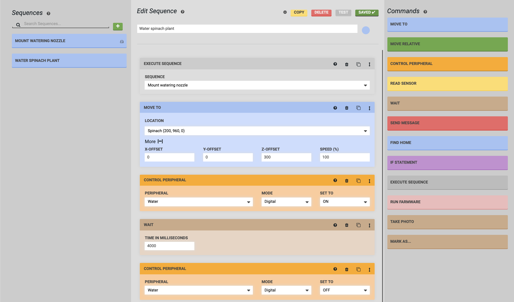

* toc
{:toc}

Now that we've created a sequence to mount the watering nozzle, let's create a sequence to water a plant. In this example we'll water a Spinach plant at coordinates `(200, 960, 0)`.

1. **Mount the watering nozzle** - Mount the watering nozzle by using the Execute step and selecting the `Mount Watering Nozzle` sequence created in the previous example.
2. **Move above the plant** - Move above the plant by selecting the Spinach plant and making use of a **Z-OFFSET**.
3. **Open the solenoid valve** - Add a Control Peripheral step to turn the `Water` peripheral `ON`. This will start the flow of water.
4. **Wait** - Use a Wait step to continue watering the plant for `4000` milliseconds (4 seconds).
5. **Close the solenoid valve** - Use another Control Peripheral step to set the `Water` peripheral to `OFF`, stopping the flow of water.
6. **Save and test** - Press the SAVE button and then RUN to try out your new sequence!

## Additional considerations

### Put the watering nozzle tool away

Now that you've mounted the watering nozzle tool and used the tool to water a plant, use another Execute step and a third sequence to put the watering nozzle tool away.

### Water any plant by using a variable

This sequence can only be used to water the specific Spinach plant chosen. Instead of making watering sequences for every plant in your garden, make this sequence a generic _Water plant_ sequence that can be used on any plant by using a [location variable](variables.md).

### Take a photo

While your FarmBot is located at the plant, consider using a Take Photo step to track the growth of your plant each time it is watered.

### Modularize the watering action

Consider making a sequence that only contains the steps required for dispensing water: Control Peripheral, Wait, and Control Peripheral. This can then be changed more easily and re-used in different ways with Execute steps in other sequences.

# What's next?

 * [Variables](../variables.md)
