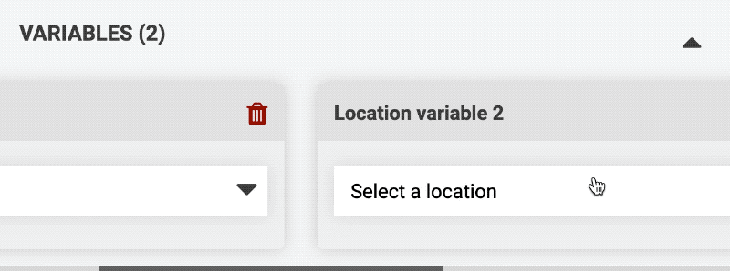

* toc
{:toc}

# Adding multiple variables

Sequences are not limited to a single variable. To add additional variables click ADD VARIABLE in the sequence header as many times as needed or select `Add new` in a sequence step dropdown.

If you already have a sequence scheduled for use in regimens and events, you can still safely add additional externally defined variables and FarmBot will continue to run the sequence using the **DEFAULT VALUES** of the new variables. Any regimens or events which you want to run with a different variable value will need to be updated.

# Removing variables

To remove a variable, click the <i class='fa fa-trash'></i> icon.



# Name each variable

To keep track of what each variable is used for, click the variable's title to add a custom name.



As variables are added, updated, and removed, their corresponding listing in sequence step dropdowns will be updated.

# Multiple externally defined variables

All `Externally defined` variables will be displayed in the run button popup, execute steps, and all other places where you can provide a value for an [externally defined variable](externally-defined-variables.md).

# Group variable limitations



# What's next?

 * [Shared Sequences](shared-sequences.md)
