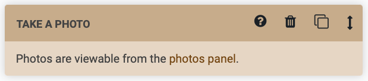
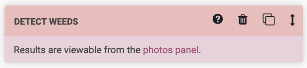

* toc
{:toc}

# Take photo

The Take Photo command instructs FarmBot to take a photo with the USB camera or the Raspberry Pi camera (whichever is selected in [camera settings](../../photos/camera-settings.md)). After taking the photo, FarmBot will upload it to the web app, along with the coordinates from where the photo was taken, and the date and time.

You can view the photos taken on the photos panel and in the farm designer.

# Detect weeds

The Detect Weeds command instructs FarmBot to take a photo and run the weed detection software. After taking the photo and processing it, FarmBot will upload it to the web app, along with the coordinates from where the photo was taken, the date and time. FarmBot will also add any weeds that it identified to the **PENDING** category in the weeds panel.

# Measure soil height

The Measure Soil Height command instructs FarmBot to take two photos from slightly different locations to simulate using a stereoscopic camera and then determine the average height of the soil viewable in the photos. See the [measure soil height page](../../photos/measure-soil-height.md) for more information.

# What's next?

 * [Logic Commands](logic.md)
 * [Building a Sequence](../building-a-sequence.md)
